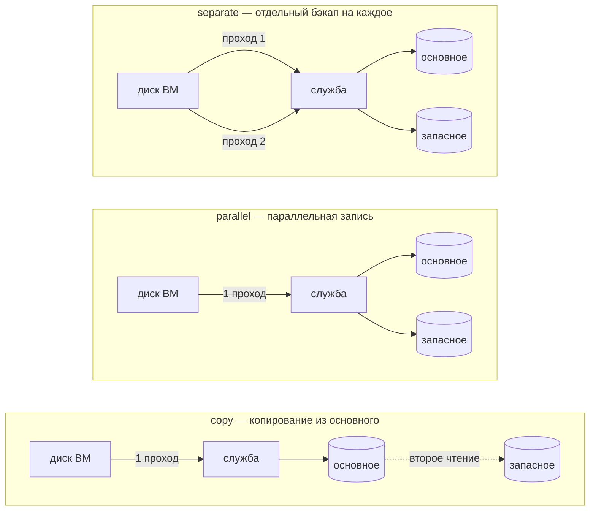
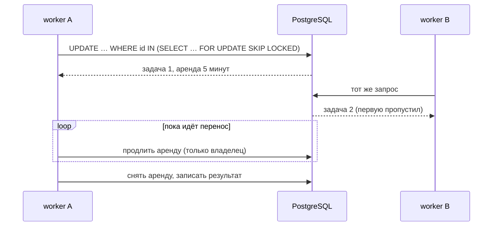
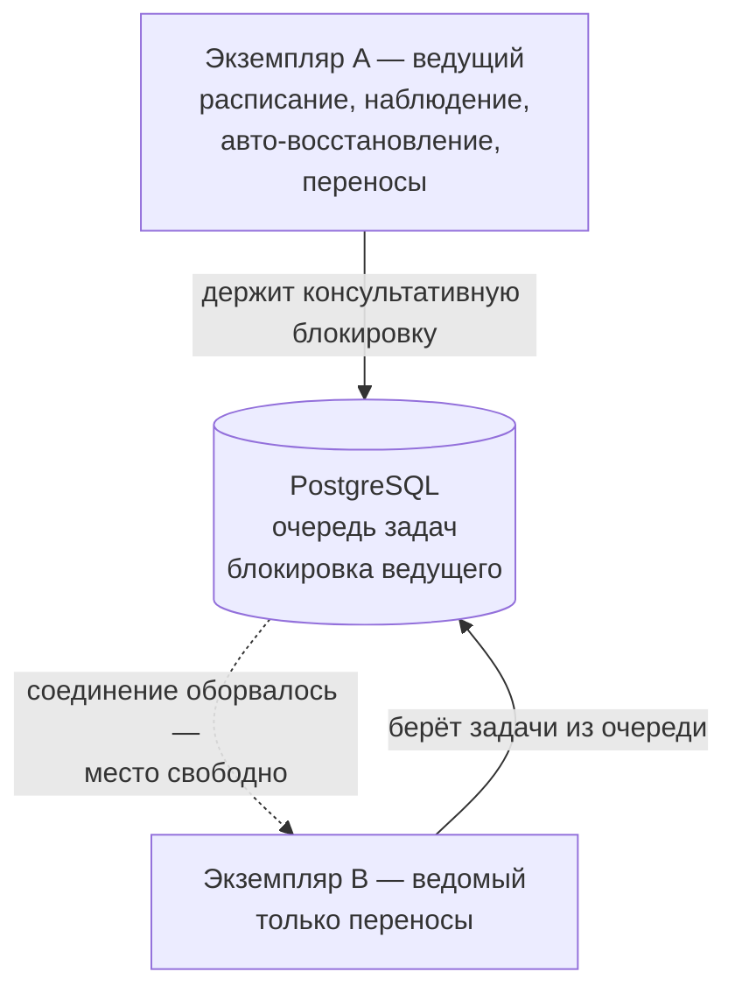

# Устройство сервиса

Документ описывает, из чего собран ovirt-backup, как части связаны и
почему сделано именно так. Формат хранения копий вынесен в
[BACKUP-FORMAT.md](BACKUP-FORMAT.md), устройство дисков QEMU — в
[DISK-ARCHITECTURE.md](DISK-ARCHITECTURE.md), внешний контракт — в
[API.md](API.md).

Объём на момент написания: ~33 000 строк Go, ~7 500 строк Vue/TypeScript.

---

## 1. Что это

Сервис резервного копирования и присмотра за виртуальными машинами двух видов
инфраструктуры:

- **oVirt / РЕД Виртуализация** — через REST API движка и `ovirt-imageio`;
- **голый libvirt/KVM** — через libvirt поверх SSH и NBD.

Три задачи, которые он решает: снимать копии без остановки гостя, доказывать
что копия пригодна, и возвращать упавшую ВМ в строй. Всё это — из браузера.

Ключевое свойство: **копии переживают сам сервис**. Каталог запуска
самодостаточен, разбирается отдельной утилитой `jvbackup` без базы и без
сервера. Если завтра исчезнет всё, кроме хранилища, данные достанутся.

---

## 2. Карта системы

```
                          браузер (Vue 3 / Quasar SPA)
                                     │  REST + SSE
        ┌────────────────────────────▼─────────────────────────────┐
        │  api          маршруты, сессии, роли, аудит, SSE          │
        ├──────────────────────────────────────────────────────────┤
        │  scheduler    cron заданий + пять служебных задач         │
        │  monitor      опрос → оповещения → авто-восстановление    │
        ├──────────────────────────────────────────────────────────┤
        │  dispatch     выбор драйвера по типу подключения          │
        │      ├── backup   формат, цепочки, проверки, restore      │
        │      └── kvm      горячий бэкап libvirt поверх backup     │
        ├──────────────────────────────────────────────────────────┤
        │  ovirt      libvirtx     repo        store      secret    │
        │  imageio    pkg/nbd      retention   logging    events    │
        └───┬────────────┬───────────┬────────────┬─────────────────┘
            │            │           │            │
            ▼            ▼           ▼            ▼
      движок oVirt   libvirt+SSH  хранилище    PostgreSQL
      443 / 54322    NBD          копий
                                  local/S3/SMB/
                                  WebDAV/SFTP
```

`jvbackup` — отдельный бинарь, который подключается к тому же хранилищу копий
напрямую, минуя весь верхний слой.

---

## 3. Пакеты и границы

| Пакет | Ответственность |
|---|---|
| `cmd/ovirt-backup-server` | сборка зависимостей, запуск, штатное завершение |
| `cmd/jvbackup` | автономный CLI: список, проверка, восстановление из хранилища |
| `internal/config` | YAML + переопределения `JHV_*`, проверка значений |
| `internal/model` | доменные типы, общие для всех слоёв |
| `internal/store` | репозитории поверх `database/sql`, миграции |
| `internal/secret` | AES-256-GCM для паролей подключений и ключей хранилищ |
| `internal/ovirt` | REST-клиент движка: SSO, инвентарь, питание, снапшоты, Backup API |
| `internal/imageio` | клиент `ovirt-imageio`: extents, диапазонное чтение и запись |
| `internal/libvirtx` | libvirt поверх SSH: инвентарь, действия, backup API, метрики |
| `pkg/nbd` | клиент NBD: рукопожатие, чтение, контексты метаданных |
| `internal/repo` | хранилища копий (local / S3 / SMB / WebDAV / SFTP) и раскладка объектов |
| `internal/retention` | правила «дед-отец-сын» с учётом целостности цепочек |
| `internal/backup` | формат, копирование, восстановление, проверки, рекомендатель |
| `internal/kvm` | драйвер горячего бэкапа libvirt поверх формата `backup` |
| `internal/dispatch` | выбор драйвера, общий конвейер для обоих |
| `internal/monitor` | опрос состояния, оповещения, восстановительные действия |
| `internal/scheduler` | cron заданий и служебные задачи |
| `internal/logging` | настройка журнала, ротация по размеру и по суткам, чтение хвоста |
| `internal/events` | внутренняя шина для SSE |
| `internal/api` | HTTP-слой |

### Правила зависимостей

Одно направление, без исключений: `api` → `scheduler`/`monitor`/`dispatch` →
`backup`/`kvm` → `repo`/`ovirt`/`libvirtx` → `store` → `model`.

Два места, где это направление пришлось защищать особо:

**`kvm` построен на `backup`, поэтому `backup` не может ссылаться на `kvm`.**
Драйвер KVM использует формат хранения, сетку чанков и писатель манифестов из
`backup`. Прямая ссылка обратно дала бы цикл импортов. Поэтому выбор драйвера
вынесен в `dispatch`, который встраивает `*backup.Engine` и добавляет путь
libvirt: всё, что не зависит от гипервизора — проверки, восстановление,
ретенция, сборка цепочек — наследуется без изменений.

**Пробный запуск копии нужен движку, но живёт в `kvm`.** Решение — реестр
внешних проверок: `Engine.RegisterVerifier` принимает обработчик для режима,
которого движок не знает, а диспетчер регистрирует в нём пробный запуск. Всё
вокруг проверки — запись, прогресс, отчёт, отметка на бэкапе — остаётся в
движке в одном экземпляре.

Новые точки сохраняют в `run.json` переносимый профиль ВМ: архитектуру, семейство
machine, BIOS/UEFI, ресурсы и подключения дисков. Полный исходный libvirt XML
лежит рядом как `vm-config.xml`, но напрямую не воспроизводится: из него нельзя
безопасно переносить сеть, UUID, NVRAM, hostdev и пути исходных дисков. Проверка
собирает все диски цепочки и создаёт transient-домен только из безопасного
профиля; память и vCPU оператор при необходимости ограничивает отдельно.

---

## 4. Что работает во время работы

Процесс один. Никаких воркеров в отдельных службах, никаких таймеров systemd —
см. [раздел про systemd](DEPLOY.md#5-установка-systemd-с-локальной-postgresql).

| Что | Период | Где |
|---|---|---|
| HTTP-сервер: API, SPA, SSE | постоянно | `api` |
| Задания бэкапа | расписания из базы | `scheduler` |
| Ретенция | 1 ч | `scheduler` |
| Удаление просроченных копий | 1 ч | `scheduler` |
| Проверка хранилищ | 15 мин | `scheduler` |
| Поиск устаревших копий | 1 ч | `scheduler` |
| Очистка истории | 6 ч | `scheduler` |
| Опрос состояния и метрик | `monitor.interval` (30 с) | `monitor` |
| Суточная смена файла журнала | 1 сутки | `logging` |

**Почему не таймеры systemd.** Задания заводятся в интерфейсе и живут в базе.
Таймер на задание означал бы генерацию unit-файлов из базы и `daemon-reload`
при каждой правке расписания, плюс расхождение между тем, что показывает
интерфейс, и тем, что реально стоит в systemd.

### Ограничители параллельности

| Что ограничено | Чем | Зачем |
|---|---|---|
| Одновременных бэкапов | `backup.workers` | чтение дисков упирается в гипервизор и сеть |
| Одновременных проверок и восстановлений | `backup.heavy_workers` | обе операции читают цепочку целиком из хранилища копий |
| Дисков одной ВМ параллельно | `transfer.max_parallel_disks` | то же, но внутри одной ВМ |
| Повторных запусков задания | заявка `claimJob` | задание не должно запускаться поверх себя |
| Попыток входа | пауза по учётной записи | подбор пароля |

Пределы бэкапов и тяжёлых операций **раздельные**: первые упираются в
гипервизор, вторые — в хранилище копий, и общий предел позволил бы одному виду
работы вытеснять другой. Семафор стоит в самом движке, а не в обработчиках
API: там его не обойдёт ни один вызывающий, включая проверку после бэкапа из
планировщика.

Запись о работе создаётся **до** ожидания в очереди, со статусом «ожидает».
Иначе оператор нажал кнопку и не видит ничего, пока впереди стоят две другие
проверки. Ожидание прерывается вместе с контекстом: операция, отменённая в
очереди, не должна начаться через час.

Разовый бэкап из интерфейса идёт **тем же путём**, что и запуск по расписанию:
через `Scheduler.RunOnce`. Прямой вызов движка обходил бы предел `workers`,
не попадал бы в список выполняющихся и не поддавался бы отмене.

### Отмена и завершение

Идентификатор запуска появляется не сразу: сначала движок разбирает диски и
строит план. Поэтому `RunRequest.OnRunCreated` вызывается ровно в тот момент,
когда запись сохранена и у неё есть идентификатор, но копирование ещё не
началось — планировщик по этому колбэку регистрирует функцию отмены. Колбэк
вызывается в обеих ветках, oVirt и libvirt: иначе отмена работала бы для одного
типа серверов и молча не работала для другого.

`SIGTERM` разворачивает штатное завершение: HTTP дренируется за
`shutdown_timeout`, выполняющиеся бэкапы отменяются и успевают записать в
историю, что были прерваны.

---

## 5. Модель данных

СУБД одна — PostgreSQL. Идентификаторы — `TEXT` (UUID), моменты времени —
`TIMESTAMPTZ`, длительности — `BIGINT` (секунды), структуры — `JSONB`.

### Почему СУБД стала одна

Раньше поддерживались две, SQLite и PostgreSQL, а схема писалась на пересечении
диалектов. В коде это стоило немного: пять ветвлений и тридцать строк драйвера.
Дорого обходилось другое — **регулярно проверялся только один путь из двух.**

Так в схему попала колонка `INTEGER`, в которую код писал `bool`: SQLite
типизирован динамически и молча писал 0/1, а pgx отказался кодировать. Служба
не поднималась на PostgreSQL вообще — при полностью зелёных тестах, потому что
тесты шли на SQLite.

Довод в пользу SQLite — «система бэкапа не должна зависеть от внешней базы» —
при проверке оказался слабее, чем звучал: **восстановление данных от базы
сервиса не зависит вовсе.** Каталог запуска самодостаточен и разбирается
утилитой `jvbackup` без базы и без сервера. Катастрофический сценарий закрыт
форматом хранения, а не выбором СУБД.

Осталось одно настоящее следствие: тесты хранилища теперь требуют настоящую
PostgreSQL и не пропускаются молча. `./run test` поднимает её в docker сам.

### Что досталось в наследство

Запросы по-прежнему пишутся с `?`, а `DB.Rebind` превращает их в `$1, $2…`.
Переписывать сто с лишним мест ради смены стиля плейсхолдеров — churn с риском
опечатки и без выигрыша.

Длительности остаются целыми секундами: `INTERVAL` потребовал бы собственного
типа при сканировании ради значения, которое всегда используется как
`time.Duration`.

### Почему JSONB, а не TEXT

Дело не в месте на диске, а в тишине при порче. Код читает такие поля через
`json.Unmarshal` с проигнорированной ошибкой — упасть на разборе списка ВМ
хуже, чем показать пустой список. Из-за этого испорченное значение
неотличимо от пустого: задание, потерявшее список машин, выглядит как задание,
у которого его и не было.

`JSONB` закрывает это на входе: некорректный JSON отвергается при записи.
Перевод сразу нашёл четыре места, писавшие пустую строку туда, где ожидался
JSON, — они хранились молча и годами могли бы не всплыть.

`alerts.details` намеренно остался текстом: несмотря на похожее имя, там
свободная фраза («состояние: paused, причина паузы: eio»), а не структура.

### Индексы на таблицах метрик

`health_samples`, `disk_samples` и `mount_samples` растут быстрее всего: строка
на объект каждые 30 секунд. Индексы по времени на них — `BRIN`, а не `B-tree`.

Они нужны одному запросу — чистке по возрасту; выборки для графиков идут через
составные `(server_id, …, at DESC)`. Данные append-only, физический порядок
совпадает с временным, и `BRIN` описывает такую таблицу сотнями байт вместо
десятков мегабайт, не обновляясь на каждой вставке. Платим точечным поиском по
времени — таких запросов нет.

Таблицы по назначению:

| Группа | Таблицы |
|---|---|
| Доступ | `users`, `sessions`, `audit_log` |
| Подключения | `servers`, `clusters`, `hosts`, `storage_domains` |
| Инвентарь | `vms`, `disks` |
| Копии | `storage_targets`, `backup_jobs`, `backup_runs`, `backup_disks` |
| Проверка и возврат | `verify_runs`, `restore_runs` |
| Присмотр | `alerts`, `health_samples`, `remediation_records`, `remediation_periods` |
| Метрики | `disk_samples`, `mount_samples` |

**База — не источник истины о копиях.** Она хранит записи о них, но сами копии
самодостаточны: потеря базы означает потерю истории и расписаний, а не данных.

### Синхронизация инвентаря помечает проход, а не время

Кэш инвентаря обновляется upsert-ом, после чего удаляется всё, что не было
затронуто. Маркером служит случайный идентификатор прохода, а не отметка
времени: два прохода могут попасть в одну миллисекунду, и сравнение по времени
тогда молча оставляет объекты, которые должны были исчезнуть. Это не гипотеза —
тест `TestSyncVMsPreservesOperatorIntent` ловил ровно этот случай.

Поля, которыми владеет оператор (`desired_state`, `remediation_opt_out`),
исключены из списка обновляемых: опрос движка не должен затирать намерение
человека.

---

## 6. Путь данных

### Бэкап

```
задание/кнопка → scheduler (семафор) → dispatch (выбор драйвера)
    ├─ oVirt:   Backup API → checkpoint → imageio (54322/54323) → чанки
    └─ libvirt: DomainBackupBegin → NBD → чанки
                                          │
                          io.Pipe → repo (local/S3/SMB/WebDAV/SFTP)
                                          │
                              манифест + объект данных
```

Чтение диска oVirt идёт напрямую с гипервизора через `ovirt-imageio` (54322).
Соседние чанки объединяются в один диапазонный GET (до 32 МиБ), сетевые сбои
диапазона повторяются. Если бэкап-сервер не видит гипервизоры напрямую —
типично, когда они на изолированной сети хранения — `transfer.prefer_proxy`
переключает поток на прокси движка (54323).

Запись в хранилище идёт потоком через `io.Pipe`: манифест строится на лету,
объект данных уходит без промежуточного файла. Бэкап-серверу не нужен свободный
терабайт под staging.

Шесть типов копии. Первые три образуют цепочки, остальные самостоятельны:

| Тип | Что берёт | Требует |
|---|---|---|
| `full` | весь диск | ничего |
| `incremental` | изменения с прошлой копии любого типа | CBT на всех дисках ВМ |
| `differential` | изменения с последней полной | CBT на всех дисках ВМ |
| `snapshot` | весь диск через временный снапшот | запасной путь, когда CBT нет |
| `ova` | экспорт средствами движка | oVirt, файл остаётся на гипервизоре |
| `config` | только описание ВМ, без дисков | ничего |

Требование «CBT на **всех** дисках» — не придирка: если хотя бы один диск ВМ не
умеет отслеживать изменения, инкремент по остальным дал бы копию, из которой
машина не соберётся целиком. Такая ВМ бэкапится запасным типом, а рекомендатель
показывает, какие именно диски мешают.

### Восстановление

Цепочка собирается по правилу «побеждает самый свежий запуск, в котором есть
чанк i». Цель — файл на сервере, существующий диск (затирает, требует
подтверждения) или новый диск в домене хранения.

Каталог для файла ограничен списком `backup.restore_dirs`: путь приходит от
клиента, а образ — десятки гигабайт. Проверка идёт через `filepath.Rel`, а не
по префиксу строки, и повторяется после `MkdirAll` через `EvalSymlinks` —
иначе обход занимал бы одну команду `ln -s`.

### Проверка

Восемь режимов, от дешёвых к дорогим:

| Режим | Что доказывает | Цена |
|---|---|---|
| `quick` | объекты на месте и нужного размера | секунды даже на терабайтах |
| `chain` | у каждого инкремента есть родитель, checkpoint-ы стыкуются, покрытие полное | дёшево, только метаданные |
| `source` | копия совпала с исходным диском (`imageio /checksum`) | осмысленна сразу после бэкапа |
| `manifest` | SHA-256 каждого чанка сходится с манифестом | читает весь бэкап |
| `restore` | образ собирается из цепочки, сумма собранного сходится | читает и собирает |
| `qemu` | `qemu-img check` по экспортированному qcow2 | нужен `qemu-img` |
| `structure` | внутри образа есть таблица разделов и суперблоки ФС | читает начало образа |
| `boot` | гость поднялся и отозвался агент | самое дорогое |

`structure` стоит особняком: это единственная проверка, ловящая случай «бэкап
цел побайтово, но внутри пусто или мусор». Контрольные суммы подтверждают
точность копии, а не осмысленность её содержимого.

Пробный запуск отдаёт образ на гипервизор потоком через `io.Pipe`, без
промежуточного файла: проверить терабайтный диск на машине с десятками
гигабайт свободного места иначе нельзя. Дыры разреженного диска передаются
настоящими нулями — `dd` на той стороне пишет последовательно, и пропуск дыры
сдвинул бы весь хвост образа; `gzip` в потоке сжимает их почти в ничто, а
`conv=sparse` не даёт им занять место. Перед передачей проверяется свободное
место: проверка не должна становиться тем, что уронило гипервизор.

Пробная ВМ создаётся **без единого сетевого интерфейса**. Поднятая копия
боевой системы, увидевшая свою сеть, — это два хоста с одним адресом и одной
идентичностью.

Для ручной проверки параметры запуска приходят с запросом. Для проверки после
бэкапа они хранятся в `backup_jobs.verify_options` и передаются планировщиком в
тот же обработчик. Это позволяет заданию с источником oVirt явно использовать
отдельное KVM-подключение; для источника KVM пустой хост нормализуется в ID
исходного подключения при сохранении задания.

---

## 7. Веб-интерфейс

Vue 3 + Quasar, собирается в статику и раздаётся тем же процессом. Двенадцать
страниц: панель, серверы и карточка сервера, ВМ, задания, копии, ретенция,
покрытие, оповещения, хранилища, настройки, вход.

Слои: `api/client.ts` — единственная точка обращения к серверу; `stores/` —
Pinia (сессия и общее состояние); `components/` — переиспользуемое (графики,
справка); `pages/` — экраны.

Живые обновления приходят по SSE из `internal/events`: прогресс бэкапов,
смена состояний, новые оповещения. Опроса по таймеру нет.

**Раздача SPA и статики разделена намеренно.** Запрос к отсутствующему файлу с
расширением возвращает 404, а не index.html: иначе опечатка в имени скрипта
отдавала бы HTML с кодом 200, и в консоли браузера появлялась бы
«неожиданная лексема `<`» вместо внятного «файл не найден».

---

## 8. Границы доверия

| Граница | Чем закрыта |
|---|---|
| Браузер → API | сессионная кука `HttpOnly`, `Secure` выводится из `external_url` |
| Роли | `admin` / `operator` / `viewer`; журнал службы и аудит — только админ |
| Подбор пароля | растущая пауза по учётной записи, потолок 15 минут |
| Секреты в базе | AES-256-GCM, ключ в `data/secret.key` (0600), никогда не сериализуются |
| Разрушающие операции | `confirm=true`: остановка, сброс, fencing, запись поверх диска |
| Каталог восстановления | список разрешённых корней |
| Служба в системе | отдельный пользователь, `ProtectSystem=strict`, `ReadWritePaths` |

Практическая диагностика этих границ, включая случай login `200` с
последующим `/auth/me` `401`, вынесена в
[TROUBLESHOOTING.md](TROUBLESHOOTING.md#5-авторизация).

Счёт попыток входа идёт по имени учётной записи, а не по адресу: `clientIP`
читает `X-Forwarded-For`, а его подделывают одной строкой. И это именно пауза,
а не блокировка — жёсткий запрет после N попыток дарит любому возможность
закрыть вход администратору, зная только логин.

Ответ на «нет такого пользователя» и «неверный пароль» одинаков не только
текстом, но и временем: пароль сверяется всегда, при отсутствии записи — с
заглушкой той же стоимости bcrypt.

**Потеря `data/secret.key` равна потере всех паролей подключений, ключей
хранилищ и зашифрованных копий.** Восстановить его неоткуда. Резервировать
отдельно от базы и не в том хранилище, где лежат копии.

---

## 8а. Вторая копия, очередь и несколько экземпляров

### Три способа доставки во второе хранилище

Хранилища перечисляются у задания: первое основное, остальные обязательные.
Способ доставки задаётся полем `storage_mode` и отличается тем, кто выполняет
лишнюю работу.



Параллельная запись реализована обёрткой `repo.Mirror` вокруг основного
приёмника: источник читается один раз, а данные расходятся по трубам во все
хранилища. Чтение всегда идёт из основного — зеркало заведено, чтобы там лежала
копия, а не чтобы её оттуда брали в обычной работе.

Отказ зеркала не прерывает запуск: основное хранилище — источник истины, и пока
оно принимает данные, копия состоялась. Упавшее зеркало до конца запуска больше
не тревожат (порвавшаяся сеть редко чинится к следующему чанку), а копия для
него регистрируется заявкой — её дошлёт очередь репликации.

`separate` — прежнее поведение при выключенной репликации. Оно сохранено ради
случая, когда копии обязаны быть независимы вплоть до отдельной точки во
времени, но по умолчанию его выбирать не стоит: диск читается с гипервизора
столько раз, сколько хранилищ.

### Очередь: аренда вместо блокировки в памяти

Очередь переносов — это строки `backup_copies`, а не сообщения в брокере.
Причина в том, что эти же строки показывает интерфейс, по ним считается качество
копий и работает ретенция: вынеси их наружу, и правда окажется в двух местах.



Аренда решает упавший worker: задача возвращается в очередь сама, когда срок
истёк. Продлевать вправе только владелец — иначе тот, у кого аренду отобрали,
вернул бы её себе и передача пошла бы вторым потоком. Задача в состоянии «идёт»
без живой аренды считается брошенной; так же выглядят строки, оставшиеся от
версий, которые аренду не проставляли.

### Ведущий и ведомый



Место ведущего держится консультативной блокировкой на отдельном соединении:
она живёт, пока живо соединение, поэтому упавший экземпляр отпускает место сам —
без сроков и сердцебиений. Блокировка всё равно проверяется по таймеру:
наполовину закрытое TCP-соединение выглядит живым часами, и всё это время
ведущими считали бы себя оба.

Включается настройкой `cluster.leader_election` и по умолчанию выключено: при
одном экземпляре выборы ничего не дают.

---

## 9. Принятые решения

### Очередь работ остаётся в PostgreSQL

Перенос очереди в Redis или RabbitMQ рассматривался и отклонён. Элемент этой
очереди — передача на гигабайты длиной в десятки минут, таких десятки в сутки;
пропускная способность здесь не проблема. Зато строки очереди — это ещё и
состояние, которое видно в интерфейсе и по которому считается качество копий.
Брокер потребовал бы outbox, чтобы «сообщение отправлено, а в базе не отмечено»
не превращалось в потерянную или задвоенную копию, а подтверждения сообщений
плохо ложатся на сорокаминутные задачи: перебалансировка очереди означала бы
вторую передачу тех же данных.

Взамен получено то же, ради чего брали бы брокер: `FOR UPDATE SKIP LOCKED` даёт
параллельным worker-ам разбирать очередь без столкновений, в одной транзакции с
остальным состоянием.

### Сетка чанков фиксируется на всю цепочку

Образ разбивается на сетку чанков фиксированного размера. Инкремент сохраняет
чанк целиком, даже если изменился один байт. Это немного переизбыточно — и
взамен слияние цепочки сводится к правилу «побеждает самый свежий запуск, в
котором есть чанк i», без арифметики диапазонов и без частично перекрывающихся
записей.

Размер сетки берётся у корня цепочки: инкремент на другой сетке невозможно
слить с родителем, поэтому такая цепочка отвергается на входе.

### Ретенция никогда не рвёт цепочку

Правила работают по бакетам (последние N, часовые, суточные, недельные,
месячные, годовые, предельный возраст). Поверх них — правило, делающее
ретенцию безопасной: если сохраняется инкремент, сохраняются все его предки
вплоть до полного бэкапа. Предельный возраст перекрывает бакеты, но не это
правило: устаревшее звено, от которого кто-то зависит, остаётся.

Плюс страховка: последняя копия ВМ не удаляется никогда.

### Действия по оживлению проходят трое ворот

1. Класс действия разрешён политикой (`allow_vm_start`, `allow_host_fence`, …).
2. С прошлой попытки прошло больше `cooldown`.
3. Не исчерпан лимит попыток за час.

Всё, что не прошло, записывается со статусом `skipped` и причиной. Иначе на
вопрос «почему ночью ничего не произошло» нет ответа.

Пропущенные решения не расходуют лимит попыток — иначе постоянно заблокированное
действие само себя исчерпало бы. Ручной запуск обходит cooldown и лимит: они
ограничивают автоматику, а не человека, который посмотрел на стойку.

Сервис стартует в **режиме проверки**: решения принимаются и записываются, но
не выполняются. Режим хранится, а не берётся из конфигурации — оператора,
наблюдающего за автоматикой, перезапуск не должен выбросить в боевой режим.
При переключении наблюдения периода уходят в архив как обоснование.

### Что делается автоматически, а что — нет

| Ситуация | Действие | Почему |
|---|---|---|
| ВМ на паузе, `pause_status=eio/enospc` | снять с паузы | хранилище вернулось — ВМ продолжит; не вернулось — снова встанет, вреда нет |
| ВМ на паузе без причины | ничего | её поставил человек |
| ВМ выключена, `desired_state=up` | запустить | оператор явно объявил, что она должна работать |
| Состояние ВМ `unknown` | ничего | движок потерял связь с хостом; запуск копии — две системы на одном диске |
| Хост `non_responsive`, есть управление питанием | fence restart | только так его вернуть; выключено по умолчанию |
| Хост `non_responsive`, питания нет | ничего | нечем |
| Хост `maintenance` | ничего | это решение человека |

### Обязательные хвосты

Открытый бэкап на движке держит блокировку на дисках ВМ. Он закрывается через
`defer` с контекстом, переживающим отмену (`context.WithoutCancel`) — иначе
прерванный бэкап заблокировал бы все последующие. То же для временных снапшотов
и разморозки файловых систем гостя.

При старте сервис ищет запуски, оставшиеся в состоянии «выполняется» от
предыдущего процесса, закрывает их бэкапы на движке и убирает снапшоты.

### Два драйвера, один конвейер

Граница между драйверами проходит ровно по получению данных:

| Общее для обоих | Своё у каждого |
|---|---|
| формат хранения и сетка чанков | как открыть точку согласованности |
| цепочки, ретенция, проверки | как узнать карту изменённых блоков |
| хранилища, расписания, оповещения | как прочитать данные (imageio HTTP против NBD) |
| действия «оживления» и их ограничители | как выполнить действие на гипервизоре |

---

## 10. Что осталось за рамками

Честный список того, чего в этой версии нет.

- **Копирование между хранилищами без повторного чтения.** Несколько хранилищ
  в задании означают N отдельных бэкапов, то есть диск читается N раз. Правило
  3-2-1 работает, но платит трафиком к гипервизору.
- **Экспорт OVA не попадает в хранилище копий.** Движок пишет файл на локальную
  ФС выбранного гипервизора и не даёт его вычитать; сервис фиксирует путь.
- **Общие (shareable) диски не бэкапятся.** Они принадлежат нескольким ВМ, и
  копирование по разу на каждую размножило бы данные и сделало восстановление
  неоднозначным.
- **Смешанный бэкап ВМ с частью дисков без CBT.** Если хотя бы у одного диска
  выключён инкрементальный режим, вся ВМ бэкапится запасным типом. Рекомендатель
  показывает, какие диски мешают.
- **Аутентификация только локальная.** Ни LDAP, ни SSO; сервис рассчитан на
  размещение внутри периметра оператора.
- **Восстановленный файл не отдаётся через веб.** Образ собирается в каталог на
  сервере копий, путь виден в истории восстановлений; забирает оператор.
  Гонять терабайт через HTTP-сессию браузера — не тот способ.

Отдельно про подключения типа `kvm` (голый libvirt):

- **Нет понятий кластера и домена хранения.** Хост представлен одной
  синтетической записью: для одиночного гипервизора это и есть правда, но
  группировать такие хосты в кластеры сервис не умеет.
- **Обслуживание и fencing недоступны.** Над голым хостом нет движка, который
  мог бы перевести его в обслуживание или перезагрузить по питанию; API
  отвечает объяснением, а не молчаливым отказом.
- **Миграция недоступна.** Переносить ВМ некуда, общего хранилища нет.
- **Включение CBT не является действием.** В libvirt битмап живёт в заголовке
  qcow2, поэтому отслеживание изменённых блоков определяется форматом диска, а
  не переключателем. Диск `raw` придётся конвертировать средствами QEMU.
