# Заморозка гостя: как устроено и где в коде

Перед снимком работающей ВМ служба может ненадолго остановить запись внутри
гостя. Тогда копия получается аккуратной, а не такой, будто у машины выдернули
шнур питания. Здесь по шагам разобрано, кто в этом участвует, что происходит
внутри ВМ, чем отличаются режимы заморозки и где всё это лежит в коде.

Практические вопросы собраны в
[OPERATIONS.md](OPERATIONS.md#согласованность-копий-субд): какой уровень
выбрать, как поставить сценарии, что делать, если уровень не достигнут.
Схемы ниже рисует GitHub. Во встроенной документации они показаны исходником
Mermaid — он тоже читается.

---

## Коротко

- **Заморозка — это стоп-кадр для файловых систем.** Гость сбрасывает на диск
  всё, что держал в памяти, и перестаёт писать, пока гипервизор фиксирует точку
  копии. Потом запись продолжается, а копия читается уже из зафиксированной
  точки.
- **Замораживает агент внутри ВМ** — qemu-guest-agent. Служба только просит об
  этом через libvirt или через движок oVirt. Ни один сценарий из комплекта
  файловые системы не замораживает, подробнее — в
  [разделе 2](#кто-именно-замораживает).
- **Перед заморозкой агент запускает сценарии.** Сценарий PostgreSQL выполняет
  `CHECKPOINT`, сценарий MySQL берёт блокировку записи: так СУБД успевает
  подготовиться к снимку.
- **Служба в гость не заходит.** Сценариев она не видит и узнаёт одно:
  заморозка удалась или нет.
- **Пока гость заморожен, запись в нём стоит.** Поэтому у заморозки есть
  предел. Если гипервизор тянет, служба размораживает гостя сама, не
  дожидаясь его.
- **Неудача не ломает копию.** Если заморозить не вышло, копия всё равно
  снимается «как после сбоя питания», а причина видна в карточке. Задание со
  строгим требованием вместо этого останавливается.

---

## 1. Три уровня копии

Данные на дисках от уровня не зависят: служба в любом случае читает то, что
лежит на диске в момент точки. Разница в том, что происходило внутри гостя в
этот момент.

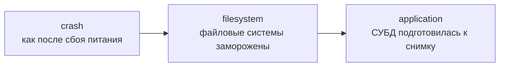

| Уровень | Что делается | Что увидит СУБД, когда копию запустят |
|---|---|---|
| `crash` | ничего | то же, что после выдернутого шнура: восстановление по журналу, последние незаписанные данные потеряны |
| `filesystem` | агент замораживает файловые системы | файловые системы целы, но СУБД всё равно проходит восстановление |
| `application` | та же заморозка, а перед ней сценарии готовят СУБД | чистый старт с минимальным восстановлением |

> [!IMPORTANT]
> Для службы `filesystem` и `application` — один и тот же вызов. Разница только
> в том, установлены ли в госте сценарии, а этого служба проверить не может.
> Уровень `application` заявляет администратор. Если сценариев нет, точка всё
> равно получит `application`, хотя на деле это `filesystem`.

---

## 2. Кто участвует

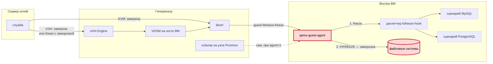

Красным выделено то, что действительно замораживает: агент и файловые
системы. Пунктиром — сценарии: они только готовят СУБД.

- **Служба** решает, нужна ли заморозка, просит о ней гипервизор, следит за
  временем и записывает, что получилось. Команд в госте она не выполняет — так
  задумано: у сервера копий нет доступа внутрь ВМ.
- **Гипервизор** передаёт просьбу агенту:
  - на голом KVM это делает libvirt;
  - на oVirt служба обращается к движку, а тот через VDSM на хосте ВМ доходит
    до того же libvirt;
  - Proxmox замораживает гостя сам во время `vzdump`, служба в этом не
    участвует.
- **qemu-guest-agent** — небольшая служба внутри ВМ. По команде гипервизора он
  сначала запускает сценарии, потом замораживает файловые системы. В Windows
  вместо сценариев работает VSS: агент вызывает VSS-писателей (SQL Server и
  другие), ставить ничего не нужно.
- **Сценарии** из комплекта `deploy/guest-hooks` готовят СУБД. Их ставит
  администратор в каждую ВМ с базой данных.

### Кто именно замораживает

> [!IMPORTANT]
> Файловые системы замораживает сама программа qemu-guest-agent внутри ВМ:
> системным вызовом `ioctl(FIFREEZE)` на каждую файловую систему. В комплекте
> нет ни одного скрипта, который замораживал бы ФС. Сценарии `fsfreeze-hook`
> только готовят СУБД перед заморозкой и могут её отменить, вернув ошибку.

| Шаг | Кто выполняет | Где это | Замораживает сам? |
|---|---|---|---|
| решить и попросить | служба | KVM — `Conn.FreezeFilesystems` в [internal/libvirtx/domain.go](../internal/libvirtx/domain.go); oVirt — `Client.FreezeFilesystems` в [internal/ovirt/actions.go](../internal/ovirt/actions.go); режим «Движок» — `Client.StartBackup` с `require_consistency` в [internal/ovirt/backup.go](../internal/ovirt/backup.go) | нет, только просит |
| передать агенту | libvirt; на oVirt перед ним движок и VDSM; на Proxmox — `vzdump` | вне репозитория | нет |
| подготовить СУБД | диспетчер `fsfreeze-hook`, сценарии `50-jhvirt-mysql` и `50-jhvirt-postgresql` | [deploy/guest-hooks/linux](../deploy/guest-hooks/linux) | нет: готовят СУБД и могут отменить заморозку |
| **заморозить ФС** | **qemu-guest-agent** | сам агент, команда `guest-fsfreeze-freeze`; в исходниках QEMU — каталог `qga/` | **да** |
| заморозить ФС в Windows | qemu-guest-agent с VSS-провайдером `qga-vss.dll` | ставится вместе с virtio-win guest tools | да, через VSS |

Проверить каждое звено можно руками, без службы:

- **Только сценарии, без заморозки** — в госте:

  ```bash
  sudo sh guest-hooks/linux/install.sh --check
  ```

- **Весь путь через агент на KVM** — на хосте. Пока гость заморожен, запись в
  нём стоит, поэтому размораживайте сразу:

  ```bash
  virsh domfsfreeze <имя-ВМ>
  ```

  ```bash
  virsh domfsthaw <имя-ВМ>
  ```

- **Заморожен ли гость сейчас** — ответ `frozen` или `thawed`:

  ```bash
  virsh qemu-agent-command <имя-ВМ> '{"execute":"guest-fsfreeze-status"}'
  ```

---

## 3. Что происходит внутри ВМ

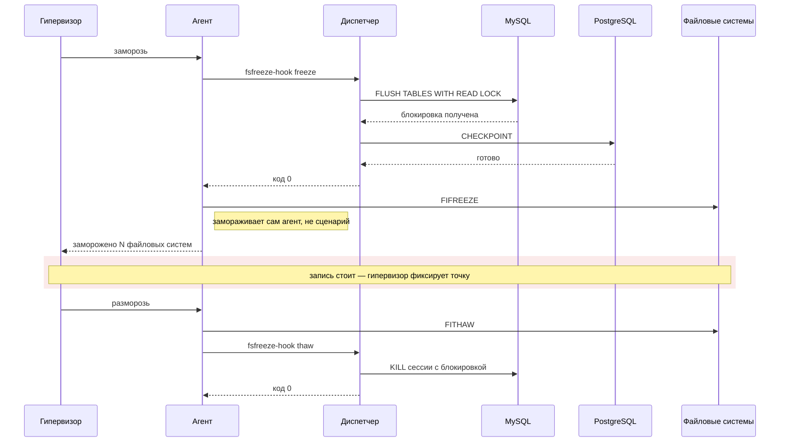

Порядок важен: при заморозке сначала сценарии, потом файловые системы, при
разморозке — наоборот. Сценарии запускаются в порядке имён, поэтому MySQL идёт
раньше PostgreSQL. Сценарий на разморозке работает уже на живой системе, и его
ошибка ничего не отменяет.

> [!NOTE]
> Сам агент по таймеру гостя не размораживает. Файловые системы стоят, пока
> кто-то не пришлёт команду «разморозь». Об этом заботится служба — см.
> [раздел 6](#6-предел-заморозки-и-сторож).

### Строгий диспетчер

Агент запускает один файл — диспетчер `fsfreeze-hook`, а тот по очереди
запускает сценарии из соседнего каталога `fsfreeze-hook.d`. Штатный диспетчер из
QEMU всегда отвечает агенту «всё хорошо», даже если сценарий СУБД упал. Агент
тогда замораживает файловые системы, и копия выглядит подготовленной, хотя
СУБД к ней не готовилась.

Поэтому в комплекте свой, строгий диспетчер. Отличие одно: при ошибке он
откатывает уже подготовленные сценарии и возвращает агенту ошибку. Агент
отменяет заморозку, а служба записывает причину в карточку точки.

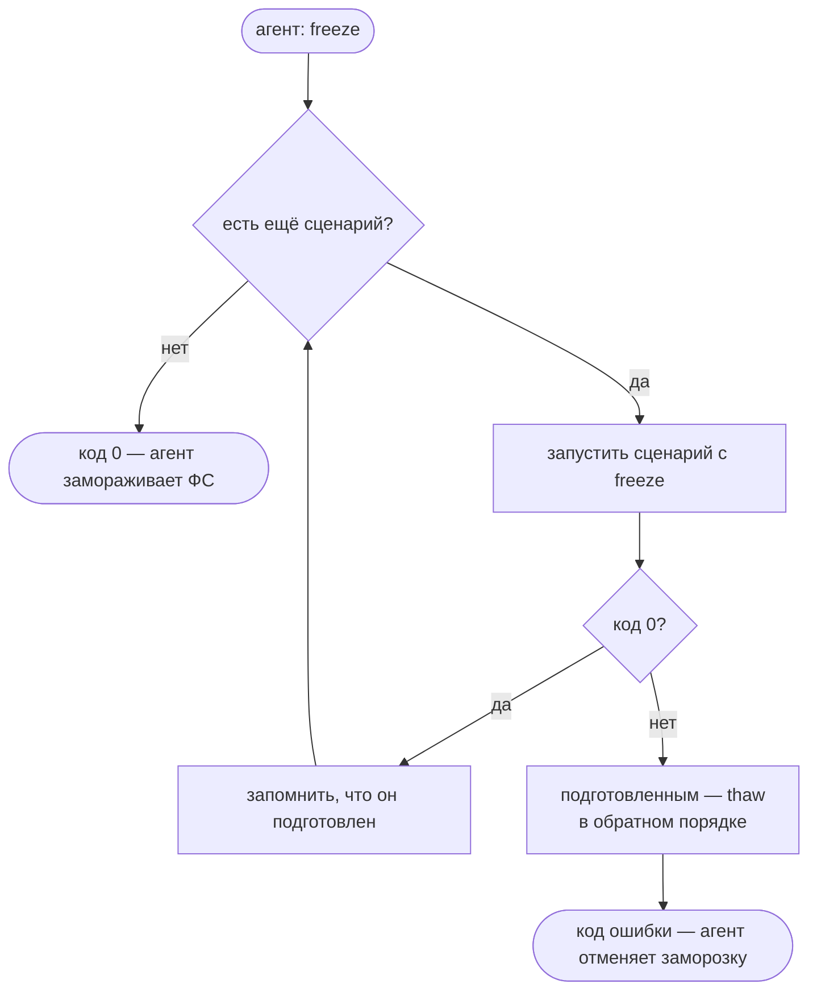

Журнал диспетчера — `/var/log/qga-fsfreeze-hook.log`. Если писать туда нельзя,
записи уходят в syslog с меткой `qemu-ga-freeze-hook`. Это первое место, куда
смотреть, если в карточке точки написано `fsfreeze hook has failed`.

### PostgreSQL

Сценарию достаточно выполнить `CHECKPOINT`:

- заморозка фиксирует все файлы кластера в один момент, так что копия
  восстановится по журналу WAL и без подготовки. `CHECKPOINT` только делает
  этот хвост журнала коротким;
- режим `pg_backup_start` здесь не нужен: он для копирования файлов по одному;
- запись `CHECKPOINT` не останавливает, на разморозке сценарий ничего не делает.

В СУБД сценарий заходит без пароля — от пользователя `postgres` через
Unix-сокет. Если база работает в поде Kubernetes на этом узле, сценарий
находит контейнер через `crictl` и выполняет `CHECKPOINT` внутри него.

### MySQL и MariaDB

Здесь сложнее: блокировку записи надо держать всё время, пока файловые системы
заморожены, а сценарий должен сразу вернуть управление агенту. Поэтому он
открывает фоновую сессию:

```sql
SELECT CONNECTION_ID();
FLUSH TABLES WITH READ LOCK;
SELECT 'jhvirt-locked';
DO SLEEP(120);
```

1. Сессия получает блокировку и засыпает, продолжая её держать.
2. Сценарий ждёт строку `jhvirt-locked`, не дольше `JHVIRT_HOOK_TIMEOUT`
   (30 с по умолчанию), и отвечает агенту «готово».
3. На разморозке сценарий завершает сессию командой `KILL`, и блокировка
   снимается.
4. Если разморозка так и не придёт — служба упала или оборвалась связь, —
   сессия закроется сама, когда кончится `SLEEP`: через 120 с по умолчанию.
   Запись не останется остановленной навсегда.

Если блокировку не удалось получить вовремя (обычно мешают длинные запросы),
сценарий снимает всё, что успел взять, и возвращает ошибку. Строгий диспетчер
отменит заморозку.

> [!NOTE]
> Запись в MySQL встаёт чуть раньше, чем файловые системы: с момента, когда
> сценарий получил блокировку. PostgreSQL в это время продолжает писать.

### Установка и настройки сценариев

Установщик `deploy/guest-hooks/linux/install.sh`:

- сам находит каталог агента;
- сохраняет штатный диспетчер рядом как `fsfreeze-hook.jhvirt-orig`;
- ставит строгий диспетчер и выбранные сценарии;
- проверяет, включён ли вызов хука в настройках агента.

`install.sh --check` прогоняет сценарии без заморозки файловых систем.
Пошаговая установка — в [OPERATIONS.md](OPERATIONS.md#сценарии-для-postgresql-и-mysqlmariadb).

Настройки сценариев лежат в `/etc/jhvirt/guest-hooks.conf` (владелец root,
права `0600`). Файл выполняется от root при каждой заморозке, поэтому сценарии
откажутся его читать, если он чужой или доступен на запись другим.

| Переменная | По умолчанию | Зачем |
|---|---|---|
| `JHVIRT_HOOK_TIMEOUT` | 30 | сколько ждать СУБД — на каждый порт или под, а не на весь прогон |
| `JHVIRT_PG_PORTS` | `5432` | порты кластеров PostgreSQL на самой ВМ |
| `JHVIRT_PG_K8S_TARGETS` | — | PostgreSQL в подах: `пространство_имён/контейнер` |
| `JHVIRT_MYSQL_DEFAULTS_FILE` | `/etc/jhvirt/mysql-freeze.cnf` | учётная запись MySQL, если вход как root из консоли не подходит |
| `JHVIRT_MYSQL_HOLD` | 120 | сколько блокировка MySQL живёт, если разморозка не пришла |
| `JHVIRT_MYSQL_K8S_TARGETS` | — | MySQL в подах |
| `JHVIRT_CRICTL` | `crictl` | для k3s и RKE2 — `k3s crictl` |

Полный список с пояснениями — в
[guest-hooks.conf.example](../deploy/guest-hooks/linux/guest-hooks.conf.example).

---

## 4. Как служба решает, морозить ли

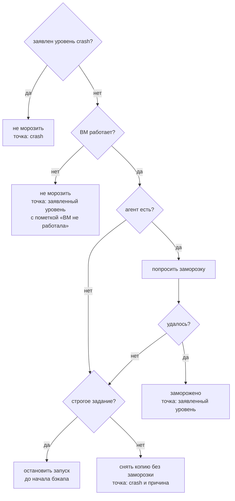

- **Выключенную ВМ замораживать незачем:** её диски и так не меняются.
- **Строгое задание останавливается до начала бэкапа.** На гипервизоре ещё
  нет ни блокировок, ни снапшотов, убирать нечего.
- **Нестрогое снимает копию «как после сбоя питания».** Это нормальная,
  годная копия. Просто обещание задания не выполнено, и об этом поднимается
  оповещение.

### Откуда служба знает про агента

- **oVirt** — из своего каталога, то есть по данным последней синхронизации
  инвентаря. Движок сообщает, что агент отвечает, а служба это запоминает.
  - Агент упал после синхронизации — служба всё равно попробует заморозить и
    получит ошибку.
  - Агент поднялся — служба не станет пробовать до следующей синхронизации.
- **KVM** — из описания ВМ в libvirt прямо в момент бэкапа: объявлен ли в ней
  канал агента. Если канал есть, а агент внутри не установлен, заморозка
  вернёт ошибку.

---

## 5. Сколько гость стоит замороженным

Этим режимы и отличаются друг от друга.

**KVM.** libvirt фиксирует точку меньше чем за секунду, и заморозка почти
незаметна.

**oVirt.** Перед фиксацией точки движок готовит scratch-диски или снапшот —
это фаза `initializing`, на oVirt 4.5 обычно 20 секунд и больше. Если служба
заморозит гостя до запроса бэкапа, запись простоит всё это время. Обычная ВМ
переживёт. Узел Kubernetes — нет:

- etcd не может сделать `fsync` и теряет лидерство;
- компоненты управления не продлевают аренду и перезапускаются;
- через 40 секунд kubelet переводит узел в NotReady.

Поэтому на oVirt есть три режима:

- **«Служба»** — служба замораживает гостя сама, до запроса бэкапа, и держит
  заморозку, пока точка не зафиксирована;
- **«Движок»** — служба просит движок заморозить гостя
  (`require_consistency=true`), и тот делает это сам, на доли секунды, уже
  после подготовки;
- **«Смешанный»** — служба пробует сама. Не смогла или не уложилась в предел —
  подключается движок.

Цифры на схеме примерные. Доли секунды нарисованы секундой, иначе полосу не
видно.

```mermaid
gantt
    title Когда в госте стоит запись
    dateFormat X
    axisFormat %M:%S
    todayMarker off

    section oVirt — Служба
    Сценарии СУБД                        :s1, 0, 2s
    Запись стоит — движок готовит бэкап  :crit, s2, after s1, 25s
    Гость работает — диски читаются      :s3, after s2, 30s

    section oVirt — Движок
    Гость работает — движок готовит бэкап :e1, 0, 25s
    Сценарии СУБД                         :e2, after e1, 2s
    Запись стоит                          :crit, e3, after e2, 1s
    Гость работает — диски читаются       :e4, after e3, 30s

    section KVM
    Сценарии СУБД                         :k1, 0, 2s
    Запись стоит                          :crit, k2, after k1, 1s
    Гость работает — диски читаются       :k3, after k2, 30s
```

### Режим «Служба»

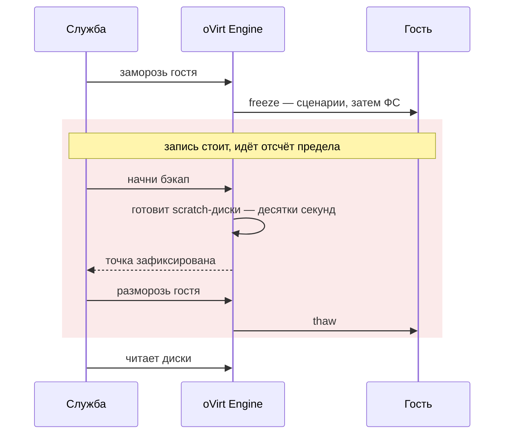

Плюс режима — служба точно знает, сколько гость стоял, и показывает это в
хронологии. Минус — стоит он всю подготовку бэкапа. Режим оставлен для
движков старше 4.4 и для заданий, созданных до появления выбора.

### Режим «Движок»

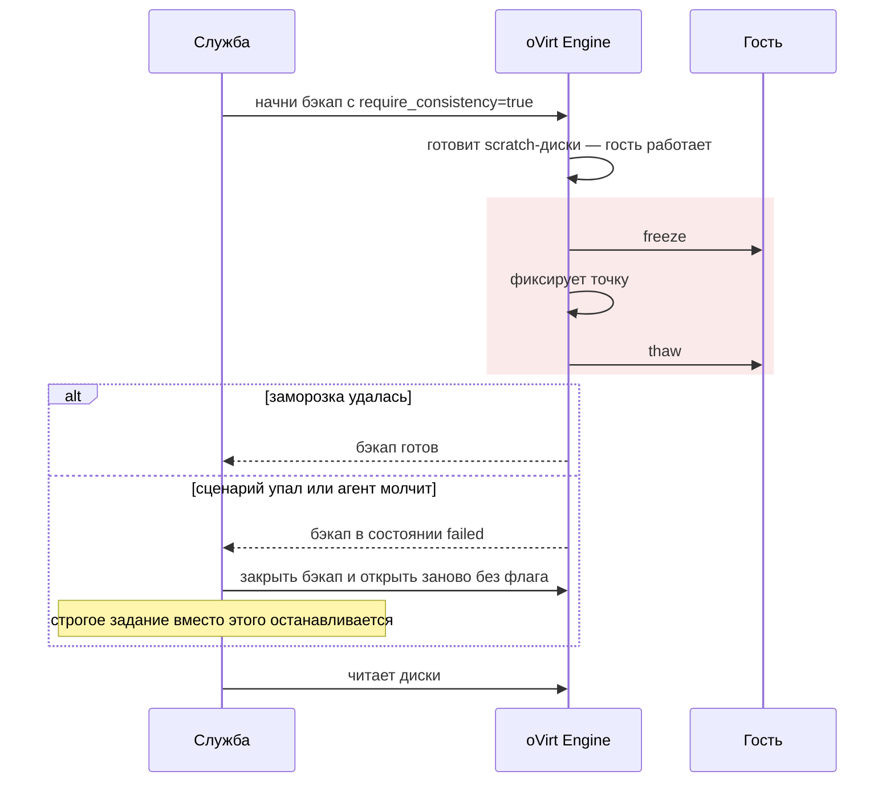

- **Зачем флаг.** Без `require_consistency` движок тоже пробует заморозить
  гостя, но при неудаче молча продолжает. С флагом неудача видна: бэкап
  переходит в `failed`.
- **Как служба понимает `failed`.** Она считает, что почти всегда это
  неудавшаяся заморозка: сценарий упал или агент не ответил. Нестрогое
  задание повторяет бэкап без флага и получает уровень `crash` с причиной.
- **Минус режима** — движок не сообщает, сколько держал заморозку. В
  хронологии вместо «Гость заморожен» и «Гость разморожен» стоит одна отметка:
  «Движок заморозил гостя на момент фиксации точки».

### Режим «Смешанный»

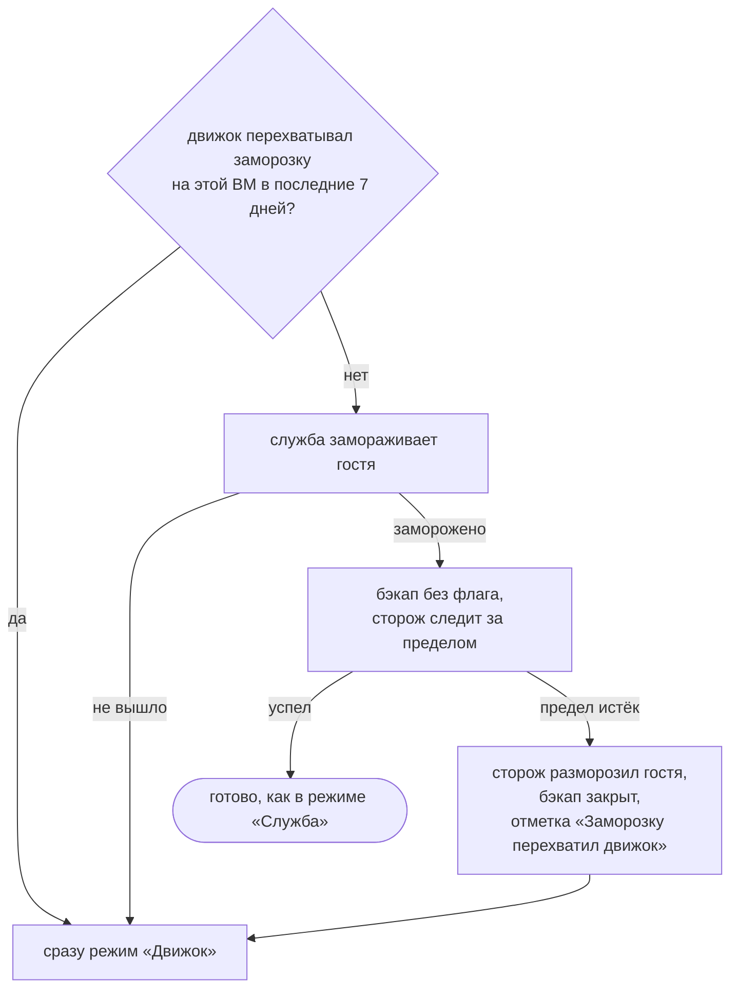

Так выглядит перехват, если предел заморозки 15 секунд, а движок готовит
бэкап 25:

```mermaid
gantt
    title Смешанный режим — служба не уложилась в предел
    dateFormat X
    axisFormat %M:%S
    todayMarker off

    section Гость
    Запись стоит — заморозила служба   :crit, g1, 0, 15s
    Работает — сторож разморозил       :g2, after g1, 35s
    Запись стоит — заморозил движок    :crit, g3, after g2, 1s
    Работает — диски читаются          :g4, after g3, 20s

    section Движок
    Первая подготовка бэкапа           :d1, 0, 25s
    Вторая подготовка — с заморозкой   :d2, after d1, 25s
    Бэкап готов                        :d3, after d2, 21s
```

- **Цена перехвата.** Подключить движок к уже идущему бэкапу нельзя:
  `require_consistency` задаётся только при создании. Поэтому перехват стоит
  второй подготовки бэкапа, но не второй долгой паузы записи.
- **Перехват запоминается.** Следующие 7 дней смешанный режим на этой ВМ
  сразу отдаёт заморозку движку, а потом служба пробует снова.
- **Если служба просто не смогла заморозить гостя**, движок подключается
  сразу, но это не запоминается: такая причина обычно разовая.

### Другие пути

- **KVM** — замораживает всегда служба. Режимы «Движок» и «Смешанный» API не
  примет: там нет движка.
- **oVirt через временный снапшот** — для дисков и движков без отслеживания
  изменений. Замораживает всегда служба, какой бы режим ни был выбран в
  задании. Есть тонкость, см. [раздел 9](#9-подводные-камни).
- **Экспорт OVA** — гость не замораживается.
- **Proxmox** — гостя замораживает сам `vzdump` при `agent=1` в настройках
  гостя, через тот же агент и те же сценарии. Результата служба не видит,
  поэтому:
  - требовать уровень в задании Proxmox нельзя;
  - в хронологии нет отметок заморозки;
  - уровень у точки не записывается.

---

## 6. Предел заморозки и сторож

Пока служба держит гостя замороженным (режимы «Служба» и «Смешанный», KVM,
снапшот), за временем следит сторож.

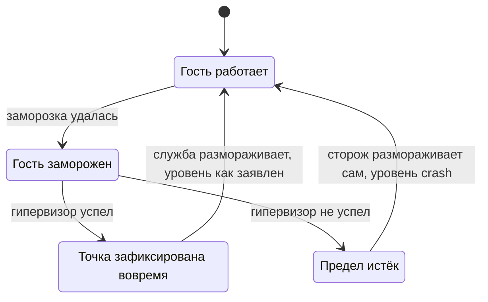

- **Предел выбирается по порядку:**
  1. поле задания «Предел заморозки, с»;
  2. если там 0 — настройка службы `backup.max_freeze`;
  3. если нет и её — 60 секунд.
- **Отсчёт идёт с момента, когда заморозка удалась.** Время работы сценариев
  в него не входит. Его видно отдельно, как длительность отметки «Гость
  заморожен».
- **Истёкший предел копию не портит.** Точка фиксируется уже на живом госте и
  становится «как после сбоя питания». Строгое задание в этом случае
  останавливается, а открытый бэкап закрывается.
- **В режиме «Движок» предел не нужен:** движок держит заморозку доли секунды.

**Разморозка обязательна при любом исходе.** Замороженный гость не
обслуживает ничего, что пишет на диск, поэтому:

- гость размораживается и при ошибке, и при отмене запуска — у разморозки
  свой контекст, который отмена не трогает;
- если первая попытка не удалась, вторая делается раньше долгой уборки:
  закрытия бэкапа или слияния снапшота;
- если разморозить не вышло совсем, служба кричит об этом везде: в журнале
  ошибка капсом, в хронологии «Не удалось разморозить гостя», в карточке
  запуска красный баннер.

> [!CAUTION]
> Увидели «Не удалось разморозить гостя» — проверьте ВМ руками. На KVM
> выполните `virsh domfsthaw <имя>`, на oVirt — `thawfilesystems` через
> REST API движка.

---

## 7. Откуда служба берёт настройки

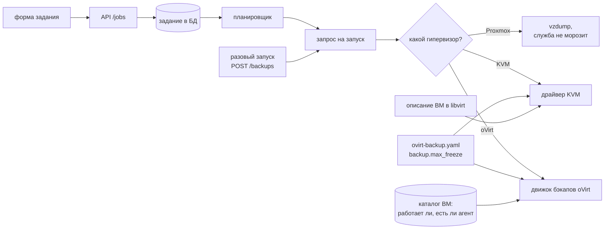

| Поле в форме задания | Поле API | Если не задано |
|---|---|---|
| Согласованность копии | `consistency` | выводится из старого флага `quiesce`: была заморозка — `filesystem`, не было — `crash` |
| Если согласованность не достигнута | `require_consistency` | копия сохраняется как после сбоя питания |
| Кто замораживает гостя | `freeze_by` | служба; новые задания oVirt в интерфейсе получают «Движок» |
| Предел заморозки, с | `max_freeze_seconds` | `backup.max_freeze` из настроек службы, по умолчанию 60 с |

Что проверяется при сохранении:

- режимы «Движок» и «Смешанный» — только для oVirt и его производных;
- строгое требование недоступно для Proxmox и бессмысленно для `crash`:
  его флаг сбрасывается сам;
- предел в задании — от 0 до 600 секунд, в настройках службы — от 1 секунды
  до 10 минут.

Разовый запуск (`POST /backups`) принимает те же поля, но без задания.
Строгое требование в нём работает, только если уровень указан явно.

---

## 8. Что остаётся после запуска

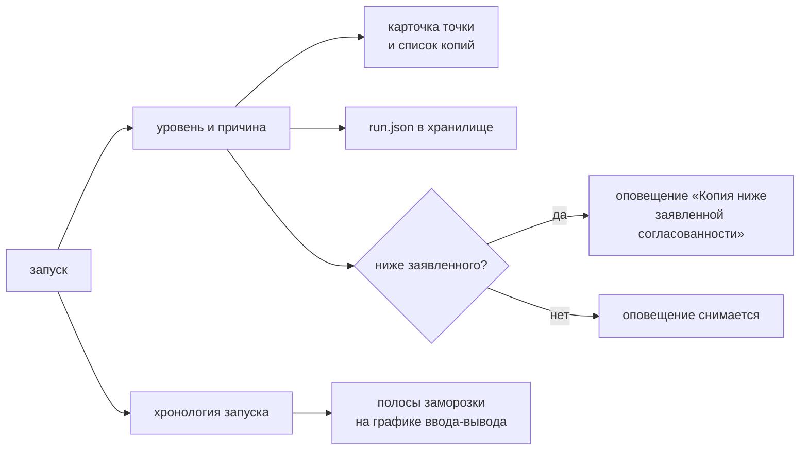

Уровень пишется не только в базу, но и в `run.json` рядом с данными копии,
поэтому он переживёт даже потерю каталога. Оповещение снимается само, как
только очередная точка того же задания достигнет уровня.

Отметки в хронологии запуска:

| Отметка | Что значит | Длительность |
|---|---|---|
| Запрошена заморозка гостя | служба попросила заморозку или бэкап с заморозкой движком | — |
| Гость заморожен | заморозка удалась | сколько готовились агент и сценарии |
| Заморозка не удалась | уровень понижен или запуск остановлен; причина — в подробностях | — |
| Гость разморожен | запись снова идёт | сколько запись стояла |
| Не удалось разморозить гостя | проверьте ВМ руками | сколько гость уже стоит |
| Движок заморозил гостя на момент фиксации точки | режим «Движок» | движок её не сообщает |
| Заморозку перехватил движок | смешанный режим передал заморозку движку | — |
| Точка зафиксирована на движке | дальше данные читаются из точки | от запроса бэкапа |
| Снапшот создан | путь через временный снапшот | от запроса снапшота |

На графике ввода-вывода в карточке запуска время заморозки показано полосой.
Оранжевая полоса значит, что гость заморожен прямо сейчас, красная — что
разморозка не подтверждена.

---

## 9. Подводные камни

> [!WARNING]
> **На KVM заморозка может ждать дольше минуты.** В коде у вызова заморозки
> стоит предел 60 секунд, но до libvirt он не доходит: библиотека go-libvirt
> контекста не принимает. Сколько ждать ответа агента, решает сам libvirt
> (`virsh guest-agent-timeout`), и по умолчанию он ждёт без ограничения. Со
> 60-секундным пределом разморозки то же самое. Сторож тут не спасает: он
> включается только после того, как заморозка удалась. Строка «тайм-аут
> заморозки на KVM» в
> [OPERATIONS.md](OPERATIONS.md#если-уровень-не-достигнут) описывает замысел,
> а не нынешнее поведение.

> [!WARNING]
> **В пути через снапшот гость размораживается раньше, чем готов снапшот.**
> Движок создаёт снапшот асинхронно: запрос возвращается сразу, а снапшот
> появляется позже. Служба держит заморозку только на время запроса, а уровень
> точке ставит по своей заморозке. Замораживает ли гостя сам движок в момент
> снапшота, служба не видит. Проверить на стенде можно так: сравнить время
> записей в `/var/log/qga-fsfreeze-hook.log` в госте с отметками «Гость
> разморожен» и «Снапшот создан».

> [!NOTE]
> **Про агента на oVirt служба узнаёт с опозданием** — из последней
> синхронизации инвентаря, а не перед самим бэкапом. Что из этого следует — в
> [разделе 4](#откуда-служба-знает-про-агента).

> [!NOTE]
> **Уровень `application` не проверяется.** Установлены ли сценарии, служба не
> видит. Проверяйте `install.sh --check` в госте. Подробнее — в
> [LIMITATIONS.md](LIMITATIONS.md#согласованность-приложения-что-проверено-а-что-нет).

---

## 10. Где что в коде

На GitHub ссылки открывают файлы. Во встроенной документации это просто пути
в репозитории.

**Решения службы**

| Что | Где |
|---|---|
| уровни, режимы и сравнение уровней | [internal/model/consistency.go](../internal/model/consistency.go) |
| морозить ли, что делать при неудаче | `QuiesceGuest`, `EngineQuiesce` — [internal/backup/consistency.go](../internal/backup/consistency.go) |
| предел и сторож | `FreezeWindow`, `RunRequest.FreezeLimit`, `DefaultMaxFreeze` — [internal/backup/freeze_window.go](../internal/backup/freeze_window.go) |
| режимы на oVirt | `runCBT`, `openBackupServiceFreeze`, `openBackupEngineFreeze`, `openBackupMixedFreeze`, `runSnapshot`, `quiesce`, `guardFreeze`, `settleFreeze` — [internal/backup/runner.go](../internal/backup/runner.go) |
| KVM | `Driver.Backup`, `Driver.quiesce`, `Driver.thaw` — [internal/kvm/driver.go](../internal/kvm/driver.go) |
| выбор гипервизора | `Dispatcher.Execute`, `executeLibvirt` — [internal/dispatch/dispatch.go](../internal/dispatch/dispatch.go); Proxmox — [internal/dispatch/proxmox.go](../internal/dispatch/proxmox.go) |

**Вызовы гипервизора**

| Что | Где |
|---|---|
| заморозка и разморозка через libvirt, канал агента в описании ВМ | `Conn.FreezeFilesystems`, `Conn.ThawFilesystems`, `ParseDomainXML` — [internal/libvirtx/domain.go](../internal/libvirtx/domain.go) |
| заморозка и разморозка через oVirt | `Client.FreezeFilesystems`, `Client.ThawFilesystems` — [internal/ovirt/actions.go](../internal/ovirt/actions.go) |
| бэкап с `require_consistency`, распознавание `failed` | `Client.StartBackup`, `Client.WaitBackupReady`, `ErrBackupFailed` — [internal/ovirt/backup.go](../internal/ovirt/backup.go) |
| отвечает ли агент на oVirt | `VM.HasGuestAgent` — [internal/ovirt/types.go](../internal/ovirt/types.go) |

**Настройки, хранение, оповещения**

| Что | Где |
|---|---|
| поля задания, вывод уровня из `quiesce`, верхний предел | `BackupJob`, `NormalizeConsistency`, `MaxFreezeLimit` — [internal/model/backup.go](../internal/model/backup.go) |
| API задания и разового запуска | `jobPayload`, `validateJob`, `adHocRequest` — [internal/api/handlers_backup.go](../internal/api/handlers_backup.go) |
| предел службы | `backup.max_freeze` — [internal/config/config.go](../internal/config/config.go), [config/ovirt-backup.yaml](../config/ovirt-backup.yaml) |
| перенос настроек в запуск, оповещение о понижении | `RunRequest`, `checkConsistency` — [internal/scheduler/scheduler.go](../internal/scheduler/scheduler.go) |
| отметки хронологии и память смешанного режима | [internal/model/run_event.go](../internal/model/run_event.go), `LastRunEventAt` — [internal/store/run_events.go](../internal/store/run_events.go) |
| уровень в `run.json` | `RunManifest` — [internal/backup/format.go](../internal/backup/format.go) |
| столбцы в БД | миграции [0043](../internal/store/migrations/0043_backup_consistency.sql), [0047](../internal/store/migrations/0047_backup_max_freeze.sql), [0049](../internal/store/migrations/0049_backup_freeze_by.sql), [0050](../internal/store/migrations/0050_backup_freeze_mixed.sql) |

**Интерфейс**

| Что | Где |
|---|---|
| форма задания | [web/src/pages/JobsPage.vue](../web/src/pages/JobsPage.vue), подсказки к режимам — [web/src/api/format.ts](../web/src/api/format.ts) |
| карточка запуска, полосы заморозки, баннеры | [web/src/pages/BackupsPage.vue](../web/src/pages/BackupsPage.vue) |
| статья справки «Согласованность копии и заморозка гостя» | [internal/api/help.go](../internal/api/help.go) |

**Внутри ВМ**

| Что | Где |
|---|---|
| строгий диспетчер | [deploy/guest-hooks/linux/fsfreeze-hook](../deploy/guest-hooks/linux/fsfreeze-hook) |
| PostgreSQL | [fsfreeze-hook.d/50-jhvirt-postgresql](../deploy/guest-hooks/linux/fsfreeze-hook.d/50-jhvirt-postgresql) |
| MySQL и MariaDB | [fsfreeze-hook.d/50-jhvirt-mysql](../deploy/guest-hooks/linux/fsfreeze-hook.d/50-jhvirt-mysql) |
| установщик | [deploy/guest-hooks/linux/install.sh](../deploy/guest-hooks/linux/install.sh) |
| пример настроек | [deploy/guest-hooks/linux/guest-hooks.conf.example](../deploy/guest-hooks/linux/guest-hooks.conf.example) |
