# Заморозка гостя: как устроено и где в коде

Перед снимком работающей ВМ служба может ненадолго остановить запись внутри
гостя. Тогда копия получается аккуратной, а не такой, будто у машины выдернули
шнур питания. Здесь по шагам разобрано, кто в этом участвует, что происходит
внутри ВМ, чем отличаются режимы заморозки и где всё это лежит в коде.

Практические вопросы собраны в
[OPERATIONS.md](OPERATIONS.md#согласованность-копий-субд): какой уровень
выбрать, как поставить сценарии, что делать, если уровень не достигнут.
Схемы ниже рисует GitHub. Во встроенной документации они показаны исходником
Mermaid — он тоже читается.

---

## Коротко

- **Горячему бэкапу заморозка не нужна.** ВМ и приложения в ней работают и
  без неё: точку фиксирует гипервизор, а служба читает её, пока гость пишет.
  Заморозка же останавливает запись в госте, поэтому новые задания её не
  включают. Как не остановить приложения — в
  [разделе 2](#2-горячий-бэкап-вм-и-приложения-продолжают-работать).
- **Заморозка — это стоп-кадр для файловых систем.** Гость сбрасывает на диск
  всё, что держал в памяти, и перестаёт писать, пока гипервизор фиксирует точку
  копии. Потом запись продолжается, а копия читается уже из зафиксированной
  точки.
- **Замораживает агент внутри ВМ** — qemu-guest-agent. Служба только просит об
  этом через libvirt или через движок oVirt. Ни один сценарий из комплекта
  файловые системы не замораживает, подробнее — в
  [разделе 3](#кто-именно-замораживает).
- **Перед заморозкой агент запускает сценарии.** Сценарий PostgreSQL выполняет
  `CHECKPOINT`, сценарий MySQL берёт блокировку записи: так СУБД успевает
  подготовиться к снимку.
- **Служба в гость не заходит.** Сценариев она не видит и узнаёт одно:
  заморозка удалась или нет.
- **Пока гость заморожен, запись в нём стоит.** Поэтому у заморозки есть
  предел. Если гипервизор тянет, служба размораживает гостя сама, не
  дожидаясь его.
- **Неудача не ломает копию.** Если заморозить не вышло, копия всё равно
  снимается «как после сбоя питания», а причина видна в карточке. Задание со
  строгим требованием вместо этого останавливается.

---

## 1. Три уровня копии

Данные на дисках от уровня не зависят: служба в любом случае читает то, что
лежит на диске в момент точки. Разница в том, что происходило внутри гостя в
этот момент.

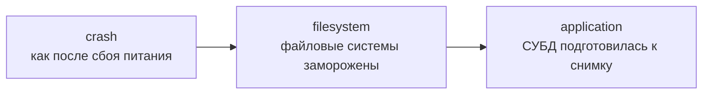
```mermaid
flowchart LR
    C["crash<br/>как после сбоя питания"] --> F["filesystem<br/>файловые системы заморожены"]
    F --> A["application<br/>СУБД подготовилась к снимку"]
```

| Уровень | Что делается | Что увидит СУБД, когда копию запустят |
|---|---|---|
| `crash` | ничего | то же, что после выдернутого шнура: восстановление по журналу, последние незаписанные данные потеряны |
| `filesystem` | агент замораживает файловые системы | файловые системы целы, но СУБД всё равно проходит восстановление |
| `application` | та же заморозка, а перед ней сценарии готовят СУБД | чистый старт с минимальным восстановлением |

> [!IMPORTANT]
> Для службы `filesystem` и `application` — один и тот же вызов. Разница только
> в том, установлены ли в госте сценарии, а этого служба проверить не может.
> Уровень `application` заявляет администратор. Если сценариев нет, точка всё
> равно получит `application`, хотя на деле это `filesystem`.

---

## 2. Горячий бэкап: ВМ и приложения продолжают работать

Горячий бэкап не должен останавливать ни ВМ, ни приложения в ней. ВМ не
выключается ни на одном пути: гипервизор фиксирует точку, и служба читает её,
пока гость работает. Приложения страдают иначе — у них встаёт запись на диск.
Заморозка как раз и останавливает запись, поэтому по умолчанию служба гостя не
замораживает.

### Что может остановить запись в госте

| Причина | Сколько стоит запись | Когда бывает | Как избежать |
|---|---|---|---|
| заморозка службой | от заморозки до фиксации точки: на KVM меньше секунды, на oVirt в режиме «Служба» — вся подготовка бэкапа, но не дольше предела | уровень `filesystem` или `application` | уровень `crash`; на oVirt — режим «Движок»; на KVM — заморозка только нужных файловых систем |
| заморозка движком oVirt | доли секунды | режим «Движок»; без него движок тоже пробует заморозить гостя с работающим агентом | служба это не отключает; приложения такую паузу обычно не замечают |
| заморозка `vzdump` | доли секунды | Proxmox с `agent=1` | опция агента ВМ `freeze-fs-on-backup=0` |
| блокировка MySQL | с `FLUSH TABLES WITH READ LOCK` до разморозки; если блокировку задерживают длинные запросы — до `JHVIRT_HOOK_TIMEOUT`, 30 с | уровень `application` со сценарием MySQL | уровень `crash` или логический дамп |
| неснятая заморозка | пока гостя не разморозят | сбой вызова, связи или службы во время заморозки | сторож предела и разморозка после ошибки — [раздел 7](#7-предел-заморозки-и-сторож) |
| место и нагрузка | от замедления до паузы ВМ | мало места на домене или под scratch, медленное хранилище | сторожа места и предел чтения — [HOT-BACKUP.md](HOT-BACKUP.md#3-чем-бэкап-может-помешать-работающей-вм) |

> [!TIP]
> Чтобы приложения не заметили бэкап:
> - оставьте уровень `crash` — это умолчание для новых заданий, разового
>   бэкапа и готовых расписаний;
> - согласованные копии СУБД снимайте логическими дампами: они запись не
>   останавливают вовсе, см.
>   [OPERATIONS.md](OPERATIONS.md#логические-дампы-субд);
> - если заморозка всё же нужна, на oVirt выбирайте режим «Движок», на KVM —
>   заморозку только тома СУБД.

> [!WARNING]
> Задания oVirt, созданные до появления выбора режима, замораживают силами
> службы. Запись в госте стоит всю подготовку бэкапа на движке: на oVirt 4.5
> обычно 20 секунд и больше, но не дольше предела заморозки, по умолчанию 60 с.
> Узлу Kubernetes или нагруженной СУБД этого хватит, чтобы упасть. Переведите
> такие задания на уровень `crash` или режим «Движок». На странице заданий они
> помечены «замораживает служба» и перечислены в предупреждении над таблицей;
> сами задания служба не меняет.

### Где заморозка в горячем запуске

Заморозка — короткий эпизод в начале запуска. Всё долгое служба делает до неё
или после разморозки.

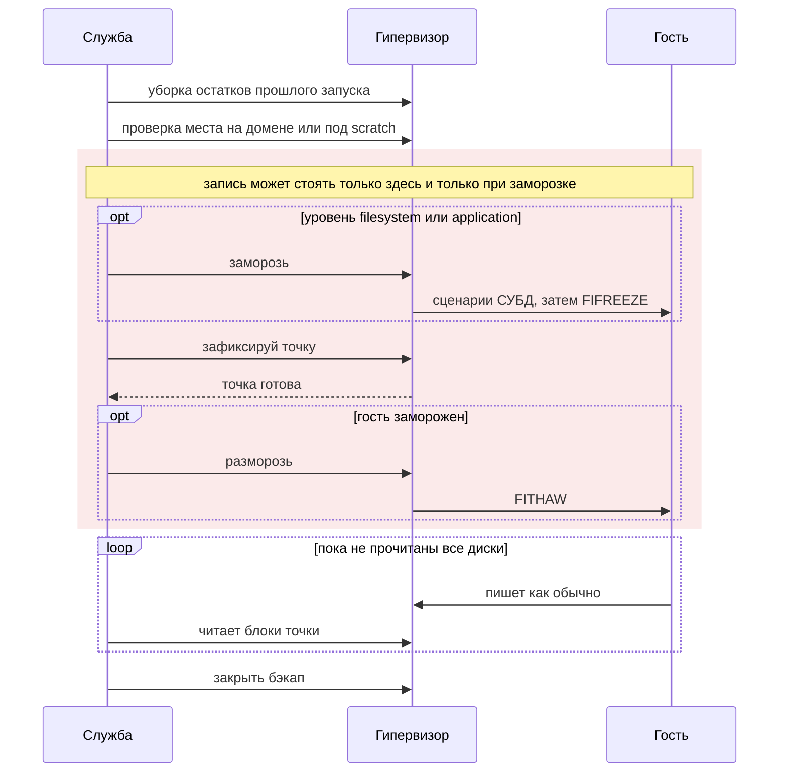
```mermaid
sequenceDiagram
    participant S as Служба
    participant H as Гипервизор
    participant G as Гость

    S->>H: уборка остатков прошлого запуска
    S->>H: проверка места на домене или под scratch
    rect rgba(220, 80, 80, 0.12)
        Note over S,G: запись может стоять только здесь и только при заморозке
        opt уровень filesystem или application
            S->>H: заморозь
            H->>G: сценарии СУБД, затем FIFREEZE
        end
        S->>H: зафиксируй точку
        H-->>S: точка готова
        opt гость заморожен
            S->>H: разморозь
            H->>G: FITHAW
        end
    end
    loop пока не прочитаны все диски
        G->>H: пишет как обычно
        S->>H: читает блоки точки
    end
    S->>H: закрыть бэкап
```

- **До заморозки** служба ждёт слияния брошенного снапшота, закрывает
  брошенный бэкап и проверяет место. Эти шаги могут идти минутами, и гость в
  это время работает. Если места мало, запуск останавливается ещё до
  заморозки.
- **Под заморозкой** остаётся только фиксация точки. На KVM это меньше
  секунды. На oVirt в режиме «Движок» заморозка тоже укладывается в доли
  секунды, потому что движок морозит уже после подготовки.
- **Разморозка** идёт сразу после фиксации точки, до чтения дисков.
- **Чтение дисков**, сторожа места и закрытие бэкапа идут на работающем госте.

### Какой путь как замораживает

| Путь | Когда используется | Кто замораживает | Что выбирается в задании | Сколько стоит запись при заморозке |
|---|---|---|---|---|
| oVirt, Backup API: полный, инкремент, смешанный | движок 4.4+ с любыми дисками: raw, qcow2, смешанные | служба, движок или оба | «Служба», «Движок», «Смешанный» | «Движок» — доли секунды, «Служба» — вся подготовка бэкапа |
| oVirt, временный снапшот | движок без Backup API или тип «Полный через снапшот» | служба | режим не учитывается | время запроса снапшота |
| KVM, pull-бэкап libvirt | всегда | служба через libvirt | можно выбрать файловые системы | меньше секунды |
| Proxmox, `vzdump` | всегда | `vzdump` при `agent=1` | ничего | доли секунды, служба её не видит |
| экспорт OVA | по заданию | никто | ничего | не стоит |

### Смешанный бэкап и откат к полному

Смешанный бэкап на oVirt снимает qcow2-диски изменениями, а raw-диски — целиком.
Но это один бэкап на движке и одна точка. Значит, и заморозка одна на все
диски: отдельной паузы для raw-диска нет.

Движок старше 4.4.5 смешанный бэкап отклоняет, и служба открывает бэкап заново,
уже полным. Что при этом переживает гость, зависит от режима:

- **«Движок»** — отказ приходит раньше заморозки: движок проверяет запрос до
  того, как обращается к гостю. Лишней паузы нет.
- **«Служба» и «Смешанный»** — гость уже заморожен, когда приходит отказ.
  Служба сразу размораживает его, а для полного бэкапа замораживает заново.
  Первая пауза короткая: отказ приходит без подготовки бэкапа.

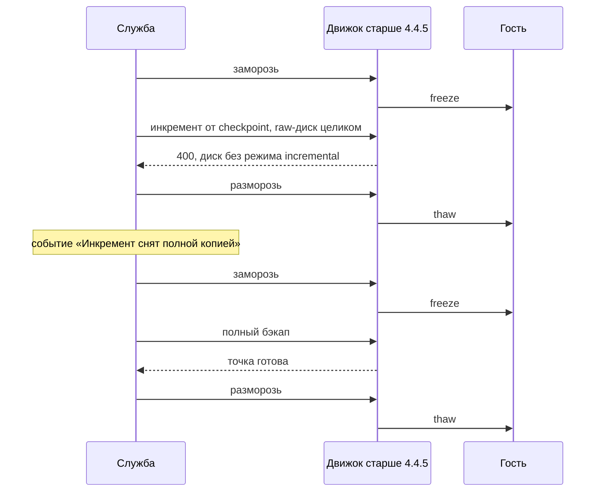
```mermaid
sequenceDiagram
    participant S as Служба
    participant E as Движок старше 4.4.5
    participant G as Гость

    S->>E: заморозь
    E->>G: freeze
    S->>E: инкремент от checkpoint, raw-диск целиком
    E-->>S: 400, диск без режима incremental
    S->>E: разморозь
    E->>G: thaw
    Note over S: событие «Инкремент снят полной копией»
    S->>E: заморозь
    E->>G: freeze
    S->>E: полный бэкап
    E-->>S: точка готова
    S->>E: разморозь
    E->>G: thaw
```

В хронологии такого запуска две пары отметок «Гость заморожен» и «Гость
разморожен». Вторая заморозка случается один раз, а не каждую ночь: служба
запоминает отказ, и следующие 7 дней инкременты этой ВМ сразу идут полными,
с одной заморозкой. Через неделю служба пробует снова — движок могли
обновить. Как устроен смешанный бэкап — в
[HOT-BACKUP.md](HOT-BACKUP.md#2а-любая-вм-на-ovirt).

---

## 3. Кто участвует

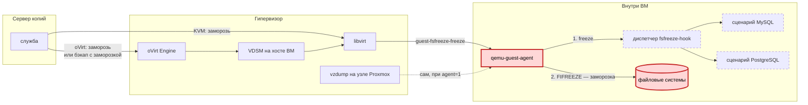
```mermaid
flowchart LR
    subgraph backup["Сервер копий"]
        S["служба"]
    end
    subgraph hv["Гипервизор"]
        E["oVirt Engine"]
        V["VDSM на хосте ВМ"]
        L["libvirt"]
        P["vzdump на узле Proxmox"]
    end
    subgraph vm["Внутри ВМ"]
        A["qemu-guest-agent"]
        H["диспетчер fsfreeze-hook"]
        MY["сценарий MySQL"]
        PG["сценарий PostgreSQL"]
        FS[("файловые системы")]
    end
    S -->|"KVM: заморозь"| L
    S -->|"oVirt: заморозь<br/>или бэкап с заморозкой"| E
    E --> V
    V --> L
    L -->|"guest-fsfreeze-freeze"| A
    P -.->|"сам, при agent=1"| A
    A -->|"1. freeze"| H
    H --> MY
    H --> PG
    A -->|"2. FIFREEZE — заморозка"| FS

    classDef freezer fill:#ffd7d7,stroke:#c62828,stroke-width:3px,color:#000
    classDef prep stroke-dasharray:5 5
    class A,FS freezer
    class H,MY,PG prep
```

Красным выделено то, что действительно замораживает: агент и файловые
системы. Пунктиром — сценарии: они только готовят СУБД.

- **Служба** решает, нужна ли заморозка, просит о ней гипервизор, следит за
  временем и записывает, что получилось. Команд в госте она не выполняет — так
  задумано: у сервера копий нет доступа внутрь ВМ.
- **Гипервизор** передаёт просьбу агенту:
  - на голом KVM это делает libvirt;
  - на oVirt служба обращается к движку, а тот через VDSM на хосте ВМ доходит
    до того же libvirt;
  - Proxmox замораживает гостя сам во время `vzdump`, служба в этом не
    участвует.
- **qemu-guest-agent** — небольшая служба внутри ВМ. По команде гипервизора он
  сначала запускает сценарии, потом замораживает файловые системы. В Windows
  вместо сценариев работает VSS: агент вызывает VSS-писателей (SQL Server и
  другие), ставить ничего не нужно.
- **Сценарии** из комплекта `deploy/guest-hooks` готовят СУБД. Их ставит
  администратор в каждую ВМ с базой данных.

### Кто именно замораживает

> [!IMPORTANT]
> Файловые системы замораживает сама программа qemu-guest-agent внутри ВМ:
> системным вызовом `ioctl(FIFREEZE)` на каждую файловую систему. В комплекте
> нет ни одного скрипта, который замораживал бы ФС. Сценарии `fsfreeze-hook`
> только готовят СУБД перед заморозкой и могут её отменить, вернув ошибку.

| Шаг | Кто выполняет | Где это | Замораживает сам? |
|---|---|---|---|
| решить и попросить | служба | KVM — `Conn.FreezeFilesystems` в [internal/libvirtx/domain.go](../internal/libvirtx/domain.go); oVirt — `Client.FreezeFilesystems` в [internal/ovirt/actions.go](../internal/ovirt/actions.go); режим «Движок» — `Client.StartBackup` с `require_consistency` в [internal/ovirt/backup.go](../internal/ovirt/backup.go) | нет, только просит |
| передать агенту | libvirt; на oVirt перед ним движок и VDSM; на Proxmox — `vzdump` | вне репозитория | нет |
| подготовить СУБД | диспетчер `fsfreeze-hook`, сценарии `50-jhvirt-mysql` и `50-jhvirt-postgresql` | [deploy/guest-hooks/linux](../deploy/guest-hooks/linux) | нет: готовят СУБД и могут отменить заморозку |
| **заморозить ФС** | **qemu-guest-agent** | сам агент, команда `guest-fsfreeze-freeze`; в исходниках QEMU — каталог `qga/` | **да** |
| заморозить ФС в Windows | qemu-guest-agent с VSS-провайдером `qga-vss.dll` | ставится вместе с virtio-win guest tools | да, через VSS |

Проверить каждое звено можно руками, без службы:

- **Только сценарии, без заморозки** — в госте:

  ```bash
  sudo sh guest-hooks/linux/install.sh --check
  ```

- **Весь путь через агент на KVM** — на хосте. Пока гость заморожен, запись в
  нём стоит, поэтому размораживайте сразу:

  ```bash
  virsh domfsfreeze <имя-ВМ>
  ```

  ```bash
  virsh domfsthaw <имя-ВМ>
  ```

- **Заморожен ли гость сейчас** — ответ `frozen` или `thawed`:

  ```bash
  virsh qemu-agent-command <имя-ВМ> '{"execute":"guest-fsfreeze-status"}'
  ```

---

## 4. Что происходит внутри ВМ

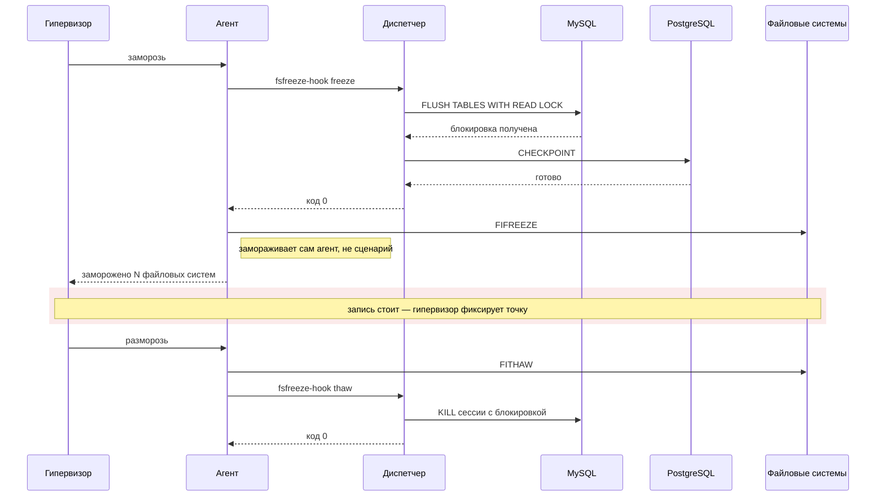
```mermaid
sequenceDiagram
    participant G as Гипервизор
    participant A as Агент
    participant H as Диспетчер
    participant MY as MySQL
    participant PG as PostgreSQL
    participant FS as Файловые системы

    G->>A: заморозь
    A->>H: fsfreeze-hook freeze
    H->>MY: FLUSH TABLES WITH READ LOCK
    MY-->>H: блокировка получена
    H->>PG: CHECKPOINT
    PG-->>H: готово
    H-->>A: код 0
    A->>FS: FIFREEZE
    Note right of A: замораживает сам агент, не сценарий
    A-->>G: заморожено N файловых систем
    rect rgba(220, 80, 80, 0.12)
        Note over G,FS: запись стоит — гипервизор фиксирует точку
    end
    G->>A: разморозь
    A->>FS: FITHAW
    A->>H: fsfreeze-hook thaw
    H->>MY: KILL сессии с блокировкой
    H-->>A: код 0
```

Порядок важен: при заморозке сначала сценарии, потом файловые системы, при
разморозке — наоборот. Сценарии запускаются в порядке имён, поэтому MySQL идёт
раньше PostgreSQL. Сценарий на разморозке работает уже на живой системе, и его
ошибка ничего не отменяет.

> [!NOTE]
> Сам агент по таймеру гостя не размораживает. Файловые системы стоят, пока
> кто-то не пришлёт команду «разморозь». Об этом заботится служба — см.
> [раздел 7](#7-предел-заморозки-и-сторож).

### Строгий диспетчер

Агент запускает один файл — диспетчер `fsfreeze-hook`, а тот по очереди
запускает сценарии из соседнего каталога `fsfreeze-hook.d`. Штатный диспетчер из
QEMU всегда отвечает агенту «всё хорошо», даже если сценарий СУБД упал. Агент
тогда замораживает файловые системы, и копия выглядит подготовленной, хотя
СУБД к ней не готовилась.

Поэтому в комплекте свой, строгий диспетчер. Отличие одно: при ошибке он
откатывает уже подготовленные сценарии и возвращает агенту ошибку. Агент
отменяет заморозку, а служба записывает причину в карточку точки.

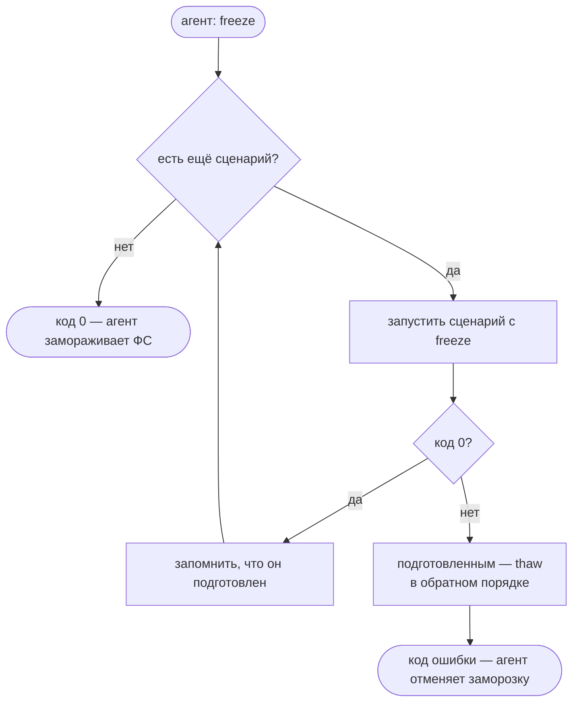
```mermaid
flowchart TD
    Start(["агент: freeze"]) --> Next{"есть ещё сценарий?"}
    Next -->|нет| Ok(["код 0 — агент замораживает ФС"])
    Next -->|да| Run["запустить сценарий с freeze"]
    Run --> Good{"код 0?"}
    Good -->|да| Remember["запомнить, что он подготовлен"]
    Remember --> Next
    Good -->|нет| Rollback["подготовленным — thaw<br/>в обратном порядке"]
    Rollback --> Fail(["код ошибки — агент отменяет заморозку"])
```

Журнал диспетчера — `/var/log/qga-fsfreeze-hook.log`. Если писать туда нельзя,
записи уходят в syslog с меткой `qemu-ga-freeze-hook`. Это первое место, куда
смотреть, если в карточке точки написано `fsfreeze hook has failed`.

### PostgreSQL

Сценарию достаточно выполнить `CHECKPOINT`:

- заморозка фиксирует все файлы кластера в один момент, так что копия
  восстановится по журналу WAL и без подготовки. `CHECKPOINT` только делает
  этот хвост журнала коротким;
- режим `pg_backup_start` здесь не нужен: он для копирования файлов по одному;
- запись `CHECKPOINT` не останавливает, на разморозке сценарий ничего не делает.

В СУБД сценарий заходит без пароля — от пользователя `postgres` через
Unix-сокет. Если база работает в поде Kubernetes на этом узле, сценарий
находит контейнер через `crictl` и выполняет `CHECKPOINT` внутри него.

### MySQL и MariaDB

Здесь сложнее: блокировку записи надо держать всё время, пока файловые системы
заморожены, а сценарий должен сразу вернуть управление агенту. Поэтому он
открывает фоновую сессию:

```sql
SELECT CONNECTION_ID();
FLUSH TABLES WITH READ LOCK;
SELECT 'jhvirt-locked';
DO SLEEP(120);
```

1. Сессия получает блокировку и засыпает, продолжая её держать.
2. Сценарий ждёт строку `jhvirt-locked`, не дольше `JHVIRT_HOOK_TIMEOUT`
   (30 с по умолчанию), и отвечает агенту «готово».
3. На разморозке сценарий завершает сессию командой `KILL`, и блокировка
   снимается.
4. Если разморозка так и не придёт — служба упала или оборвалась связь, —
   сессия закроется сама, когда кончится `SLEEP`: через 120 с по умолчанию.
   Запись не останется остановленной навсегда.

Если блокировку не удалось получить вовремя (обычно мешают длинные запросы),
сценарий снимает всё, что успел взять, и возвращает ошибку. Строгий диспетчер
отменит заморозку.

> [!NOTE]
> Запись в MySQL встаёт чуть раньше, чем файловые системы: с момента, когда
> сценарий получил блокировку. PostgreSQL в это время продолжает писать.

### Установка и настройки сценариев

Установщик `deploy/guest-hooks/linux/install.sh`:

- сам находит каталог агента;
- сохраняет штатный диспетчер рядом как `fsfreeze-hook.jhvirt-orig`;
- ставит строгий диспетчер и выбранные сценарии;
- проверяет, включён ли вызов хука в настройках агента.

`install.sh --check` прогоняет сценарии без заморозки файловых систем.
Пошаговая установка — в [OPERATIONS.md](OPERATIONS.md#сценарии-для-postgresql-и-mysqlmariadb).

Настройки сценариев лежат в `/etc/jhvirt/guest-hooks.conf` (владелец root,
права `0600`). Файл выполняется от root при каждой заморозке, поэтому сценарии
откажутся его читать, если он чужой или доступен на запись другим.

| Переменная | По умолчанию | Зачем |
|---|---|---|
| `JHVIRT_HOOK_TIMEOUT` | 30 | сколько ждать СУБД — на каждый порт или под, а не на весь прогон |
| `JHVIRT_PG_PORTS` | `5432` | порты кластеров PostgreSQL на самой ВМ |
| `JHVIRT_PG_K8S_TARGETS` | — | PostgreSQL в подах: `пространство_имён/контейнер` |
| `JHVIRT_MYSQL_DEFAULTS_FILE` | `/etc/jhvirt/mysql-freeze.cnf` | учётная запись MySQL, если вход как root из консоли не подходит |
| `JHVIRT_MYSQL_HOLD` | 120 | сколько блокировка MySQL живёт, если разморозка не пришла |
| `JHVIRT_MYSQL_K8S_TARGETS` | — | MySQL в подах |
| `JHVIRT_CRICTL` | `crictl` | для k3s и RKE2 — `k3s crictl` |

Полный список с пояснениями — в
[guest-hooks.conf.example](../deploy/guest-hooks/linux/guest-hooks.conf.example).

---

## 5. Как служба решает, морозить ли

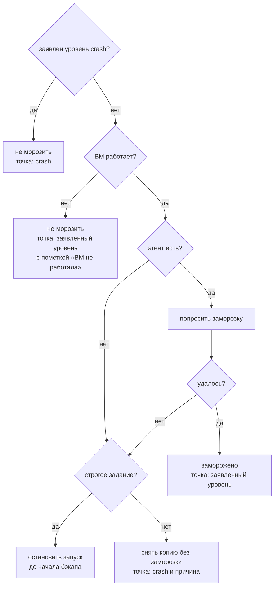
```mermaid
flowchart TD
    Q{"заявлен уровень crash?"} -->|да| NoFreeze["не морозить<br/>точка: crash"]
    Q -->|нет| Running{"ВМ работает?"}
    Running -->|нет| Off["не морозить<br/>точка: заявленный уровень<br/>с пометкой «ВМ не работала»"]
    Running -->|да| Agent{"агент есть?"}
    Agent -->|да| Freeze["попросить заморозку"]
    Agent -->|нет| Strict{"строгое задание?"}
    Freeze --> Done{"удалось?"}
    Done -->|да| Frozen["заморожено<br/>точка: заявленный уровень"]
    Done -->|нет| Strict
    Strict -->|да| Halt["остановить запуск<br/>до начала бэкапа"]
    Strict -->|нет| Crash["снять копию без заморозки<br/>точка: crash и причина"]
```

- **Выключенную ВМ замораживать незачем:** её диски и так не меняются.
- **Строгое задание останавливается до начала бэкапа.** На гипервизоре ещё
  нет ни блокировок, ни снапшотов, убирать нечего.
- **Нестрогое снимает копию «как после сбоя питания».** Это нормальная,
  годная копия. Просто обещание задания не выполнено, и об этом поднимается
  оповещение.

### Откуда служба знает про агента

- **oVirt** — из своего каталога, то есть по данным последней синхронизации
  инвентаря. Движок сообщает, что агент отвечает, а служба это запоминает.
  - Агент упал после синхронизации — служба всё равно попробует заморозить и
    получит ошибку.
  - Агент поднялся — служба не станет пробовать до следующей синхронизации.
- **KVM** — из описания ВМ в libvirt прямо в момент бэкапа: объявлен ли в ней
  канал агента. Если канал есть, а агент внутри не установлен, заморозка
  вернёт ошибку.

---

## 6. Сколько гость стоит замороженным

Этим режимы и отличаются друг от друга.

**KVM.** libvirt фиксирует точку меньше чем за секунду, и заморозка почти
незаметна.

**oVirt.** Перед фиксацией точки движок готовит scratch-диски или снапшот —
это фаза `initializing`, на oVirt 4.5 обычно 20 секунд и больше. Если служба
заморозит гостя до запроса бэкапа, запись простоит всё это время. Обычная ВМ
переживёт. Узел Kubernetes — нет:

- etcd не может сделать `fsync` и теряет лидерство;
- компоненты управления не продлевают аренду и перезапускаются;
- через 40 секунд kubelet переводит узел в NotReady.

Поэтому на oVirt есть три режима:

- **«Служба»** — служба замораживает гостя сама, до запроса бэкапа, и держит
  заморозку, пока точка не зафиксирована;
- **«Движок»** — служба просит движок заморозить гостя
  (`require_consistency=true`), и тот делает это сам, на доли секунды, уже
  после подготовки;
- **«Смешанный»** — служба пробует сама. Не смогла или не уложилась в предел —
  подключается движок.

Цифры на схеме примерные. Доли секунды нарисованы секундой, иначе полосу не
видно.


```mermaid
gantt
    title Когда в госте стоит запись
    dateFormat X
    axisFormat %M:%S
    todayMarker off

    section oVirt — Служба
    Сценарии СУБД                        :s1, 0, 2s
    Запись стоит — движок готовит бэкап  :crit, s2, after s1, 25s
    Гость работает — диски читаются      :s3, after s2, 30s

    section oVirt — Движок
    Гость работает — движок готовит бэкап :e1, 0, 25s
    Сценарии СУБД                         :e2, after e1, 2s
    Запись стоит                          :crit, e3, after e2, 1s
    Гость работает — диски читаются       :e4, after e3, 30s

    section KVM
    Сценарии СУБД                         :k1, 0, 2s
    Запись стоит                          :crit, k2, after k1, 1s
    Гость работает — диски читаются       :k3, after k2, 30s
```

### Режим «Служба»

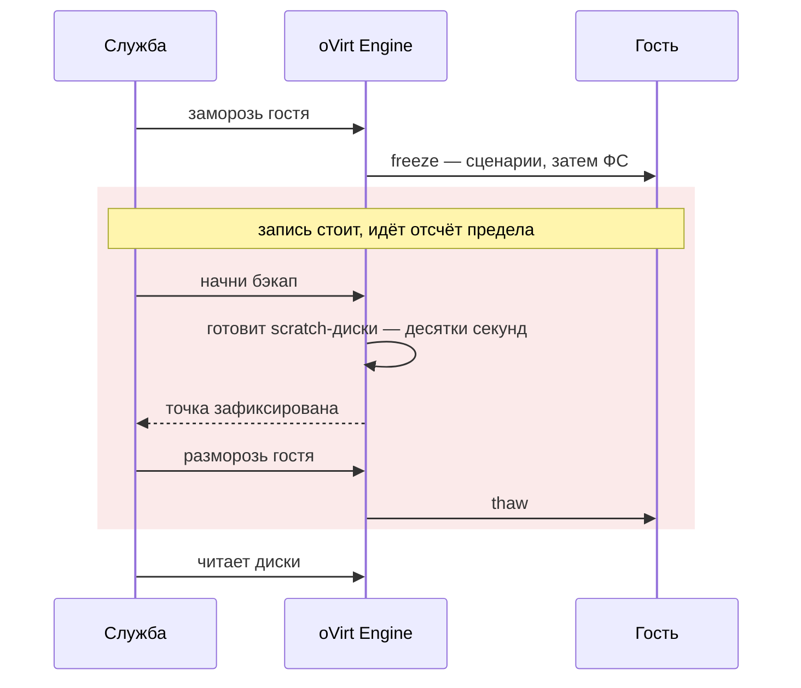
```mermaid
sequenceDiagram
    participant S as Служба
    participant E as oVirt Engine
    participant G as Гость

    S->>E: заморозь гостя
    E->>G: freeze — сценарии, затем ФС
    rect rgba(220, 80, 80, 0.12)
        Note over S,G: запись стоит, идёт отсчёт предела
        S->>E: начни бэкап
        E->>E: готовит scratch-диски — десятки секунд
        E-->>S: точка зафиксирована
        S->>E: разморозь гостя
        E->>G: thaw
    end
    S->>E: читает диски
```

Плюс режима — служба точно знает, сколько гость стоял, и показывает это в
хронологии. Минус — стоит он всю подготовку бэкапа. Режим оставлен для
движков старше 4.4 и для заданий, созданных до появления выбора.

### Режим «Движок»

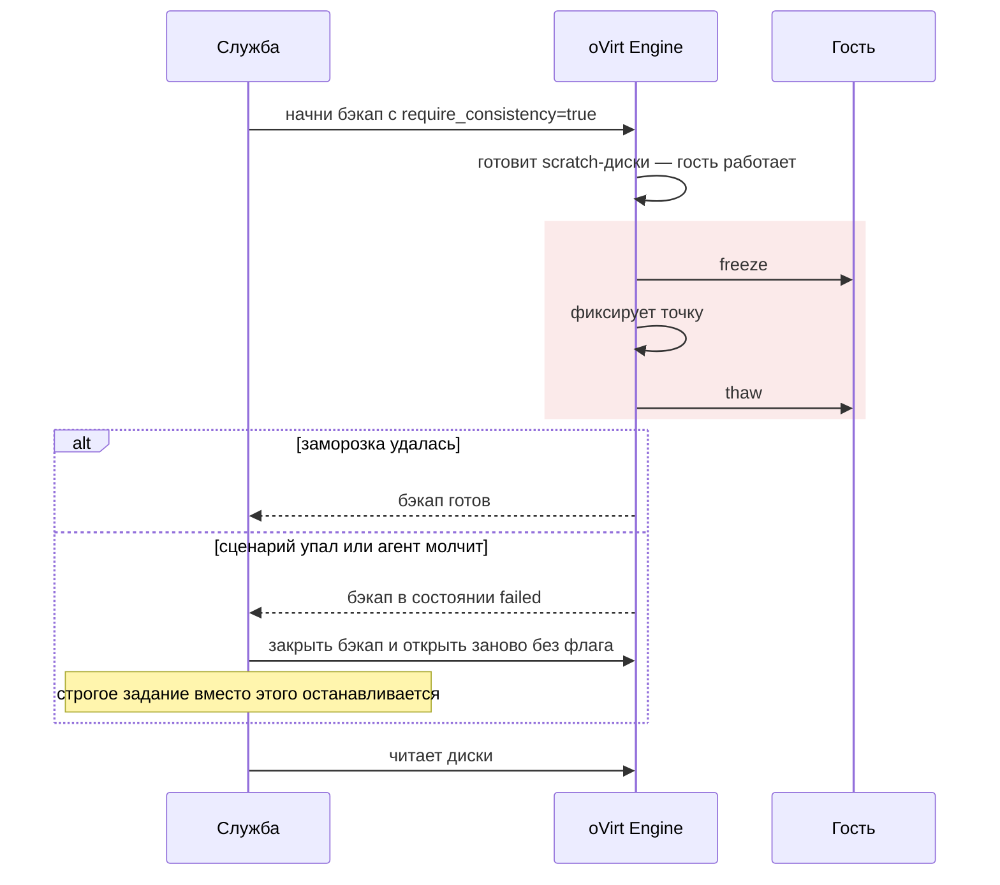
```mermaid
sequenceDiagram
    participant S as Служба
    participant E as oVirt Engine
    participant G as Гость

    S->>E: начни бэкап с require_consistency=true
    E->>E: готовит scratch-диски — гость работает
    rect rgba(220, 80, 80, 0.12)
        E->>G: freeze
        E->>E: фиксирует точку
        E->>G: thaw
    end
    alt заморозка удалась
        E-->>S: бэкап готов
    else сценарий упал или агент молчит
        E-->>S: бэкап в состоянии failed
        S->>E: закрыть бэкап и открыть заново без флага
        Note over S: строгое задание вместо этого останавливается
    end
    S->>E: читает диски
```

- **Зачем флаг.** Без `require_consistency` движок тоже пробует заморозить
  гостя, но при неудаче молча продолжает. С флагом неудача видна: бэкап
  переходит в `failed`.
- **Как служба понимает `failed`.** Она считает, что почти всегда это
  неудавшаяся заморозка: сценарий упал или агент не ответил. Нестрогое
  задание повторяет бэкап без флага и получает уровень `crash` с причиной.
- **Минус режима** — движок не сообщает, сколько держал заморозку. В
  хронологии вместо «Гость заморожен» и «Гость разморожен» стоит одна отметка:
  «Движок заморозил гостя на момент фиксации точки».

### Режим «Смешанный»

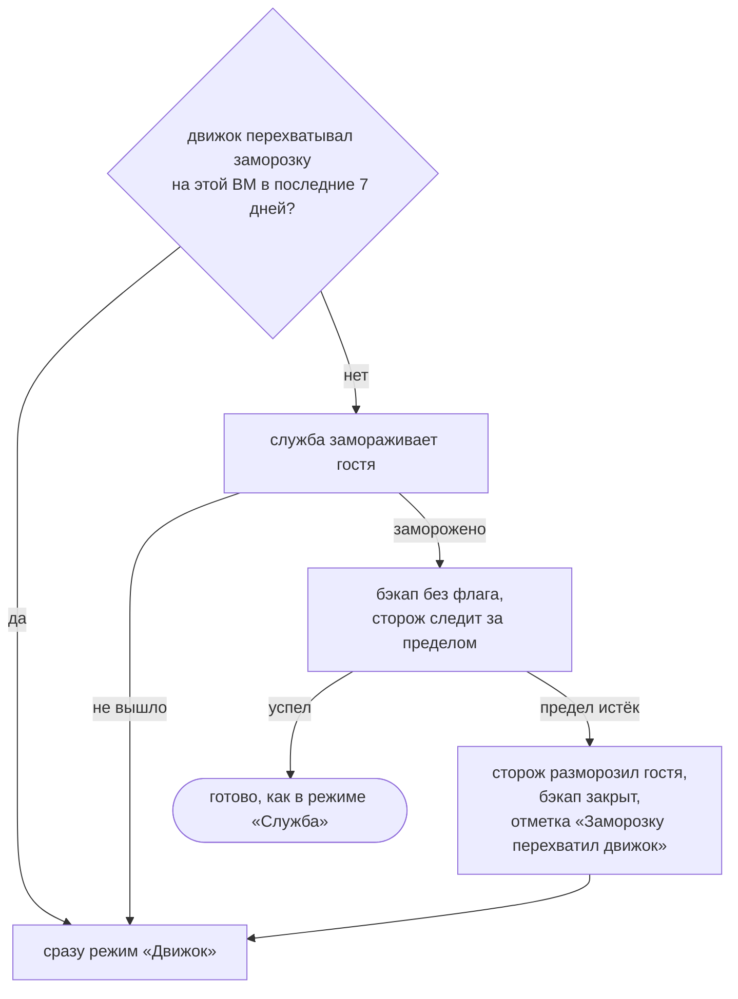
```mermaid
flowchart TD
    M{"движок перехватывал заморозку<br/>на этой ВМ в последние 7 дней?"} -->|да| EngineNow["сразу режим «Движок»"]
    M -->|нет| Try["служба замораживает гостя"]
    Try -->|не вышло| EngineNow
    Try -->|заморожено| Wait["бэкап без флага,<br/>сторож следит за пределом"]
    Wait -->|успел| Fine(["готово, как в режиме «Служба»"])
    Wait -->|предел истёк| Takeover["сторож разморозил гостя,<br/>бэкап закрыт,<br/>отметка «Заморозку перехватил движок»"]
    Takeover --> EngineNow
```

Так выглядит перехват, если предел заморозки 15 секунд, а движок готовит
бэкап 25:


```mermaid
gantt
    title Смешанный режим — служба не уложилась в предел
    dateFormat X
    axisFormat %M:%S
    todayMarker off

    section Гость
    Запись стоит — заморозила служба   :crit, g1, 0, 15s
    Работает — сторож разморозил       :g2, after g1, 35s
    Запись стоит — заморозил движок    :crit, g3, after g2, 1s
    Работает — диски читаются          :g4, after g3, 20s

    section Движок
    Первая подготовка бэкапа           :d1, 0, 25s
    Вторая подготовка — с заморозкой   :d2, after d1, 25s
    Бэкап готов                        :d3, after d2, 21s
```

- **Цена перехвата.** Подключить движок к уже идущему бэкапу нельзя:
  `require_consistency` задаётся только при создании. Поэтому перехват стоит
  второй подготовки бэкапа, но не второй долгой паузы записи.
- **Перехват запоминается.** Следующие 7 дней смешанный режим на этой ВМ
  сразу отдаёт заморозку движку, а потом служба пробует снова.
- **Если служба просто не смогла заморозить гостя**, движок подключается
  сразу, но это не запоминается: такая причина обычно разовая.

### Другие пути

- **KVM** — замораживает всегда служба. Режимы «Движок» и «Смешанный» API не
  примет: там нет движка. Зато только на KVM можно заморозить не все
  файловые системы, а перечисленные в поле задания «Заморозить только эти
  файловые системы» (`freeze_mountpoints`). libvirt передаёт список агенту
  командой `guest-fsfreeze-freeze-list`, и сценарии `fsfreeze-hook` агент
  вызывает так же. Нужно узлам Kubernetes: заморозить том СУБД, не
  останавливая запись etcd и корня. Остальные файловые системы в такой копии —
  как после сбоя питания. Разморозка всегда общая.

  Указывать нужно точки монтирования отдельных томов (`findmnt` в госте):
  обычный каталог агент молча пропускает. Если из списка не заморожено ничего,
  служба считает заморозку неудачной, а не приписывает точке уровень, которого
  нет.

  Поле есть и в задании, и в разовом бэкапе со страницы ВМ. Когда ВМ одна,
  поле предлагает её тома: служба спрашивает агента `guest-get-fsinfo` через
  libvirt (`GET /servers/{id}/vms/{vmID}/filesystems`). Гость при этом не
  замораживается, а зависший агент ждут не дольше 10 секунд.
- **oVirt через временный снапшот** — для движков без Backup API и для типа
  «Полный через снапшот». Диски raw и диски без отслеживания изменений на
  движке с Backup API идут обычным путём, и режимы заморозки для них те же,
  что для qcow2. В пути через снапшот замораживает всегда служба. Для движка
  без Backup API формы выбор «Кто замораживает гостя» не показывают, а API
  отклоняет режимы «Движок» и «Смешанный». Есть тонкость, см.
  [раздел 10](#10-подводные-камни).
- **Экспорт OVA** — гость не замораживается.
- **Proxmox** — гостя замораживает сам `vzdump` при `agent=1` в настройках
  гостя, через тот же агент и те же сценарии. Результата служба не видит,
  поэтому:
  - требовать уровень в задании Proxmox нельзя;
  - в хронологии нет отметок заморозки;
  - уровень у точки не записывается.

---

## 7. Предел заморозки и сторож

Пока служба держит гостя замороженным (режимы «Служба» и «Смешанный», KVM,
снапшот), за временем следит сторож.

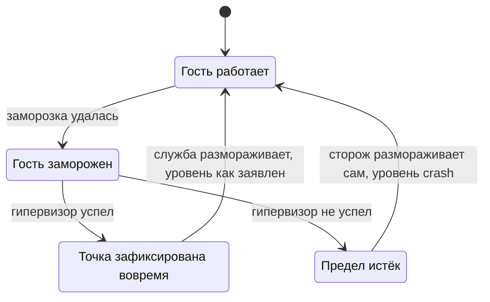
```mermaid
stateDiagram-v2
    state "Гость работает" as Working
    state "Гость заморожен" as Frozen
    state "Точка зафиксирована вовремя" as InTime
    state "Предел истёк" as Expired

    [*] --> Working
    Working --> Frozen: заморозка удалась
    Frozen --> InTime: гипервизор успел
    Frozen --> Expired: гипервизор не успел
    InTime --> Working: служба размораживает, уровень как заявлен
    Expired --> Working: сторож размораживает сам, уровень crash
```

- **Предел выбирается по порядку:**
  1. поле задания «Предел заморозки, с»;
  2. если там 0 — настройка службы `backup.max_freeze`;
  3. если нет и её — 60 секунд.
- **Отсчёт идёт с момента, когда заморозка удалась.** Время работы сценариев
  в него не входит. Его видно отдельно, как длительность отметки «Гость
  заморожен».
- **Истёкший предел копию не портит.** Точка фиксируется уже на живом госте и
  становится «как после сбоя питания». Строгое задание в этом случае
  останавливается, а открытый бэкап закрывается.
- **В режиме «Движок» предел не нужен:** движок держит заморозку доли секунды.

**Разморозка обязательна при любом исходе.** Замороженный гость не
обслуживает ничего, что пишет на диск, поэтому:

- гость размораживается и при ошибке, и при отмене запуска — у разморозки
  свой контекст, который отмена не трогает;
- если первая попытка не удалась, вторая делается раньше долгой уборки:
  закрытия бэкапа или слияния снапшота;
- если разморозить не вышло совсем, служба кричит об этом везде: в журнале
  ошибка капсом, в хронологии «Не удалось разморозить гостя», в карточке
  запуска красный баннер.

> [!CAUTION]
> Увидели «Не удалось разморозить гостя» — проверьте ВМ руками. На KVM
> выполните `virsh domfsthaw <имя>`, на oVirt — `thawfilesystems` через
> REST API движка.

---

## 8. Откуда служба берёт настройки

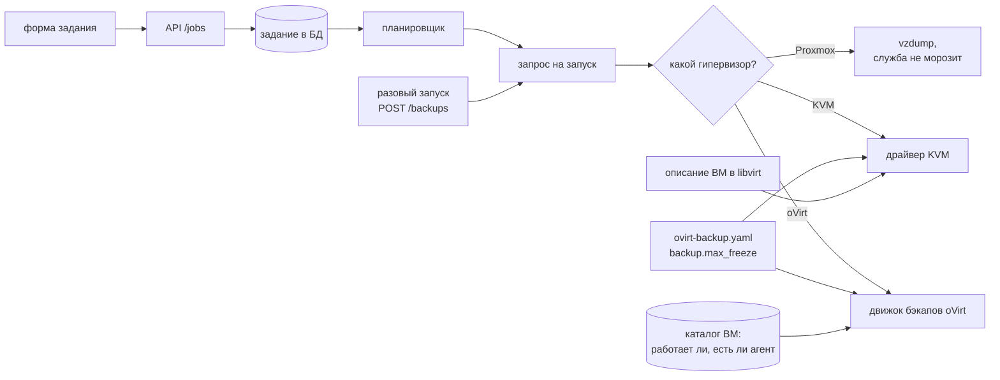
```mermaid
flowchart LR
    Form["форма задания"] --> Jobs["API /jobs"]
    Jobs --> DB[("задание в БД")]
    DB --> Sch["планировщик"]
    Sch --> Req["запрос на запуск"]
    Once["разовый запуск<br/>POST /backups"] --> Req
    Req --> Route{"какой гипервизор?"}
    Route -->|oVirt| O["движок бэкапов oVirt"]
    Route -->|KVM| K["драйвер KVM"]
    Route -->|Proxmox| X["vzdump,<br/>служба не морозит"]
    Cfg["ovirt-backup.yaml<br/>backup.max_freeze"] --> O
    Cfg --> K
    Inv[("каталог ВМ:<br/>работает ли, есть ли агент")] --> O
    Xml["описание ВМ в libvirt"] --> K
```

| Поле в форме задания | Поле API | Если не задано |
|---|---|---|
| Согласованность копии | `consistency` | выводится из старого флага `quiesce`: была заморозка — `filesystem`, не было — `crash` |
| Если согласованность не достигнута | `require_consistency` | копия сохраняется как после сбоя питания |
| Кто замораживает гостя | `freeze_by` | служба; новые задания oVirt в интерфейсе получают «Движок» |
| Предел заморозки, с | `max_freeze_seconds` | `backup.max_freeze` из настроек службы, по умолчанию 60 с |
| Заморозить только эти файловые системы (KVM) | `freeze_mountpoints` | все файловые системы гостя |

Что проверяется при сохранении:

- режимы «Движок» и «Смешанный» — только для oVirt и его производных;
- строгое требование недоступно для Proxmox и бессмысленно для `crash`:
  его флаг сбрасывается сам;
- предел в задании — от 0 до 600 секунд, в настройках службы — от 1 секунды
  до 10 минут.

Разовый запуск (`POST /backups`) принимает те же поля, но без задания.
Строгое требование в нём работает, только если уровень указан явно.

Новое задание в интерфейсе, разовый бэкап со страницы ВМ и готовые
расписания создаются с уровнем `crash`: горячий бэкап идёт без паузы записи.
Заморозку администратор включает сам — подробнее в
[HOT-BACKUP.md](HOT-BACKUP.md#7-заморозка).

---

## 9. Что остаётся после запуска

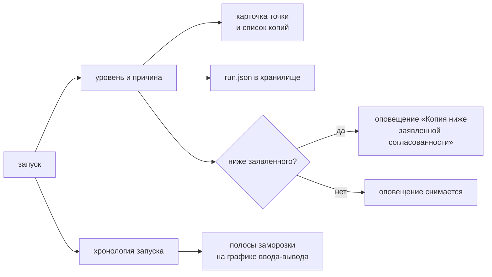
```mermaid
flowchart LR
    Run["запуск"] --> Level["уровень и причина"]
    Level --> Card["карточка точки<br/>и список копий"]
    Level --> Json["run.json в хранилище"]
    Level --> Cmp{"ниже заявленного?"}
    Cmp -->|да| Alert["оповещение «Копия ниже<br/>заявленной согласованности»"]
    Cmp -->|нет| Clear["оповещение снимается"]
    Run --> Timeline["хронология запуска"]
    Timeline --> Chart["полосы заморозки<br/>на графике ввода-вывода"]
```

Уровень пишется не только в базу, но и в `run.json` рядом с данными копии,
поэтому он переживёт даже потерю каталога. Оповещение снимается само, как
только очередная точка того же задания достигнет уровня.

Отметки в хронологии запуска:

| Отметка | Что значит | Длительность |
|---|---|---|
| Запрошена заморозка гостя | служба попросила заморозку или бэкап с заморозкой движком | — |
| Гость заморожен | заморозка удалась | сколько готовились агент и сценарии |
| Заморозка не удалась | уровень понижен или запуск остановлен; причина — в подробностях | — |
| Гость разморожен | запись снова идёт | сколько запись стояла |
| Не удалось разморозить гостя | проверьте ВМ руками | сколько гость уже стоит |
| Движок заморозил гостя на момент фиксации точки | режим «Движок» | движок её не сообщает |
| Заморозку перехватил движок | смешанный режим передал заморозку движку | — |
| Точка зафиксирована на движке | дальше данные читаются из точки | от запроса бэкапа |
| Снапшот создан | путь через временный снапшот | от запроса снапшота |
| Инкремент снят полной копией | движок отклонил смешанный бэкап, запуск повторён полным; в режимах «Служба» и «Смешанный» гость заморожен второй раз | — |

На графике ввода-вывода в карточке запуска время заморозки показано полосой.
Оранжевая полоса значит, что гость заморожен прямо сейчас, красная — что
разморозка не подтверждена.

---

## 10. Подводные камни

> [!NOTE]
> **Предел ожидания агента на KVM задаётся самому домену.** Библиотека
> go-libvirt не принимает контекст, поэтому перед заморозкой служба
> выставляет домену тайм-аут ответа агента — 60 секунд
> (`virDomainAgentSetResponseTimeout`, как `virsh guest-agent-timeout`), а
> после последней разморозки возвращает умолчание libvirt. Узнать прежнее
> значение libvirt не даёт: если администратор задавал домену свой тайм-аут,
> после бэкапа его придётся задать снова. На libvirt старше 5.10 предела нет —
> остаётся поведение самого libvirt.

> [!NOTE]
> **Неудачная заморозка тоже заканчивается разморозкой.** Ошибка вызова не
> значит, что гость не заморожен: libvirt, VDSM или движок могли не дождаться
> агента, а агент — заморозить файловые системы уже после ответа. Поэтому
> после любой ошибки заморозки служба размораживает гостя сама:
> - если агент прямо отказал — упал сценарий, агент не подключён, — хватает
>   одной попытки;
> - если ответа не дождались, разморозка повторяется раз в 10 секунд, пока не
>   пройдёт, но не дольше трёх минут. Всё это время запуск ждёт: оставить гостя
>   замороженным хуже, чем задержать бэкап.
>
> На KVM, если агент всё-таки успел заморозить гостя, в хронологии появится
> «Гость разморожен» с пояснением. Если разморозить не удалось — «Не удалось
> разморозить гостя» и красный баннер в карточке запуска: проверьте ВМ
> вручную.

> [!WARNING]
> **В пути через снапшот гость размораживается раньше, чем готов снапшот.**
> Движок создаёт снапшот асинхронно: запрос возвращается сразу, а снапшот
> появляется позже. Служба держит заморозку только на время запроса, а уровень
> точке ставит по своей заморозке. Замораживает ли гостя сам движок в момент
> снапшота, служба не видит. Проверить на стенде можно так: сравнить время
> записей в `/var/log/qga-fsfreeze-hook.log` в госте с отметками «Гость
> разморожен» и «Снапшот создан».

> [!NOTE]
> **На движке старше 4.4.5 смешанный бэкап стоит второй заморозки.** В
> режимах «Служба» и «Смешанный» гость уже заморожен, когда движок
> отклоняет смешанный запрос. Служба размораживает его и замораживает снова
> для полного бэкапа. Отказ служба запоминает на 7 дней, так что вторая
> заморозка не повторяется каждую ночь. Подробнее — в
> [разделе 2](#смешанный-бэкап-и-откат-к-полному).

> [!NOTE]
> **Про агента на oVirt служба узнаёт с опозданием** — из последней
> синхронизации инвентаря, а не перед самим бэкапом. Что из этого следует — в
> [разделе 5](#откуда-служба-знает-про-агента).

> [!NOTE]
> **Уровень `application` не проверяется.** Установлены ли сценарии, служба не
> видит. Проверяйте `install.sh --check` в госте. Подробнее — в
> [LIMITATIONS.md](LIMITATIONS.md#согласованность-приложения-что-проверено-а-что-нет).

---

## 11. Заморозка в коде по шагам

Здесь путь заморозки пройден по коду горячего бэкапа oVirt и KVM. Фрагменты
сокращены, пропуски отмечены `// …`. Полные функции — по ссылкам в
[разделе 12](#12-где-что-в-коде).

### Горячий запуск oVirt целиком

На схеме имена функций. Заморозка возможна только внутри функций, выделенных
красным. До них и после того, как точка готова, гость работает.

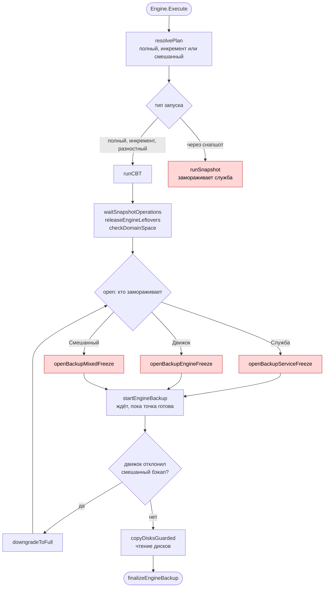
```mermaid
flowchart TD
    Exec(["Engine.Execute"]) --> Plan["resolvePlan<br/>полный, инкремент или смешанный"]
    Plan --> Type{"тип запуска"}
    Type -->|"полный, инкремент, разностный"| CBT["runCBT"]
    Type -->|"через снапшот"| Snap["runSnapshot<br/>замораживает служба"]
    CBT --> Prep["waitSnapshotOperations<br/>releaseEngineLeftovers<br/>checkDomainSpace"]
    Prep --> Open{"open: кто замораживает"}
    Open -->|Служба| Svc["openBackupServiceFreeze"]
    Open -->|Движок| Eng["openBackupEngineFreeze"]
    Open -->|Смешанный| Mix["openBackupMixedFreeze"]
    Svc --> Start["startEngineBackup<br/>ждёт, пока точка готова"]
    Eng --> Start
    Mix --> Start
    Start --> Rej{"движок отклонил<br/>смешанный бэкап?"}
    Rej -->|да| Down["downgradeToFull"] --> Open
    Rej -->|нет| Copy["copyDisksGuarded<br/>чтение дисков"]
    Copy --> Fin(["finalizeEngineBackup"])

    classDef frozen fill:#ffd7d7,stroke:#c62828,color:#000
    class Svc,Eng,Mix,Snap frozen
```

Красным — функции, внутри которых гость может стоять замороженным.

Порядок в `runCBT` — не случайность: уборка и проверка места стоят до
заморозки.

```go
// internal/backup/runner.go — runCBT
e.waitSnapshotOperations(ctx, client, vm, run)

// Бэкап, брошенный прошлым запуском, держит диски: убрать его надо до
// заморозки, иначе гость простоит замороженным всю уборку.
if err := e.releaseEngineLeftovers(ctx, client, srv, vm, run, diskIDs); err != nil {
	return nil, err
}

// После уборки: она могла вернуть место на домене. До заморозки и до
// открытия бэкапа: на почти полном домене он не открывается вовсе.
domains, err := e.checkDomainSpace(ctx, client, vm, disks)
if err != nil {
	return nil, err
}

open := func() (*ovirt.Backup, error) {
	switch {
	case req.FreezeBy.Engine():
		return e.openBackupEngineFreeze(ctx, client, srv, vm, run, req, diskIDs, p, "")
	case req.FreezeBy.Mixed():
		return e.openBackupMixedFreeze(ctx, client, srv, vm, run, req, diskIDs, p)
	default:
		return e.openBackupServiceFreeze(ctx, client, srv, vm, run, req, diskIDs, p)
	}
}
backup, err := open()
if backup == nil && err != nil && p.FromCheckpointID != "" && len(p.FullDisks) > 0 && mixedBackupRejected(err) {
	// …
	e.event(ctx, run, model.RunEventDowngradedFull, 0, reason+"; копия снимается полной")
	e.downgradeToFull(ctx, run, &p)
	backup, err = open()
}
```

`open` — замыкание. Повтор после отказа идёт тем же режимом заморозки, что и
первая попытка, и видит план, который `downgradeToFull` уже сделал полным.

### Решение: морозить ли

Все пути спрашивают одну функцию. Уровень `crash` возвращается раньше, чем
кто-либо обратится к гостю.

```go
// internal/backup/consistency.go
func QuiesceGuest(ctx context.Context, target model.Consistency, require bool, guest GuestState,
	freeze func(context.Context) error) (Quiesced, error) {
	// …
	if !target.NeedsFreeze() {
		return Quiesced{Level: model.ConsistencyCrash}, nil
	}
	if !guest.Running {
		return Quiesced{Level: target, Note: "ВМ не работала: заморозка не требовалась"}, nil
	}

	var reason string
	if !guest.Agent {
		reason = "гостевой агент не отвечает — заморозка невозможна"
	} else if err := freeze(ctx); err != nil {
		reason = fmt.Sprintf("заморозка не удалась: %v", err)
	} else {
		return Quiesced{Frozen: true, Level: target}, nil
	}

	if require {
		return Quiesced{Level: model.ConsistencyCrash, Note: reason}, fmt.Errorf( /* … */ )
	}
	return Quiesced{Level: model.ConsistencyCrash, Note: reason + "; копия снята как после сбоя питания"}, nil
}
```

Та же логика в блок-схеме — в [разделе 5](#5-как-служба-решает-морозить-ли).
Для режима «Движок» есть двойник `EngineQuiesce`: он не замораживает сам, а
решает, передавать ли движку `require_consistency`.

### Режим «Служба»: как гарантируется разморозка

```go
// internal/backup/runner.go
func (e *Engine) openBackupServiceFreeze(ctx context.Context, client *ovirt.Client, srv *model.Server,
	vm *model.VM, run *model.BackupRun, req RunRequest, diskIDs []string, p plan) (*ovirt.Backup, error) {

	frozenAt, err := e.quiesce(ctx, client, vm, run, req)
	if err != nil {
		return nil, err
	}
	window := e.guardFreeze(ctx, client, vm, run, req, frozenAt)
	defer func() { _ = window.Thaw() }()

	backup, err := e.startEngineBackup(ctx, client, srv, vm, run, diskIDs, p, false)
	if err != nil {
		return backup, err
	}
	// The point in time is fixed once the backup is ready; the guest can run
	// again while we read the frozen image.
	if err := window.Thaw(); err != nil {
		return backup, err
	}
	return backup, e.settleFreeze(ctx, run, req, window)
}
```

Гостя размораживают три пути, и хотя бы один из них срабатывает всегда:

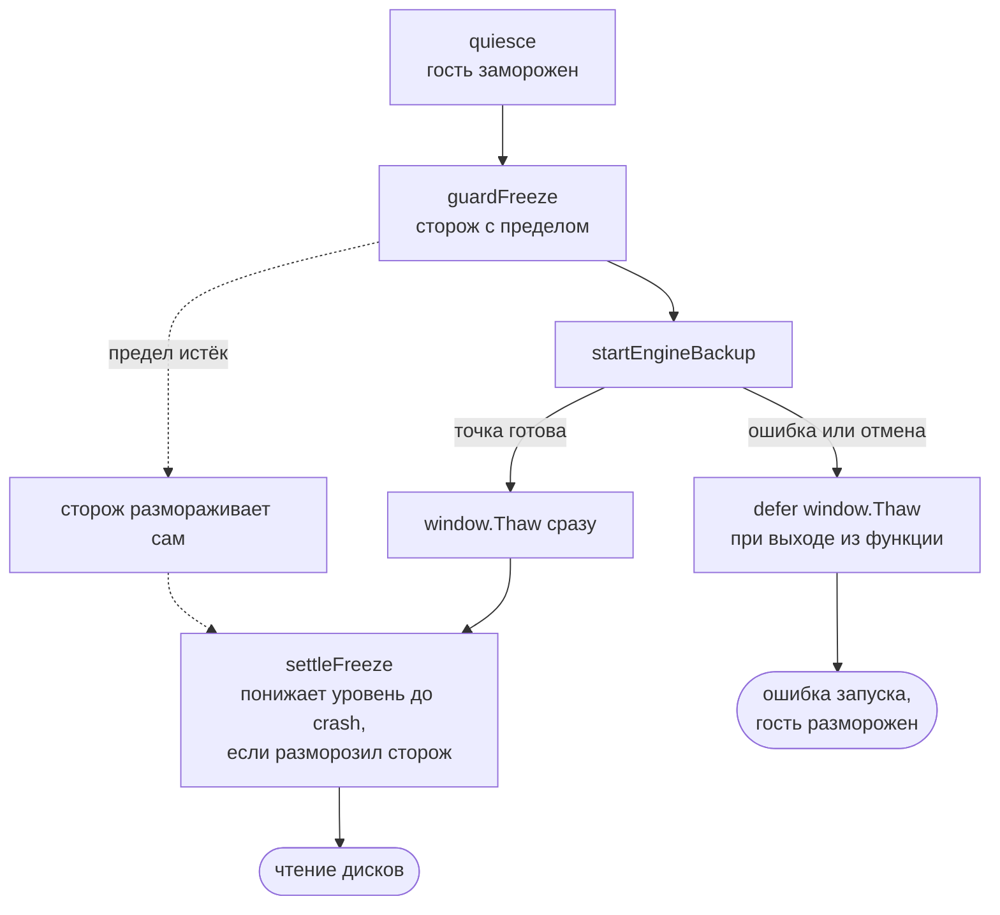
```mermaid
flowchart TD
    Q["quiesce<br/>гость заморожен"] --> W["guardFreeze<br/>сторож с пределом"]
    W --> S["startEngineBackup"]
    S -->|"точка готова"| T["window.Thaw сразу"]
    S -->|"ошибка или отмена"| D["defer window.Thaw<br/>при выходе из функции"]
    W -.->|"предел истёк"| X["сторож размораживает сам"]
    T --> Set["settleFreeze<br/>понижает уровень до crash,<br/>если разморозил сторож"]
    X -.-> Set
    Set --> Read(["чтение дисков"])
    D --> Fail(["ошибка запуска,<br/>гость разморожен"])
```

- **`window.Thaw` можно звать сколько угодно раз.** После первой удачной
  разморозки функция `thaw` видит нулевой `frozenAt` и ничего не делает.
- **Контекст разморозки отвязан от запуска** (`context.WithoutCancel`).
  Отменённый бэкап всё равно разморозит гостя.
- **`Expired` проверяется после `Thaw`.** Если сторож и служба сошлись в одно
  мгновение, выигрывает осторожный ответ: уровень понижается.

Сам сторож — таймер на `time.AfterFunc`:

```go
// internal/backup/freeze_window.go — NewFreezeWindow
wait := limit - time.Since(frozenAt)
if wait < 0 {
	wait = 0
}
w.timer = time.AfterFunc(wait, func() {
	w.mu.Lock()
	w.expired = true
	err := w.thaw()
	w.mu.Unlock()
	if onExpire != nil {
		onExpire(err)
	}
})
```

### Неудачная заморозка тоже кончается разморозкой

Ошибка вызова заморозки не значит, что гость не заморожен. libvirt, VDSM или
движок могли не дождаться агента, а агент — заморозить файловые системы
позже. Поэтому вызов заморозки всегда обёрнут так:

```go
// internal/backup/runner.go — quiesce, функция заморозки для QuiesceGuest
asked := time.Now().UTC()
if err := client.FreezeFilesystems(ctx, vm.ID); err != nil {
	e.thawAfterFailedFreeze(ctx, client, vm, run, err)
	return err
}
frozenAt = time.Now().UTC()
e.event(ctx, run, model.RunEventFrozen, frozenAt.Sub(asked), "")
```

Сколько раз пробовать разморозить, решает, могла ли заморозка ещё идти:

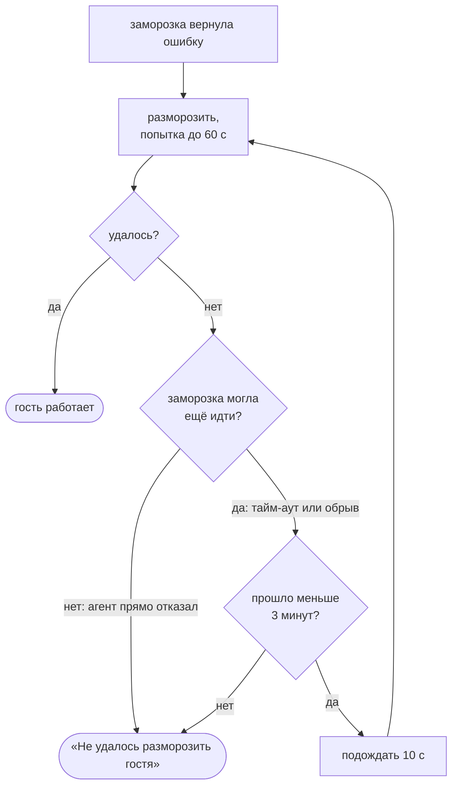
```mermaid
flowchart TD
    F["заморозка вернула ошибку"] --> T["разморозить,<br/>попытка до 60 с"]
    T --> OK{"удалось?"}
    OK -->|да| Done(["гость работает"])
    OK -->|нет| P{"заморозка могла<br/>ещё идти?"}
    P -->|"нет: агент прямо отказал"| Fail(["«Не удалось разморозить гостя»"])
    P -->|"да: тайм-аут или обрыв"| W{"прошло меньше<br/>3 минут?"}
    W -->|да| Sleep["подождать 10 с"] --> T
    W -->|нет| Fail
```

```go
// internal/backup/freeze_release.go
base := context.WithoutCancel(ctx)
deadline := time.Now().Add(window)
for {
	attemptCtx, cancel := context.WithTimeout(base, thawAttemptTimeout)
	err := thaw(attemptCtx)
	cancel()
	if err == nil {
		return nil
	}
	if !pending || time.Now().Add(interval).After(deadline) {
		return err
	}
	time.Sleep(interval)
}
```

«Могла ещё идти» у каждого гипервизора определяет своя функция
`FreezeMayBePending`:

| Ошибка | KVM, libvirt | oVirt, движок |
|---|---|---|
| обрыв связи, ответ не разобран | могла | могла |
| агент не ответил вовремя | `ErrAgentCommandTimeout`, `ErrOperationTimeout`, `ErrAgentUnsynced`, `ErrAgentUnresponsive` без `not connected` — могла | в тексте `timeout`, `timed out`, `not responding`, `not available` — могла |
| агент не подключён | `ErrAgentUnresponsive` с `not connected` — не могла | — |
| агент отказал: упал сценарий, ВМ выключена | не могла | не могла |

### KVM: порядок в `Driver.Backup`

На KVM всё происходит в одной функции, а разморозку и уборку держат
отложенные вызовы. Выполняются они в обратном порядке регистрации:

```go
// internal/kvm/driver.go — Driver.Backup
if err := checkScratchStart(freeBytes, d.cfg.ScratchDir); err != nil { /* … */ }

agentLimited := false
defer func() { /* … */ d.conn.RestoreAgentTimeout(restoreCtx, dom) /* … */ }()

q, frozenAt, err := d.quiesce(ctx, dom, info, req, result, &agentLimited, log)
// …
window := backup.NewFreezeWindow(frozenAt, limit,
	func() error { return d.thaw(ctx, dom, &frozenAt, result, log) }, /* … */)

if err := d.conn.BeginBackup(ctx, dom, spec, checkpoint); err != nil {
	if thawErr := window.Thaw(); thawErr != nil {
		_ = window.Thaw()
	}
	// …
	return result, err
}

defer func() { /* … */ d.conn.EndBackup(cleanupCtx, dom) /* … */ }()
defer func() { _ = window.Thaw() }()

if err := window.Thaw(); err != nil {
	return result, err
}
```

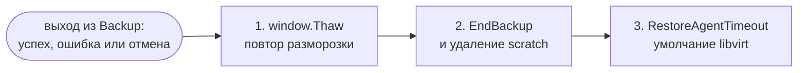
```mermaid
flowchart LR
    Exit(["выход из Backup:<br/>успех, ошибка или отмена"]) --> A["1. window.Thaw<br/>повтор разморозки"]
    A --> B["2. EndBackup<br/>и удаление scratch"]
    B --> C["3. RestoreAgentTimeout<br/>умолчание libvirt"]
```

- **Сначала разморозка, потом уборка.** Закрытие задания на гипервизоре может
  затянуться, а гость не должен ждать его замороженным.
- **Предел ожидания агента возвращается последним**, уже после всех
  разморозок: `LimitAgentTimeout` ставит домену 60 с только на время
  заморозки.
- **Место под scratch проверяется до заморозки.** На почти полном томе бэкап
  не откроется, и гость не простоит зря.

Выборочная заморозка — это тот же вызов libvirt со списком точек
монтирования:

```go
// internal/libvirtx/domain.go
func (c *Conn) FreezeFilesystems(ctx context.Context, dom libvirt.Domain, mountpoints []string) (int, error) {
	n, err := c.lv.DomainFsfreeze(dom, mountpoints, 0)
	if err != nil {
		return 0, fmt.Errorf("заморозка файловых систем гостя: %w", err)
	}
	return int(n), nil
}
```

Агент молча пропускает пути, которые не являются точками монтирования.
Поэтому `checkPartialFreeze` считает заморозку неудачной, если из списка не
заморожено ничего.

### Вызовы гипервизора

| Что делает служба | KVM: вызов libvirt | Команда агента | oVirt: запрос к движку |
|---|---|---|---|
| заморозить все ФС | `DomainFsfreeze(dom, nil, 0)` | `guest-fsfreeze-freeze` | `POST /vms/{id}/freezefilesystems` |
| заморозить выбранные ФС | `DomainFsfreeze(dom, список, 0)` | `guest-fsfreeze-freeze-list` | нет |
| разморозить | `DomainFsthaw(dom, nil, 0)` | `guest-fsfreeze-thaw` | `POST /vms/{id}/thawfilesystems` |
| ограничить ожидание агента | `DomainAgentSetResponseTimeout` | — | нет |
| бэкап с заморозкой движком | нет | `guest-fsfreeze-freeze` от VDSM | `POST /vms/{id}/backups?require_consistency=true` |

Флаг `require_consistency` передаётся параметром запроса, а не в теле:

```go
// internal/ovirt/backup.go — Client.StartBackup
var opts []func(*requestOptions)
if requireConsistency {
	opts = append(opts, withQuery(url.Values{"require_consistency": {"true"}}))
}

var backup Backup
if err := c.post(ctx, "/vms/"+vmID+"/backups", body, &backup, opts...); err != nil {
	// …
}
```

Разморозить гостя вручную, если служба сообщила «Не удалось разморозить
гостя». На KVM:

```bash
virsh domfsthaw <имя-ВМ>
```

На oVirt — запросом к движку. Пароль `curl` спросит сам:

```bash
curl -k -u 'admin@internal' -X POST -H 'Content-Type: application/xml' -d '<action/>' https://<движок>/ovirt-engine/api/vms/<id-ВМ>/thawfilesystems
```

---

## 12. Где что в коде

На GitHub ссылки открывают файлы. Во встроенной документации это просто пути
в репозитории.

**Решения службы**

| Что | Где |
|---|---|
| уровни, режимы и сравнение уровней | [internal/model/consistency.go](../internal/model/consistency.go) |
| морозить ли, что делать при неудаче | `QuiesceGuest`, `EngineQuiesce` — [internal/backup/consistency.go](../internal/backup/consistency.go) |
| предел и сторож | `FreezeWindow`, `RunRequest.FreezeLimit`, `DefaultMaxFreeze` — [internal/backup/freeze_window.go](../internal/backup/freeze_window.go) |
| режимы на oVirt | `runCBT`, `openBackupServiceFreeze`, `openBackupEngineFreeze`, `openBackupMixedFreeze`, `runSnapshot`, `quiesce`, `guardFreeze`, `settleFreeze` — [internal/backup/runner.go](../internal/backup/runner.go) |
| разморозка после неудачной заморозки | `ThawAfterFailedFreeze` — [internal/backup/freeze_release.go](../internal/backup/freeze_release.go); на oVirt — `Engine.thawAfterFailedFreeze` в [internal/backup/runner.go](../internal/backup/runner.go) |
| повтор полным, если движок отклонил смешанный бэкап | `mixedBackupRejected`, `Engine.downgradeToFull` — [internal/backup/runner.go](../internal/backup/runner.go) |
| что делается до заморозки на oVirt | `waitSnapshotOperations` — [internal/backup/snapshot_leftovers.go](../internal/backup/snapshot_leftovers.go); `releaseEngineLeftovers` — [internal/backup/engine_leftovers.go](../internal/backup/engine_leftovers.go); `checkDomainSpace` — [internal/backup/storage_guard.go](../internal/backup/storage_guard.go) |
| KVM | `Driver.Backup`, `Driver.quiesce`, `Driver.thaw`, `Driver.thawAfterFailedFreeze`, `checkPartialFreeze` — [internal/kvm/driver.go](../internal/kvm/driver.go); место до заморозки — `checkScratchStart` в [internal/kvm/scratch.go](../internal/kvm/scratch.go) |
| выбор гипервизора | `Dispatcher.Execute`, `executeLibvirt` — [internal/dispatch/dispatch.go](../internal/dispatch/dispatch.go); Proxmox — [internal/dispatch/proxmox.go](../internal/dispatch/proxmox.go) |

**Вызовы гипервизора**

| Что | Где |
|---|---|
| заморозка и разморозка через libvirt, канал агента в описании ВМ | `Conn.FreezeFilesystems`, `Conn.ThawFilesystems`, `ParseDomainXML` — [internal/libvirtx/domain.go](../internal/libvirtx/domain.go) |
| заморозка и разморозка через oVirt | `Client.FreezeFilesystems`, `Client.ThawFilesystems` — [internal/ovirt/actions.go](../internal/ovirt/actions.go) |
| бэкап с `require_consistency`, распознавание `failed` | `Client.StartBackup`, `Client.WaitBackupReady`, `ErrBackupFailed` — [internal/ovirt/backup.go](../internal/ovirt/backup.go) |
| отвечает ли агент на oVirt | `VM.HasGuestAgent` — [internal/ovirt/types.go](../internal/ovirt/types.go) |
| могла ли заморозка ещё идти после ошибки | `FreezeMayBePending` — [internal/libvirtx/domain.go](../internal/libvirtx/domain.go) и [internal/ovirt/actions.go](../internal/ovirt/actions.go) |
| предел ожидания агента на KVM | `AgentFreezeTimeout`, `Conn.LimitAgentTimeout`, `Conn.RestoreAgentTimeout` — [internal/libvirtx/domain.go](../internal/libvirtx/domain.go) |

**Настройки, хранение, оповещения**

| Что | Где |
|---|---|
| поля задания, вывод уровня из `quiesce`, верхний предел, список ФС | `BackupJob`, `NormalizeConsistency`, `MaxFreezeLimit`, `ValidateFreezeMountpoints` — [internal/model/backup.go](../internal/model/backup.go) |
| API задания и разового запуска | `jobPayload`, `validateJob`, `adHocRequest` — [internal/api/handlers_backup.go](../internal/api/handlers_backup.go) |
| предел службы | `backup.max_freeze` — [internal/config/config.go](../internal/config/config.go), [config/ovirt-backup.yaml](../config/ovirt-backup.yaml) |
| перенос настроек в запуск, оповещение о понижении | `RunRequest`, `checkConsistency` — [internal/scheduler/scheduler.go](../internal/scheduler/scheduler.go) |
| отметки хронологии и память смешанного режима | [internal/model/run_event.go](../internal/model/run_event.go), `LastRunEventAt` — [internal/store/run_events.go](../internal/store/run_events.go) |
| уровень в `run.json` | `RunManifest` — [internal/backup/format.go](../internal/backup/format.go) |
| столбцы в БД | миграции [0043](../internal/store/migrations/0043_backup_consistency.sql), [0047](../internal/store/migrations/0047_backup_max_freeze.sql), [0049](../internal/store/migrations/0049_backup_freeze_by.sql), [0050](../internal/store/migrations/0050_backup_freeze_mixed.sql), [0053](../internal/store/migrations/0053_backup_freeze_mountpoints.sql) |

**Интерфейс**

| Что | Где |
|---|---|
| форма задания | [web/src/pages/JobsPage.vue](../web/src/pages/JobsPage.vue), подсказки к режимам — [web/src/api/format.ts](../web/src/api/format.ts) |
| карточка запуска, полосы заморозки, баннеры | [web/src/pages/BackupsPage.vue](../web/src/pages/BackupsPage.vue) |
| статья справки «Согласованность копии и заморозка гостя» | [internal/api/help.go](../internal/api/help.go) |

**Внутри ВМ**

| Что | Где |
|---|---|
| строгий диспетчер | [deploy/guest-hooks/linux/fsfreeze-hook](../deploy/guest-hooks/linux/fsfreeze-hook) |
| PostgreSQL | [fsfreeze-hook.d/50-jhvirt-postgresql](../deploy/guest-hooks/linux/fsfreeze-hook.d/50-jhvirt-postgresql) |
| MySQL и MariaDB | [fsfreeze-hook.d/50-jhvirt-mysql](../deploy/guest-hooks/linux/fsfreeze-hook.d/50-jhvirt-mysql) |
| установщик | [deploy/guest-hooks/linux/install.sh](../deploy/guest-hooks/linux/install.sh) |
| пример настроек | [deploy/guest-hooks/linux/guest-hooks.conf.example](../deploy/guest-hooks/linux/guest-hooks.conf.example) |
