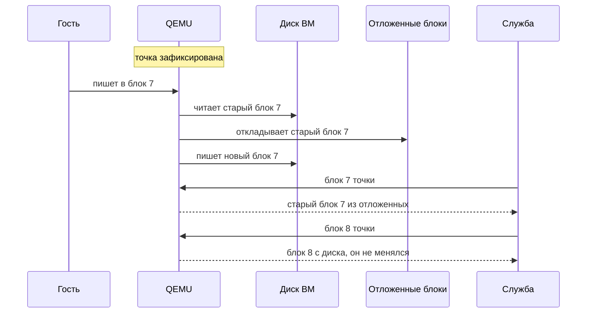
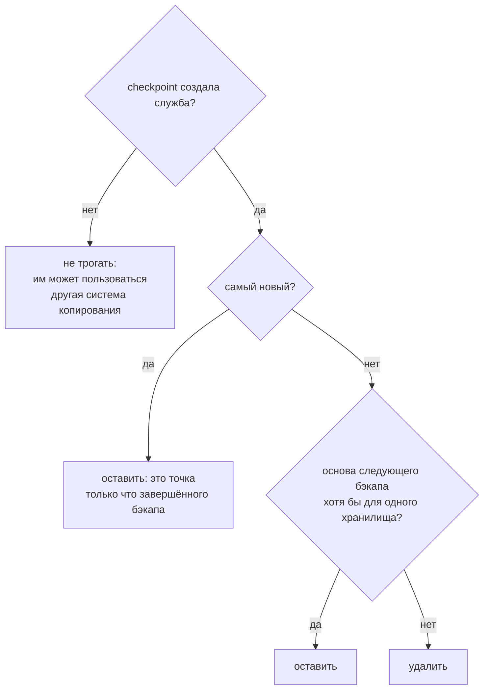
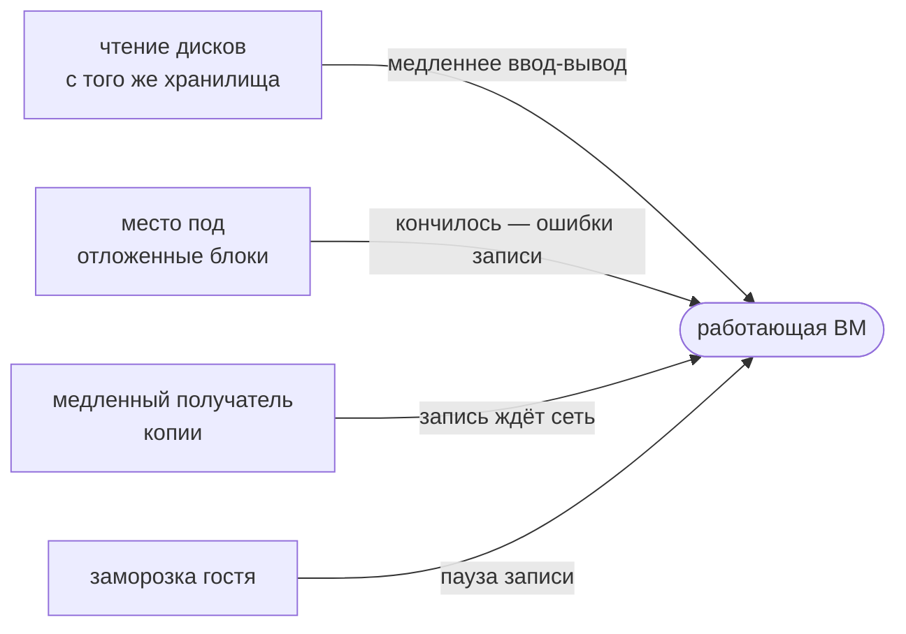
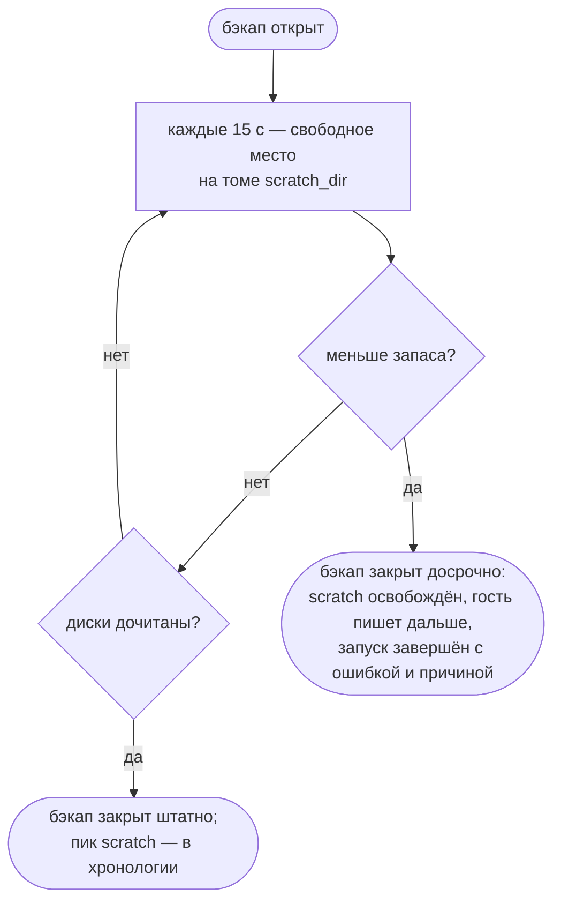
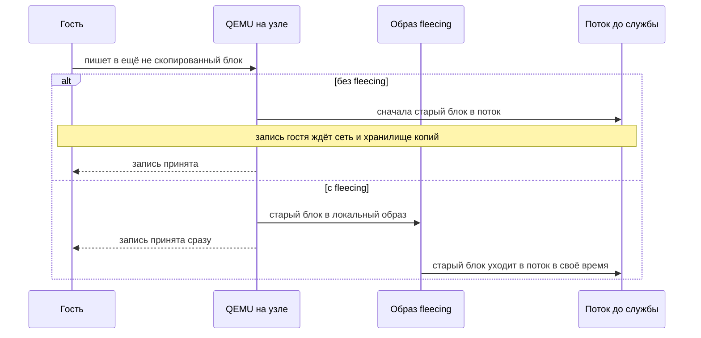

# Горячий бэкап: как устроен и как не мешать работающей ВМ

Горячий бэкап снимает копию работающей ВМ, не останавливая её. Здесь разобрано,
как каждый гипервизор фиксирует точку копии, чем бэкап всё-таки может помешать
работающей машине и что служба делает, чтобы этого не случилось.

Про заморозку гостя — в [GUEST-FREEZE.md](GUEST-FREEZE.md), про устройство
дисков QEMU — в [DISK-ARCHITECTURE.md](DISK-ARCHITECTURE.md), про повседневную
эксплуатацию — в [OPERATIONS.md](OPERATIONS.md). Схемы ниже рисует GitHub; во
встроенной документации они показаны исходником Mermaid.

---

## Коротко

- **ВМ не останавливается.** Гипервизор фиксирует точку копии, а служба читает
  её, пока гость продолжает работать и писать.
- **Заморозка для этого не нужна.** Новые задания по умолчанию гостя не
  замораживают, и копия получается «как после сбоя питания». Журналируемые
  файловые системы и СУБД переживают это штатно.
- **Мешать работающей ВМ бэкап может тремя путями:** нагрузкой чтения на её
  хранилище, нехваткой места под отложенные блоки и медленным получателем
  копии. От каждого есть своя защита, о них — в
  [разделе 3](#3-чем-бэкап-может-помешать-работающей-вм).
- **Инкременты остаются дешёвыми.** Служба сама убирает checkpoint-ы, которые
  больше не понадобятся.

---

## 1. Как фиксируется точка без остановки ВМ

После фиксации точки гость пишет как обычно. Чтобы копия всё равно получилась
на один момент, QEMU перед записью в ещё не прочитанный блок откладывает его
старое содержимое. Этот приём называется copy-before-write.

Где лежат отложенные блоки и как служба читает точку, зависит от гипервизора:

| Гипервизор | Как фиксирует точку | Куда откладываются старые блоки | Как служба читает |
|---|---|---|---|
| KVM | pull-режим бэкапа libvirt | scratch-файл на хосте, в каталоге `scratch_dir` подключения | NBD через SSH |
| oVirt | Backup API | scratch-диски на домене хранения или снапшот — решает движок | ovirt-imageio по HTTPS |
| oVirt, диски без CBT | временный снапшот | никуда: гость пишет в новый слой, а старый читается как есть | ovirt-imageio по HTTPS |
| Proxmox | `vzdump` в режиме snapshot | никуда: гость ждёт, пока блок уйдёт в поток. С fleecing — в образ на узле | поток `vzdump` по SSH |

Все диски ВМ фиксируются в один момент, так что ВМ с несколькими дисками тоже
получается согласованной.

---

## 2. Инкременты и checkpoint-ы

Бэкап с отслеживанием изменённых блоков оставляет на гипервизоре checkpoint —
метку «с этого момента считать изменения». Следующий инкремент читает только
блоки, изменённые после него.

Сами checkpoint-ы не исчезают:

- в libvirt каждый держит битмап в заголовке qcow2 каждого диска;
- в oVirt они копятся в базе движка, и движок пересоздаёт их на хосте при
  каждом старте ВМ.

Нужны же из них единицы. Поэтому после каждого успешного бэкапа служба
убирает лишние:

- **Основа следующего бэкапа** — по каждому хранилищу точка последней пригодной
  копии (от неё считается инкремент) и последней полной (от неё — разностная).
  Правило то же, что при выборе основы.
- **На oVirt** движок удаляет только самый старый checkpoint. Поэтому удаление
  идёт с корня и останавливается на первом, который трогать нельзя.
- **На KVM** удалять можно из любого места цепочки: libvirt сливает битмап
  удалённого checkpoint-а с соседним.
- **Ошибка обходится дёшево.** Если удалённый checkpoint всё-таки понадобится,
  следующий бэкап не найдёт его и честно сделает полную копию.

---

## 3. Чем бэкап может помешать работающей ВМ

| Что мешает | Где | Защита |
|---|---|---|
| нагрузка чтения на хранилище ВМ | везде | предел чтения, [раздел 4](#4-предел-чтения) |
| кончилось место под scratch | KVM | сторож закрывает бэкап раньше, [раздел 5](#5-место-под-scratch-на-kvm) |
| гость ждёт медленный поток до службы | Proxmox | fleecing, [раздел 6](#6-fleecing-на-proxmox) |
| пауза записи на время заморозки | если заморозка включена | по умолчанию выключена, [раздел 7](#7-заморозка) |
| слияние снапшота после бэкапа | oVirt, диски без CBT | включите CBT на дисках — тогда бэкап идёт без снапшота |

---

## 4. Предел чтения

Бэкап читает диски ВМ с того же хранилища, с которого она работает. Предел
задаётся в задании (поле «Предел чтения, МБ/с»), а если там 0 — берётся
значение службы `backup.transfer.max_read_mbps`. Ноль и там — без ограничения.

- **Предел общий на весь запуск.** Диски читаются параллельно, а хранилище у
  них одно.
- **Меньше 10 МБ/с задать нельзя:** паузы между блоками стали бы соизмеримы с
  тайм-аутами передачи.

| Гипервизор | Как применяется |
|---|---|
| oVirt | служба выдерживает темп перед каждым запросом к ovirt-imageio |
| KVM | тот же ограничитель перед каждым чтением по NBD; сверка с источником тоже подчиняется пределу |
| Proxmox | `vzdump --bwlimit` на узле. Нужна вторая версия помощника на узлах, иначе предел не применяется и об этом пишется в хронологии |

> [!NOTE]
> Предел удлиняет бэкап. На KVM и oVirt это значит, что дольше копятся
> отложенные блоки, на Proxmox без fleecing — что дольше гость ждёт поток.
> Подбирайте предел так, чтобы копия укладывалась в окно низкой нагрузки.

---

## 5. Место под scratch на KVM

Пока бэкап открыт, каждый блок, который гость перезаписал до того, как служба
его прочитала, копируется в scratch-файл на хосте. Если на этом томе кончится
место, откладывать станет некуда, и запись гостя начнёт получать ошибки
ввода-вывода. Бэкап без остановок обернулся бы сбоем работающей ВМ.

Поэтому, пока читаются диски, за местом следит сторож:

- **Запас** — 5 % от свободного на старте, но не меньше 1 ГиБ. На почти
  заполненном томе — не больше половины свободного, иначе сторож срабатывал бы
  сразу.
- **Предупреждение.** Когда свободного становится меньше двух запасов, в
  журнал службы уходит предупреждение.
- **Место неизвестно.** Если свободное место на старте узнать не удалось,
  сторож только наблюдает и бэкап не закрывает.
- **Пик.** Сколько места заняли scratch-файлы, видно в хронологии запуска, в
  отметке «Данные скопированы», если libvirt сообщает это в статистике
  задания бэкапа.

**Если сторож сработал:**

- освободите место на томе или перенесите `scratch_dir` подключения на том
  побольше;
- запускайте бэкап этой ВМ в часы меньшей записи;
- не ставьте жёсткий предел чтения: чем быстрее служба читает, тем меньше
  блоков успевает отложиться.

---

## 6. Fleecing на Proxmox

`vzdump` в режиме snapshot устроен иначе, чем KVM и oVirt. Если гость пишет в
ещё не скопированный блок, старое содержимое сначала уходит получателю копии,
и только потом запись продолжается. Получатель здесь — поток по SSH до службы
и дальше в хранилище копий. Если сеть или хранилище медленные, гость тормозит
вместе с ними.

Fleecing (Proxmox VE 8.2+) кладёт старые блоки в образ на хранилище узла, и
запись гостя сети не ждёт:

**Как включить:**

1. Обновите помощник `jhvirt-pve-data-plane` на **каждом** узле до версии из
   этого комплекта. Инструкция — в
   [DEPLOY.md](DEPLOY.md#proxmox-ve-канал-данных-для-backuprestore).
   Обновлённый помощник на `probe` отвечает `jhvirt-pve-data-plane/2`, а на
   узлах Proxmox VE 8.2+ добавляет строку `fleecing`.
2. В форме подключения Proxmox заполните «Хранилище для fleecing», например
   `local-lvm`. Хранилище должно существовать на каждом узле; лучше быстрое
   локальное: LVM-thin, ZFS, RBD.

**Как это работает дальше:**

- Перед каждым бэкапом служба спрашивает у узла, что он умеет, и передаёт
  `vzdump` только то, что узел поддерживает.
- Что применено, а что нет и почему, видно в хронологии, в отметке «Данные
  скопированы».
- Если fleecing применить нельзя — старый помощник или узел старше 8.2 —
  бэкап идёт как раньше, без него.
- Fleecing нужен только ВМ QEMU. Контейнер `vzdump` снимает снимком хранилища,
  и отложенных блоков у него нет.

---

## 7. Заморозка

Для горячего бэкапа заморозка не нужна. Она даёт одно: в момент точки в
госте нет недописанных данных. Платить за это приходится паузой записи.

- **Новые задания** и разовый бэкап со страницы ВМ по умолчанию используют
  уровень `crash` — служба гостя не трогает. Готовые расписания на странице ВМ
  тоже создаются без заморозки.
- **Гипервизоры иногда замораживают сами:**
  - движок oVirt при бэкапе ВМ с работающим агентом — на доли секунды;
  - Proxmox при `agent=1` — отключается опцией агента ВМ
    `freeze-fs-on-backup=0`.
- **Согласованная копия СУБД без пауз** — это логические дампы, раздел
  «Логические дампы СУБД» в [OPERATIONS.md](OPERATIONS.md#логические-дампы-субд).

Подробно о заморозке — в [GUEST-FREEZE.md](GUEST-FREEZE.md).

---

## 8. Что видно в карточке запуска

| Где | Что |
|---|---|
| хронология, «Данные скопированы» | на KVM — пик scratch-файлов; на Proxmox — применённые предел чтения и fleecing или причина, почему не применены |
| ошибка запуска | «на хосте кончается место под временные файлы бэкапа…» — сработал сторож scratch |
| журнал службы | предупреждение о подходе к запасу scratch; сколько checkpoint-ов удалено после бэкапа |

> [!WARNING]
> Сторож scratch, fleecing и ротация checkpoint-ов проверены модульными тестами,
> но ещё не на живых гипервизорах. Прежде чем полагаться на них, прогоните
> бэкап на одной ВМ:
> - на KVM сравните пик scratch с `du` каталога `scratch_dir` во время бэкапа;
> - на Proxmox убедитесь, что в хронологии написано «fleecing в хранилище …»;
> - после нескольких бэкапов проверьте, что лишние checkpoint-ы исчезают:
>   `virsh checkpoint-list <ВМ>` на KVM, список checkpoint-ов ВМ в API движка
>   на oVirt.

---

## 9. Где что в коде

На GitHub ссылки открывают файлы. Во встроенной документации это просто пути в
репозитории.

| Что | Где |
|---|---|
| предел чтения, общий на запуск | `ReadPacer` — [internal/backup/pacer.go](../internal/backup/pacer.go) |
| предел чтения на KVM | `copyDisks`, `copyOneDisk`, `verifyAgainstSource` — [internal/kvm/copy.go](../internal/kvm/copy.go) |
| сторож scratch | `scratchGuard`, `scratchReserve` — [internal/kvm/scratch.go](../internal/kvm/scratch.go); встроен в `Driver.Backup` — [internal/kvm/driver.go](../internal/kvm/driver.go) |
| замер места и статистика scratch в libvirt | `Conn.ScratchFree`, `Conn.BackupScratchUsage` — [internal/libvirtx/backup.go](../internal/libvirtx/backup.go) |
| правило ротации checkpoint-ов | `CheckpointsToDrop` — [internal/backup/checkpoints.go](../internal/backup/checkpoints.go) |
| какие checkpoint-ы ещё нужны | `CheckpointsInUse`, `OwnCheckpoints` — [internal/store/backup_runs.go](../internal/store/backup_runs.go) |
| ротация на oVirt | `Engine.pruneCheckpoints`, `ovirtCheckpointChain` — [internal/backup/checkpoint_prune.go](../internal/backup/checkpoint_prune.go) |
| ротация на KVM | `Driver.PruneCheckpoints` — [internal/kvm/driver.go](../internal/kvm/driver.go); вызов — `pruneLibvirtCheckpoints` в [internal/dispatch/dispatch.go](../internal/dispatch/dispatch.go) |
| параметры vzdump | `proxmoxBackupOptions` — [internal/dispatch/proxmox_options.go](../internal/dispatch/proxmox_options.go) |
| протокол помощника Proxmox | `ParseProbe`, `BackupOptions`, `DataPlane.Backup` — [internal/proxmox/dataplane.go](../internal/proxmox/dataplane.go) |
| помощник на узлах | [deploy/proxmox/jhvirt-pve-data-plane](../deploy/proxmox/jhvirt-pve-data-plane) |
| хранилище для fleecing | `Server.FleecingStorage` — [internal/model/infra.go](../internal/model/infra.go); миграция [0052](../internal/store/migrations/0052_proxmox_fleecing.sql) |
| умолчание «без заморозки» | готовые расписания — `buildPresets` в [internal/backup/plan.go](../internal/backup/plan.go); формы — [web/src/pages/JobsPage.vue](../web/src/pages/JobsPage.vue), [web/src/pages/VMDetailPage.vue](../web/src/pages/VMDetailPage.vue) |
