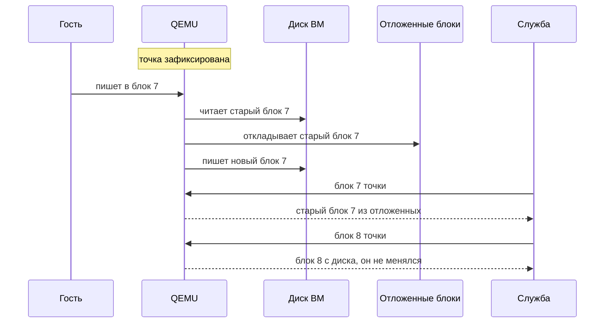
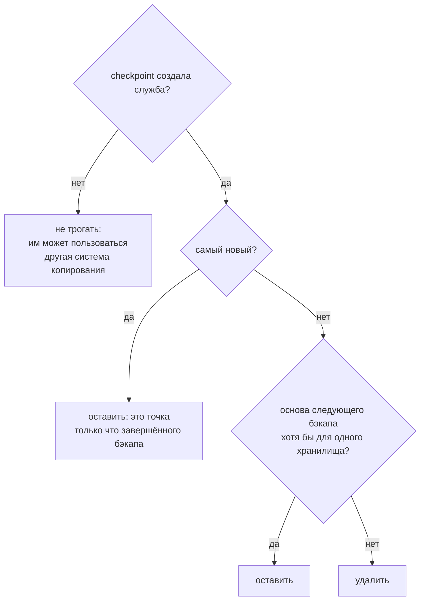
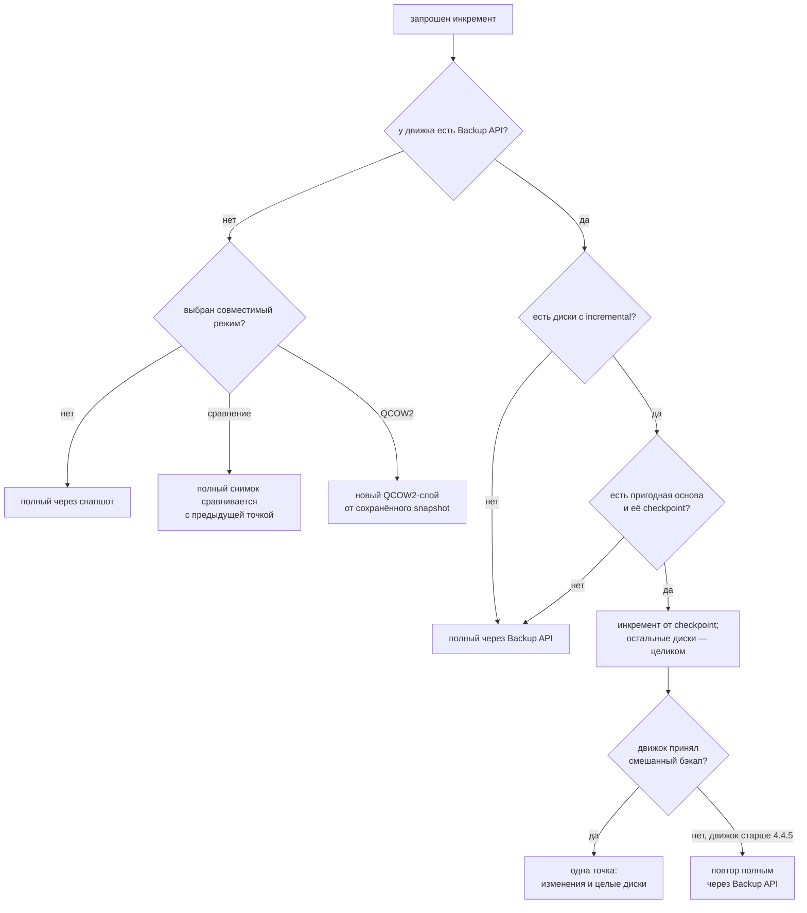
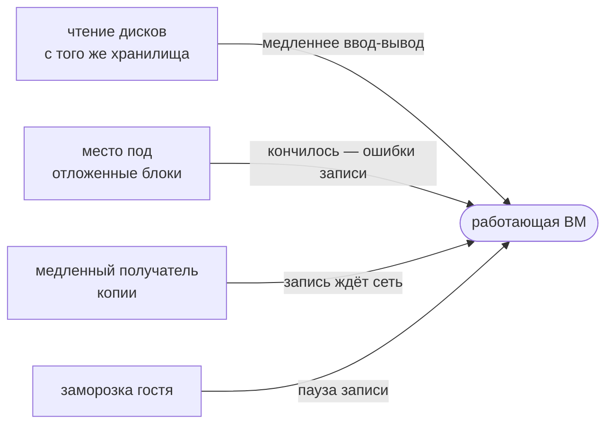
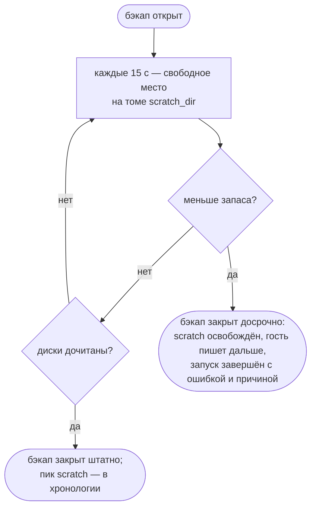
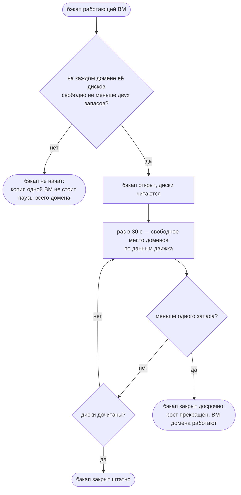
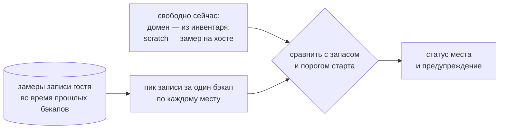
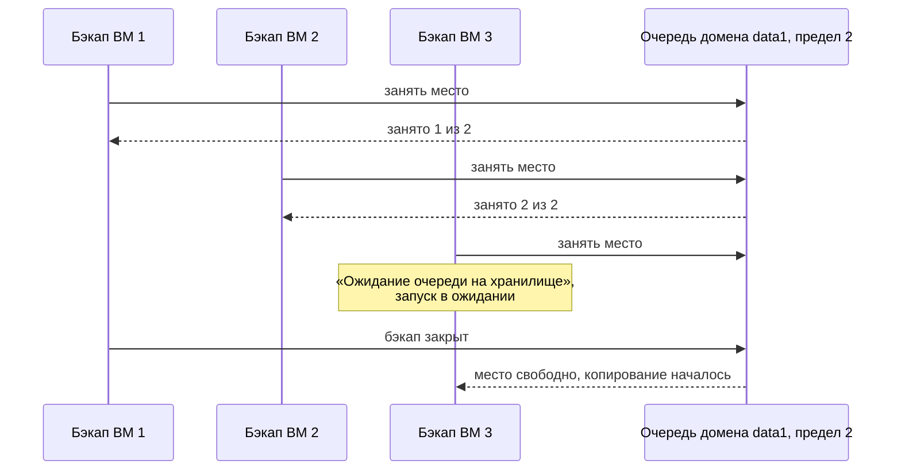
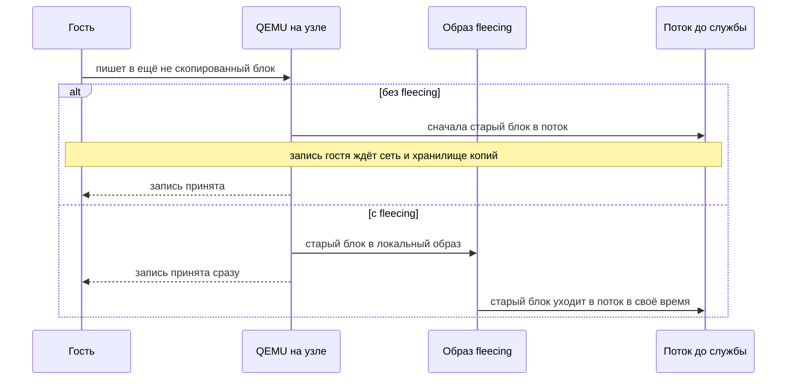
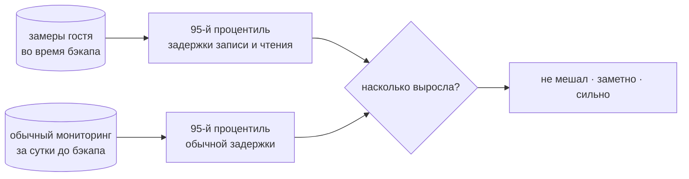

# Горячий бэкап: как устроен и как не мешать работающей ВМ

Горячий бэкап снимает копию работающей ВМ, не останавливая её. Здесь разобрано,
как каждый гипервизор фиксирует точку копии, чем бэкап всё-таки может помешать
работающей машине и что служба делает, чтобы этого не случилось.

Про заморозку гостя — в [GUEST-FREEZE.md](GUEST-FREEZE.md), про устройство
дисков QEMU — в [DISK-ARCHITECTURE.md](DISK-ARCHITECTURE.md), про повседневную
эксплуатацию — в [OPERATIONS.md](OPERATIONS.md). Схемы ниже рисует GitHub; во
встроенной документации они показаны исходником Mermaid.

---

## Коротко

- **ВМ не останавливается.** Гипервизор фиксирует точку копии, а служба читает
  её, пока гость продолжает работать и писать.
- **Заморозка для этого не нужна.** Новые задания по умолчанию гостя не
  замораживают, и копия получается «как после сбоя питания». Журналируемые
  файловые системы и СУБД переживают это штатно.
- **Мешать работающей ВМ бэкап может тремя путями:** нагрузкой чтения на её
  хранилище, нехваткой места под отложенные блоки и медленным получателем
  копии. От каждого есть своя защита, о них — в
  [разделе 3](#3-чем-бэкап-может-помешать-работающей-вм).
- **Инкременты остаются дешёвыми.** Служба сама убирает checkpoint-ы, которые
  больше не понадобятся.
- **На oVirt горячей копируется любая ВМ.** raw, qcow2 без отслеживания и
  смешанные ВМ идут через Backup API, без временного снапшота. Подробно — в
  [разделе 2а](#2а-любая-вм-на-ovirt).

---

## 1. Как фиксируется точка без остановки ВМ

После фиксации точки гость пишет как обычно. Чтобы копия всё равно получилась
на один момент, QEMU перед записью в ещё не прочитанный блок откладывает его
старое содержимое. Этот приём называется copy-before-write.


```mermaid
sequenceDiagram
    participant G as Гость
    participant Q as QEMU
    participant D as Диск ВМ
    participant T as Отложенные блоки
    participant S as Служба

    Note over Q: точка зафиксирована
    G->>Q: пишет в блок 7
    Q->>D: читает старый блок 7
    Q->>T: откладывает старый блок 7
    Q->>D: пишет новый блок 7
    S->>Q: блок 7 точки
    Q-->>S: старый блок 7 из отложенных
    S->>Q: блок 8 точки
    Q-->>S: блок 8 с диска, он не менялся
```

Где лежат отложенные блоки и как служба читает точку, зависит от гипервизора:

| Гипервизор | Как фиксирует точку | Куда откладываются старые блоки | Как служба читает |
|---|---|---|---|
| KVM | pull-режим бэкапа libvirt | scratch-файл на хосте, в каталоге `scratch_dir` подключения | NBD через SSH |
| oVirt | Backup API | scratch-диски на домене хранения или снапшот — решает движок | ovirt-imageio по HTTPS |
| oVirt без Backup API (старше 4.4) | временный снапшот | никуда: гость пишет в новый слой, а старый читается как есть | ovirt-imageio по HTTPS |
| Proxmox | `vzdump` в режиме snapshot | никуда: гость ждёт, пока блок уйдёт в поток. С fleecing — в образ на узле | поток `vzdump` по SSH |

Все диски ВМ фиксируются в один момент, так что ВМ с несколькими дисками тоже
получается согласованной.

---

## 2. Инкременты и checkpoint-ы

Бэкап с отслеживанием изменённых блоков оставляет на гипервизоре checkpoint —
метку «с этого момента считать изменения». Следующий инкремент читает только
блоки, изменённые после него.


```mermaid
flowchart LR
    F["полная копия"] --> C1(["checkpoint 1"])
    C1 --> I1["инкремент:<br/>изменения после 1"]
    I1 --> C2(["checkpoint 2"])
    C2 --> I2["инкремент:<br/>изменения после 2"]
    I2 --> C3(["checkpoint 3"])
```

Сами checkpoint-ы не исчезают:

- в libvirt каждый держит битмап в заголовке qcow2 каждого диска;
- в oVirt они копятся в базе движка, и движок пересоздаёт их на хосте при
  каждом старте ВМ.

Нужны же из них единицы. Поэтому после каждого успешного бэкапа служба
убирает лишние:


```mermaid
flowchart TD
    A{"checkpoint создала служба?"} -->|нет| Keep["не трогать:<br/>им может пользоваться<br/>другая система копирования"]
    A -->|да| B{"самый новый?"}
    B -->|да| Keep2["оставить: это точка<br/>только что завершённого бэкапа"]
    B -->|нет| C{"основа следующего бэкапа<br/>хотя бы для одного хранилища?"}
    C -->|да| Keep3["оставить"]
    C -->|нет| Drop["удалить"]
```

- **Основа следующего бэкапа** — по каждому хранилищу точка последней пригодной
  копии (от неё считается инкремент) и последней полной (от неё — разностная).
  Правило то же, что при выборе основы.
- **На oVirt** движок удаляет только самый старый checkpoint. Поэтому удаление
  идёт с корня и останавливается на первом, который трогать нельзя.
- **На KVM** удалять можно из любого места цепочки: libvirt сливает битмап
  удалённого checkpoint-а с соседним.
- **Ошибка обходится дёшево.** Если удалённый checkpoint всё-таки понадобится,
  следующий бэкап не найдёт его и честно сделает полную копию.

---

## 2а. Любая ВМ на oVirt

Backup API снимает горячую копию дисков любого формата. Режим `incremental` на
диске нужен только инкрементам: он говорит движку вести для диска карту
изменений. Полный бэкап через Backup API его не требует.

| Диски ВМ | Полный | Инкремент и разностный |
|---|---|---|
| все qcow2, режим `incremental` включён | Backup API | Backup API, только изменения |
| только raw или qcow2 без `incremental` | Backup API | запуск становится полным через Backup API, причина — в записи о нём |
| смешанные | Backup API | смешанный бэкап: диски с `incremental` — изменениями, остальные — целиком, все в одной точке |
| любые, движок без Backup API (oVirt 4.3) | временный снапшот | совместимый режим: сравнение полного снимка с основой |
| qcow2/cow, движок без Backup API (oVirt 4.3) | временный снапшот | совместимая цепочка QCOW2: передаётся новый слой; нужен `qemu-img` |
| Direct LUN | не копируется | не копируется |
| общий (shareable) диск | не копируется | не копируется |

Direct LUN и общие диски попадают в список пропущенных с причиной. Движок
отдаёт в бэкап только образы из доменов хранения. Общий диск принадлежит
нескольким ВМ, и копия на каждую размножила бы данные. Такие диски защищают
средствами СХД или изнутри гостя.

### Как выбирается путь


```mermaid
flowchart TD
    R["запрошен инкремент"] --> A{"у движка есть Backup API?"}
    A -->|нет| L{"выбран совместимый режим?"}
    L -->|нет| S["полный через снапшот"]
    L -->|сравнение| C["полный снимок сравнивается<br/>с предыдущей точкой"]
    L -->|QCOW2| Q["новый QCOW2-слой<br/>от сохранённого snapshot"]
    A -->|да| B{"есть диски с incremental?"}
    B -->|нет| F["полный через Backup API"]
    B -->|да| P{"есть пригодная основа<br/>и её checkpoint?"}
    P -->|нет| F
    P -->|да| M["инкремент от checkpoint;<br/>остальные диски — целиком"]
    M --> E{"движок принял<br/>смешанный бэкап?"}
    E -->|да| OK["одна точка:<br/>изменения и целые диски"]
    E -->|"нет, движок старше 4.4.5"| F2["повтор полным<br/>через Backup API"]
```

Полный запрос сразу идёт в Backup API, без этих проверок.

### Совместимые инкременты oVirt 4.3

Для задания `incremental` на движке без Backup API доступны два способа:

- **Сравнение блоков** — при каждом запуске временный snapshot читается целиком,
  но с родителем сравнивается по сетке чанков и в репозиторий записываются только
  изменения. Годится для `raw` и `qcow2`; экономит место в репозитории, но не
  сетевой трафик и не чтение СХД.
- **Цепочка QCOW2** — только для дисков `cow/qcow2`. Служба сохраняет один
  опорный snapshot между запусками, загружает следующий слой в формате QCOW2,
  локально привязывает его к восстановленной основе через `qemu-img` и также
  публикует только изменённые чанки. После полной публикации новой точки старая
  основа сливается. При ошибке новая точка удаляется, а старая остаётся.

**Как читается том на 4.3.** `ovirt-imageio` 1.x отдаёт файл тома как есть:
у тома qcow2 это байты формата qcow2 одного слоя, а не содержимое диска.
Поэтому том qcow2 — тонкий диск или любой диск, у которого уже есть снапшоты, —
служба скачивает целиком вместе с цепочкой предков из снапшотов ВМ, связывает
слои через `qemu-img` и раскладывает на чанки собранный сырой образ. Так
работают и полная копия, и сравнение блоков, и основа цепочки QCOW2. Том raw
без предков — это и есть диск: его служба читает диапазонами, как на 4.4. Для
томов qcow2 нужны `qemu-img` и место в `backup.temp_dir` под тома цепочки и
собранный разреженный образ самого большого диска.

Первый запуск и каждый `full_every` создают новую полную основу. Разностный
режим поддерживается только сравнением блоков. Для QCOW2 нужны `qemu-img` и
временное место как минимум под восстановленную основу и текущий raw-образ
самого большого диска. Удалять служебный snapshot вручную нельзя: следующий
запуск обнаружит его отсутствие и безопасно начнёт новую полную основу.
Другой snapshot, созданный между служебными точками, разрывает ожидаемую
backing-chain. Служба сверяет `image_id` в заголовке слоя и останавливает такой
запуск без публикации данных; после этого выберите сравнение блоков либо начните
новую QCOW2-цепочку полной основой. Режим `separate` для нескольких хранилищ
запрещён, потому что независимые цепочки той же ВМ также чередовали бы snapshots.

### Смешанный бэкап

Смешанный бэкап появился в oVirt 4.4.5. Движок открывает одну точку на все
диски. Для каждого из них он сам решает, отдать изменения от checkpoint или
диск целиком, и сообщает решение в поле `backup_mode`.

- **До старта** служба помечает для полного копирования диски без режима
  `incremental`.
- **После старта** она спрашивает у движка `backup_mode` каждого диска. Движок
  может отдать целиком и диск с `incremental`, например добавленный после
  прошлого checkpoint-а. Такой диск служба тоже копирует целиком.
- **Диск целиком** читается по карте занятых областей (контекст `zero`
  ovirt-imageio). Остальные диски читаются по карте изменений (контекст
  `dirty`).
- **В хронологии запуска** у события «Данные скопированы» перечислены диски,
  скопированные целиком, и причина для каждого.

Движок старше 4.4.5 смешанный бэкап отклоняет. Тогда служба повторяет запуск
полным через тот же Backup API. В хронологии появляется событие «Инкремент
снят полной копией», а запуск начинает новую цепочку.

Служба запоминает отказ. Следующие 7 дней инкременты этой ВМ по заданию сразу
идут полными, без лишней попытки. Причина видна в отметке «Бэкап запущен».
Память гаснет через неделю или раньше, если смешанный инкремент прошёл:
разовый запуск со страницы ВМ память не учитывает, им удобно проверить
движок после обновления.

### Восстановление смешанной цепочки

Диск, скопированный целиком внутри инкремента, становится новой основой для
себя. Поэтому цепочка каждого диска начинается с его последней полной копии,
а не с первого запуска цепочки.


```mermaid
flowchart LR
    F["полный:<br/>A и B целиком"] --> I1["инкремент:<br/>A и B изменения"]
    I1 --> I2["смешанный:<br/>A изменения, B целиком"]
    I2 --> I3["инкремент:<br/>A и B изменения"]
```

Для восстановления точки `I3` диск A собирается из `F`, `I1`, `I2` и `I3`, а
диск B — только из `I2` и `I3`. Иначе область, которую гость на B обнулил
между `F` и `I2`, вернулась бы из старой копии. Правило описано в
[BACKUP-FORMAT.md](BACKUP-FORMAT.md).

### Проверка на стенде

Утверждение «горячий бэкап любой ВМ» проверяется набором ВМ, а не одной
машиной. У каждого типа свой путь в службе и в движке. Скрипт
`scripts/verify-ovirt-matrix.sh` прогоняет `verify-hot-backup.sh` по списку ВМ
и сводит итог в таблицу.

Файл матрицы — строки «метка идентификатор_ВМ»:

```text
qcow2-incremental   <vm_id>   # все диски qcow2, режим incremental включён
raw-file            <vm_id>   # raw на NFS
raw-block           <vm_id>   # raw preallocated на iSCSI или FC
mixed               <vm_id>   # системный qcow2 и данные на raw
down                <vm_id>   # выключенная ВМ
no-agent            <vm_id>   # без qemu-guest-agent
windows             <vm_id>
```

```bash
JHV_SESSION=<кука jhvirt_session> JHV_INSECURE=1 sh ./scripts/verify-ovirt-matrix.sh SERVER_ID STORAGE_ID matrix.txt https://10.249.251.36:8080
```

Для каждой ВМ скрипт делает две копии без заморозки и сохраняет отчёт. Сводка
попадает в `ovirt-matrix-<дата>.txt`. Для каждой ВМ в ней указаны путь (Backup
API или снапшот), был ли инкремент и смешанный бэкап, сработал ли откат к
полному и замораживался ли гость.

---

## 3. Чем бэкап может помешать работающей ВМ


```mermaid
flowchart LR
    VM(["работающая ВМ"])
    R["чтение дисков<br/>с того же хранилища"] -->|"медленнее ввод-вывод"| VM
    T["место под<br/>отложенные блоки"] -->|"кончилось — ошибки записи"| VM
    N["медленный получатель<br/>копии"] -->|"запись ждёт сеть"| VM
    Z["заморозка гостя"] -->|"пауза записи"| VM
```

| Что мешает | Где | Защита |
|---|---|---|
| нагрузка чтения на хранилище ВМ | везде | предел чтения, [раздел 4](#4-предел-чтения) |
| кончилось место под scratch | KVM | проверка до старта и сторож, [раздел 5](#5-место-под-scratch-на-kvm) |
| кончилось место на домене хранения — движок ставит на паузу **все** ВМ домена | oVirt | проверка до старта и сторож, [раздел 5а](#5а-место-на-домене-хранения-ovirt) |
| гость ждёт медленный поток до службы | Proxmox | fleecing, [раздел 6](#6-fleecing-на-proxmox) |
| пауза записи на время заморозки | если заморозка включена | по умолчанию выключена, [раздел 7](#7-заморозка) |
| слияние снапшота после бэкапа | oVirt без Backup API | обновить движок: с Backup API временный снапшот не нужен ни для каких дисков |

---

## 4. Предел чтения

Бэкап читает диски ВМ с того же хранилища, с которого она работает. Предел
задаётся в задании (поле «Предел чтения, МБ/с»), а если там 0 — берётся
значение службы `backup.transfer.max_read_mbps`. Ноль и там — без ограничения.

- **Предел общий на весь запуск.** Диски читаются параллельно, а хранилище у
  них одно.
- **Меньше 10 МБ/с задать нельзя:** паузы между блоками стали бы соизмеримы с
  тайм-аутами передачи.

| Гипервизор | Как применяется |
|---|---|
| oVirt | служба выдерживает темп перед каждым запросом к ovirt-imageio |
| KVM | тот же ограничитель перед каждым чтением по NBD; сверка с источником тоже подчиняется пределу |
| Proxmox | `vzdump --bwlimit` на узле. Нужна вторая версия помощника на узлах, иначе предел не применяется и об этом пишется в хронологии |

> [!NOTE]
> Предел удлиняет бэкап. На KVM и oVirt это значит, что дольше копятся
> отложенные блоки, на Proxmox без fleecing — что дольше гость ждёт поток.
> Подбирайте предел так, чтобы копия укладывалась в окно низкой нагрузки.

---

## 5. Место под scratch на KVM

Пока бэкап открыт, каждый блок, который гость перезаписал до того, как служба
его прочитала, копируется в scratch-файл на хосте. Если на этом томе кончится
место, откладывать станет некуда, и запись гостя начнёт получать ошибки
ввода-вывода. Бэкап без остановок обернулся бы сбоем работающей ВМ.

Поэтому на томе, где свободно меньше 2 ГиБ, бэкап не открывается вовсе: гость
заполнил бы остаток за минуты записи. Запуск завершается ошибкой ещё до
заморозки и до открытия бэкапа. Если свободное место узнать не удалось, бэкап
идёт под присмотром сторожа.

Пока читаются диски, за местом следит сторож:


```mermaid
flowchart TD
    Open(["бэкап открыт"]) --> Measure["каждые 15 с — свободное место<br/>на томе scratch_dir"]
    Measure --> Low{"меньше запаса?"}
    Low -->|нет| Read{"диски дочитаны?"}
    Read -->|нет| Measure
    Read -->|да| Fine(["бэкап закрыт штатно;<br/>пик scratch — в хронологии"])
    Low -->|да| Abort(["бэкап закрыт досрочно:<br/>scratch освобождён, гость пишет дальше,<br/>запуск завершён с ошибкой и причиной"])
```

- **Запас** — 5 % от свободного на старте, но не меньше 1 ГиБ. На почти
  заполненном томе — не больше половины свободного, иначе сторож срабатывал бы
  сразу.
- **Предупреждение.** Когда свободного становится меньше двух запасов, в
  журнал службы уходит предупреждение.
- **Место неизвестно.** Если свободное место на старте узнать не удалось,
  сторож только наблюдает и бэкап не закрывает.
- **Пик.** Сколько места заняли scratch-файлы, видно в хронологии запуска, в
  отметке «Данные скопированы», если libvirt сообщает это в статистике
  задания бэкапа.

**Если сторож сработал:**

- освободите место на томе или перенесите `scratch_dir` подключения на том
  побольше;
- запускайте бэкап этой ВМ в часы меньшей записи;
- не ставьте жёсткий предел чтения: чем быстрее служба читает, тем меньше
  блоков успевает отложиться.

---

## 5а. Место на домене хранения oVirt

На oVirt записи гостя за время бэкапа копятся на домене хранения его дисков:
в scratch-дисках или в слое служебного снапшота (hybrid backup, по умолчанию в
oVirt 4.5), а у бэкапа через временный снапшот — в его слое. Если на домене
кончится место, движок ставит на паузу **все** ВМ этого домена, а не только ту,
что копируется.


```mermaid
flowchart TD
    Start(["бэкап работающей ВМ"]) --> Pre{"на каждом домене её дисков<br/>свободно не меньше двух запасов?"}
    Pre -->|нет| Refuse(["бэкап не начат:<br/>копия одной ВМ не стоит паузы всего домена"])
    Pre -->|да| Open["бэкап открыт, диски читаются"]
    Open --> Check["раз в 30 с — свободное место доменов<br/>по данным движка"]
    Check --> Low{"меньше одного запаса?"}
    Low -->|нет| Done{"диски дочитаны?"}
    Done -->|нет| Check
    Done -->|да| Fine(["бэкап закрыт штатно"])
    Low -->|да| Abort(["бэкап закрыт досрочно:<br/>рост прекращён, ВМ домена работают"])
```

- **Запас** — 5 % объёма домена, но не меньше 10 ГиБ.
- **До старта** на каждом домене дисков ВМ нужно хотя бы два запаса, иначе бэкап
  не начинается: запуск завершается ошибкой с именем домена и цифрами.
- **Во время чтения** бэкап закрывается, как только на каком-то домене осталось
  меньше одного запаса. Минимум свободного места по каждому домену за время
  бэкапа пишется в журнал службы.
- **Выключенную ВМ** это не касается: записи у неё не копятся, и бэкап идёт как
  обычно.
- **Место движок обновляет с задержкой**, поэтому запас взят с избытком. Если
  движок не отдал место по домену, служба решения по нему не принимает.

## 5б. Прогноз места до старта

Сторожа из разделов 5 и 5а спасают работающую ВМ, но не копию: закрытый
досрочно бэкап — это запуск без точки восстановления. Прогноз предупреждает об
этом заранее, на странице ВМ и в форме задания.


```mermaid
flowchart LR
    S[("замеры записи гостя<br/>во время прошлых бэкапов")] --> N["пик записи за один бэкап<br/>по каждому месту"]
    F["свободно сейчас:<br/>домен — из инвентаря,<br/>scratch — замер на хосте"] --> C{"сравнить с запасом<br/>и порогом старта"}
    N --> C
    C --> W["статус места<br/>и предупреждение"]
```

- **Сколько места нужно.** Служба смотрит до 20 последних бэкапов ВМ за 30
  дней и берёт замеры записи гостя, снятые мониторингом во время этих запусков.
  Для каждого места берётся больше всего, что гость записал на его диски за
  один бэкап. Это верхняя граница: блок, переписанный дважды, откладывается
  один раз. Вклад диска не больше его размера. Замеры живут столько же, сколько
  остальная статистика мониторинга.
- **Сколько свободно.** Для доменов oVirt — данные инвентаря, обновляются при
  синхронизации. Для каталога scratch на KVM служба делает один замер `stat -f`
  по уже открытому соединению с хостом и помнит его две минуты: форма задания
  спрашивает варианты по каждой выбранной ВМ, а новых входов в журнале хоста
  это не оставляет.
- **С чем сравнивается.** С теми же порогами, что у сторожей: запасом и
  порогом старта.

| Статус | Когда | Что значит |
|---|---|---|
| хватает | пик записи меньше половины места сверх запаса | бэкап поместится с запасом |
| впритык | пик записи — от половины до всего места сверх запаса | если ВМ станет писать больше, сторож может закрыть бэкап |
| не хватит | пик записи не меньше места сверх запаса | сторож, скорее всего, закроет бэкап раньше конца |
| не начнётся | свободно меньше порога старта | запуск будет отклонён до начала копирования |
| неизвестно | нет замеров прошлых бэкапов или место не замерено | прогноза нет, решают сторожа |

Прогноз только советует. Он не запрещает запуск и ничего в нём не меняет: до
старта и по ходу решают те же сторожа, что и без него. Для выключенной ВМ
предупреждений нет: она не пишет, и место бэкапу не нужно.

Прогноз считается для одной ВМ. Если на том же домене одновременно копируются
несколько ВМ, место делят все их бэкапы. Ограничить их число можно очередью —
[раздел 5в](#5в-очередь-на-место-хранения).

## 5в. Очередь на место хранения

Сторожа места считают по одной ВМ. А бэкапы многих ВМ одного домена oVirt или
одного хоста KVM копят записи гостей в одном месте. Сторож спасёт работающие
ВМ, но закроет копии досрочно. Настройка `backup.max_runs_per_storage`
ограничивает, сколько горячих бэкапов одновременно держат открытыми на одном
месте. Остальные ждут очереди.


```mermaid
sequenceDiagram
    participant A as Бэкап ВМ 1
    participant B as Бэкап ВМ 2
    participant C as Бэкап ВМ 3
    participant Q as Очередь домена data1, предел 2

    A->>Q: занять место
    Q-->>A: занято 1 из 2
    B->>Q: занять место
    Q-->>B: занято 2 из 2
    C->>Q: занять место
    Note over C: «Ожидание очереди на хранилище»,<br/>запуск в ожидании
    A->>Q: бэкап закрыт
    Q-->>C: место свободно, копирование началось
```

- **По умолчанию выключено** (`0`): порядок запусков такой же, как раньше.
  Обычно хватает 2–3.
- **Место** — домен хранения oVirt (у ВМ с дисками на нескольких доменах —
  каждый из них) или каталог scratch подключения KVM. Места занимаются в одном
  порядке, поэтому два запуска с общими доменами не ждут друг друга по кругу.
- **Кого касается.** Только горячих бэкапов работающих ВМ: выключенная ВМ не
  пишет и места не занимает. Экспорт OVA, копии конфигурации и Proxmox в
  очередь не встают.
- **Пока запуск ждёт**, он остаётся в ожидании, а в хронологии стоит отметка
  «Ожидание очереди на хранилище» с тем, чего он ждёт. Время старта запуска —
  время начала копирования. Ожидание засчитывается в предел длительности
  задания, и отмена его прерывает.
- **Место освобождается**, когда запуск закончился: бэкап на движке закрыт,
  scratch удалён.

---

## 6. Fleecing на Proxmox

`vzdump` в режиме snapshot устроен иначе, чем KVM и oVirt. Если гость пишет в
ещё не скопированный блок, старое содержимое сначала уходит получателю копии,
и только потом запись продолжается. Получатель здесь — поток по SSH до службы
и дальше в хранилище копий. Если сеть или хранилище медленные, гость тормозит
вместе с ними.

Fleecing (Proxmox VE 8.2+) кладёт старые блоки в образ на хранилище узла, и
запись гостя сети не ждёт:


```mermaid
sequenceDiagram
    participant G as Гость
    participant Q as QEMU на узле
    participant F as Образ fleecing
    participant S as Поток до службы

    G->>Q: пишет в ещё не скопированный блок
    alt без fleecing
        Q->>S: сначала старый блок в поток
        Note over G,S: запись гостя ждёт сеть и хранилище копий
        Q-->>G: запись принята
    else с fleecing
        Q->>F: старый блок в локальный образ
        Q-->>G: запись принята сразу
        F->>S: старый блок уходит в поток в своё время
    end
```

**Как включить:**

1. Обновите помощник `jhvirt-pve-data-plane` на **каждом** узле до версии из
   этого комплекта. Инструкция — в
   [DEPLOY.md](DEPLOY.md#proxmox-ve-канал-данных-для-backuprestore).
   Обновлённый помощник на `probe` отвечает `jhvirt-pve-data-plane/2`, а на
   узлах Proxmox VE 8.2+ добавляет строку `fleecing`.
2. В форме подключения Proxmox заполните «Хранилище для fleecing», например
   `local-lvm`. Хранилище должно существовать на каждом узле; лучше быстрое
   локальное: LVM-thin, ZFS, RBD.

**Как это работает дальше:**

- Перед каждым бэкапом служба спрашивает у узла, что он умеет, и передаёт
  `vzdump` только то, что узел поддерживает.
- Что применено, а что нет и почему, видно в хронологии, в отметке «Данные
  скопированы».
- Если fleecing применить нельзя — старый помощник или узел старше 8.2 —
  бэкап идёт как раньше, без него.
- Fleecing нужен только ВМ QEMU. Контейнер `vzdump` снимает снимком хранилища,
  и отложенных блоков у него нет.

---

## 7. Заморозка

Для горячего бэкапа заморозка не нужна. Она даёт одно: в момент точки в
госте нет недописанных данных. Платить за это приходится паузой записи.

- **Новые задания** и разовый бэкап со страницы ВМ по умолчанию используют
  уровень `crash` — служба гостя не трогает. Готовые расписания на странице ВМ
  тоже создаются без заморозки.
- **Гипервизоры иногда замораживают сами:**
  - движок oVirt при бэкапе ВМ с работающим агентом — на доли секунды;
  - Proxmox при `agent=1` — отключается опцией агента ВМ
    `freeze-fs-on-backup=0`.
- **Согласованная копия СУБД без пауз** — это логические дампы, раздел
  «Логические дампы СУБД» в [OPERATIONS.md](OPERATIONS.md#логические-дампы-субд).

Подробно о заморозке — в [GUEST-FREEZE.md](GUEST-FREEZE.md).

---

## 8. Что видно в карточке запуска

| Где | Что |
|---|---|
| хронология, «Бэкап запущен» | тип запуска и, если он сменился, причина: нет основы или checkpoint, предел цепочки, отказ движка в смешанном бэкапе |
| хронология, «Данные скопированы» | на KVM — пик scratch-файлов; на Proxmox — применённые предел чтения и fleecing или причина, почему не применены |
| страница ВМ, «Место под горячий бэкап» | прогноз по каждому домену или каталогу scratch: свободно, пик записи гостя, статус; то же предупреждение — в форме задания |
| карточка запуска, «Влияние на ВМ» | задержки записи и чтения гостя за время бэкапа против обычных и оценка — см. ниже |
| хронология, «Ожидание очереди на хранилище» | запуск ждёт, пока на домене или в каталоге scratch освободится место в очереди (`backup.max_runs_per_storage`) |
| ошибка запуска | «на хосте кончается место под временные файлы бэкапа…» — не хватило места под scratch на KVM, до старта или по ходу |
| ошибка запуска | «на домене хранения мало места для горячего бэкапа…» — не хватило места на домене oVirt, до старта или по ходу |
| журнал службы | предупреждение о подходе к запасу scratch; сколько checkpoint-ов удалено после бэкапа |

### Влияние на ВМ

Горячий бэкап не останавливает ВМ, но может замедлить её ввод-вывод. Под
графиком «Ввод-вывод гостя» карточка запуска сравнивает задержки гостя за
время бэкапа с обычными — по замерам мониторинга за сутки до запуска.


```mermaid
flowchart LR
    D[("замеры гостя<br/>во время бэкапа")] --> P1["95-й процентиль<br/>задержки записи и чтения"]
    B[("обычный мониторинг<br/>за сутки до бэкапа")] --> P2["95-й процентиль<br/>обычной задержки"]
    P1 --> J{"насколько выросла?"}
    P2 --> J
    J --> L["не мешал · заметно · сильно"]
```

| Оценка | Когда | Что делать |
|---|---|---|
| не мешал | задержка выросла не больше чем в 1,5 раза или не больше чем на 2 мс | ничего |
| заметно | между «не мешал» и «сильно» | обычно приложения это переносят |
| сильно | задержка выросла в 4 раза и больше и не меньше чем на 10 мс | задать в задании предел чтения — оценка предлагает половину скорости этого запуска, не меньше 10 МБ/с — или перенести бэкап на часы низкой нагрузки; если служба и так читала медленнее 10 МБ/с, предел не поможет |
| неизвестно | меньше 5 замеров с операциями за время бэкапа или до него | сравнить не с чем |

- **Почему 95-й процентиль.** Медиана прячет редкие долгие операции, а именно
  их замечают приложения.
- **Какие замеры не считаются.** Замеры без операций: задержки в них нет. На
  Proxmox гипервизор задержек не отдаёт, и оценка там «неизвестно».
- **На oVirt** задержки берутся из статистики движка, она усредняет их сама.

> [!WARNING]
> Сторожа scratch и домена хранения, fleecing и ротация checkpoint-ов проверены модульными тестами,
> но ещё не на живых гипервизорах. Прежде чем полагаться на них, прогоните
> бэкап на одной ВМ. Большую часть проверок делает скрипт
> `scripts/verify-hot-backup.sh`: он снимает две разовые копии без заморозки и
> сверяет хронологию — не было ли заморозки, есть ли инкремент, пик scratch,
> fleecing, не сработали ли сторожа:
>
> ```bash
> JHV_SESSION=<кука jhvirt_session> JHV_INSECURE=1 sh ./scripts/verify-hot-backup.sh SERVER_ID VM_ID STORAGE_ID https://10.249.251.36:8080
> ```
>
> Вручную остаётся:
> - на KVM сравните пик scratch с `du` каталога `scratch_dir` во время бэкапа;
> - после нескольких бэкапов проверьте, что лишние checkpoint-ы исчезают:
>   `virsh checkpoint-list <ВМ>` на KVM, список checkpoint-ов ВМ в API движка
>   на oVirt.

---

## 9. Где что в коде

На GitHub ссылки открывают файлы. Во встроенной документации это просто пути в
репозитории.

| Что | Где |
|---|---|
| предел чтения, общий на запуск | `ReadPacer` — [internal/backup/pacer.go](../internal/backup/pacer.go) |
| предел чтения на KVM | `copyDisks`, `copyOneDisk`, `verifyAgainstSource` — [internal/kvm/copy.go](../internal/kvm/copy.go) |
| выбор пути для ВМ oVirt | `Engine.resolvePlan`, `plan.markFullDisk` — [internal/backup/runner.go](../internal/backup/runner.go) |
| смешанный бэкап и откат к полному | `Engine.runCBT`, `mixedBackupRejected`, `Engine.downgradeToFull`, `copyDisks` — [internal/backup/runner.go](../internal/backup/runner.go) |
| режим каждого диска от движка | `Client.BackupDiskModes` — [internal/ovirt/backup.go](../internal/ovirt/backup.go); поле `Disk.BackupMode` — [internal/ovirt/types.go](../internal/ovirt/types.go) |
| основа цепочки диска при восстановлении | `EffectiveChain` — [internal/backup/reader.go](../internal/backup/reader.go) |
| варианты бэкапа для ВМ | `buildOptions`, `buildPresets` — [internal/backup/plan.go](../internal/backup/plan.go) |
| проверка на стенде | [scripts/verify-hot-backup.sh](../scripts/verify-hot-backup.sh), [scripts/verify-ovirt-matrix.sh](../scripts/verify-ovirt-matrix.sh) |
| общий цикл сторожей | `Guard`, `StartGuard` — [internal/backup/guard.go](../internal/backup/guard.go) |
| сторож scratch и проверка до старта | `scratchGuard`, `scratchReserve`, `checkScratchStart` — [internal/kvm/scratch.go](../internal/kvm/scratch.go); встроен в `Driver.Backup` — [internal/kvm/driver.go](../internal/kvm/driver.go) |
| влияние бэкапа на ВМ | `ComputeIOImpact` — [internal/model/io_impact.go](../internal/model/io_impact.go); ответ телеметрии — `handleRunTelemetry` в [internal/api/handlers_backup.go](../internal/api/handlers_backup.go); обычные замеры — `DiskSampleFilter.OnlyMonitoring` в [internal/store/iostats.go](../internal/store/iostats.go) |
| тома гостя для выборочной заморозки | `Conn.GuestFilesystems` — [internal/libvirtx/guest_fs.go](../internal/libvirtx/guest_fs.go); `handleGuestFilesystems` — [internal/api/handlers_inventory.go](../internal/api/handlers_inventory.go); поле — [web/src/components/FreezeMountpointsField.vue](../web/src/components/FreezeMountpointsField.vue) |
| очередь на место хранения | `PlaceLimiter` — [internal/backup/place_limiter.go](../internal/backup/place_limiter.go); oVirt — `Engine.waitDomains` в [internal/backup/storage_queue.go](../internal/backup/storage_queue.go); KVM — `Dispatcher.waitScratch` в [internal/dispatch/storage_queue.go](../internal/dispatch/storage_queue.go); настройка — `backup.max_runs_per_storage` в [config/ovirt-backup.yaml](../config/ovirt-backup.yaml) |
| образ тома qcow2 на oVirt 4.3 | `materializeLegacyChain`, `downloadVolume`, `copyLegacyChainDisk` — [internal/backup/legacy_chain.go](../internal/backup/legacy_chain.go); выбор пути — `runSnapshot` и `copyDisks` в [internal/backup/runner.go](../internal/backup/runner.go) |
| прогноз места до старта | `SpaceForecast`, `Engine.forecastSpace`, `peakWrites`, `Assessment.SetPlaceFree` — [internal/backup/space_forecast.go](../internal/backup/space_forecast.go); замеры записи — `Store.GuestWritesDuringRuns` в [internal/store/iostats.go](../internal/store/iostats.go); место под scratch на KVM — `Dispatcher.Recommend` в [internal/dispatch/space_forecast.go](../internal/dispatch/space_forecast.go); карточка — [web/src/components/SpaceForecastCard.vue](../web/src/components/SpaceForecastCard.vue) |
| защита домена хранения oVirt | `DomainReserve`, `checkDomainsBeforeBackup`, `domainGuard`, `copyDisksGuarded` — [internal/backup/storage_guard.go](../internal/backup/storage_guard.go); место домена — `Client.GetStorageDomain` в [internal/ovirt/inventory.go](../internal/ovirt/inventory.go) |
| замер места и статистика scratch в libvirt | `Conn.ScratchFree`, `Conn.BackupScratchUsage` — [internal/libvirtx/backup.go](../internal/libvirtx/backup.go) |
| правило ротации checkpoint-ов | `CheckpointsToDrop` — [internal/backup/checkpoints.go](../internal/backup/checkpoints.go) |
| какие checkpoint-ы ещё нужны | `CheckpointsInUse`, `OwnCheckpoints` — [internal/store/backup_runs.go](../internal/store/backup_runs.go) |
| ротация на oVirt | `Engine.pruneCheckpoints`, `ovirtCheckpointChain` — [internal/backup/checkpoint_prune.go](../internal/backup/checkpoint_prune.go) |
| ротация на KVM | `Driver.PruneCheckpoints` — [internal/kvm/driver.go](../internal/kvm/driver.go); вызов — `pruneLibvirtCheckpoints` в [internal/dispatch/dispatch.go](../internal/dispatch/dispatch.go) |
| параметры vzdump | `proxmoxBackupOptions` — [internal/dispatch/proxmox_options.go](../internal/dispatch/proxmox_options.go) |
| протокол помощника Proxmox | `ParseProbe`, `BackupOptions`, `DataPlane.Backup` — [internal/proxmox/dataplane.go](../internal/proxmox/dataplane.go) |
| помощник на узлах | [deploy/proxmox/jhvirt-pve-data-plane](../deploy/proxmox/jhvirt-pve-data-plane) |
| хранилище для fleecing | `Server.FleecingStorage` — [internal/model/infra.go](../internal/model/infra.go); миграция [0052](../internal/store/migrations/0052_proxmox_fleecing.sql) |
| умолчание «без заморозки» | готовые расписания — `buildPresets` в [internal/backup/plan.go](../internal/backup/plan.go); формы — [web/src/pages/JobsPage.vue](../web/src/pages/JobsPage.vue), [web/src/pages/VMDetailPage.vue](../web/src/pages/VMDetailPage.vue) |
