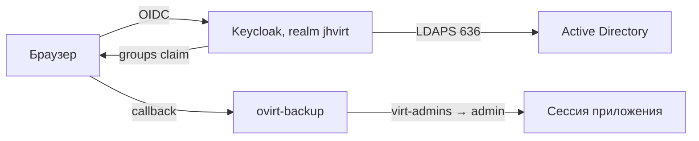

# Keycloak и Active Directory

Эта инструкция относится к встроенному Keycloak, который установщик запускает
рядом с ovirt-backup. Приложение не подключается к LDAP напрямую: пользователь
вводит доменный пароль в Keycloak, Keycloak проверяет его в Active Directory и
возвращает приложению подписанный OIDC-токен. Доменный пароль в приложение и
его PostgreSQL не попадает.



## 1. Подготовьте Active Directory

Нужны:

- полные DNS-имена минимум двух контроллеров домена;
- порт `636/tcp` для LDAPS, либо `389/tcp` только с StartTLS;
- DN области пользователей, например `OU=Users,DC=corp,DC=example,DC=local`;
- отдельная учётная запись чтения, например
  `CN=svc-keycloak,OU=Service Accounts,DC=corp,DC=example,DC=local`;
- корневой и при необходимости промежуточный CA, которым подписаны
  сертификаты LDAPS контроллеров;
- три группы доступа. Проще всего назвать их `virt-admins`,
  `virt-operators` и `virt-readers`.

Bind-пользователю не нужны Domain Admin и право менять каталог. Достаточно
читать пользователей, группы и их членство. Не используйте личную учётную
запись: срок её пароля однажды остановит вход всех пользователей.

Группы, которые установщик создаёт в realm `jhvirt`, не являются объектами AD.
При автоматической федерации mapper связывает их по имени с уже существующими
AD security groups. Создавать группы в домене с read-only bind account
установщик намеренно не пытается.

Создайте группы безопасности в том OU, который затем будет передан как
`--keycloak-ad-groups-dn`. Пример из PowerShell с модулем ActiveDirectory:

```powershell
$groupsOu = "OU=Application Groups,DC=corp,DC=example,DC=local"
"virt-admins", "virt-operators", "virt-readers" | ForEach-Object {
  New-ADGroup -Name $_ -SamAccountName $_ -GroupCategory Security `
    -GroupScope Global -Path $groupsOu
}

Add-ADGroupMember -Identity "virt-admins" -Members "alice"
Add-ADGroupMember -Identity "virt-operators" -Members "bob"
Add-ADGroupMember -Identity "virt-readers" -Members "carol"
```

Пользователя включайте непосредственно в одну из трёх групп. Текущая
автоматическая конфигурация читает стандартный атрибут AD `memberOf`, то есть
прямое членство. Вложенные группы не считаются рекурсивно. Проверка:

```powershell
Get-ADUser alice -Properties memberOf |
  Select-Object -ExpandProperty memberOf
```

Если пользователь случайно состоит в нескольких группах, приложение выбирает
старшую роль: `admin`, затем `operator`, затем `viewer`.

## 2. Проверьте DNS из контейнера

Имя контроллера должно разрешаться на Docker-host и внутри Keycloak:

```bash
getent hosts dc01.corp.example.local
cd /opt/jhvirt/compose
sudo docker compose exec -T keycloak \
  getent hosts dc01.corp.example.local
```

Адрес `127.0.0.11` внутри контейнера является DNS-прокси Docker. Постоянно
исправлять нужно резолвер host, а не `/etc/resolv.conf` контейнера. Порядок для
Ubuntu, RHEL/Alma/Rocky и Docker приведён в [DNS.md](DNS.md). После изменения
DNS перезапустите Docker в согласованное окно и снова выполните обе проверки.

## 3. Добавьте корпоративный CA

Установщик создаёт сохраняемый каталог
`/opt/jhvirt/keycloak-truststores` и подключает его к Keycloak только для
чтения. Поместите туда CA в PEM, а не сертификат с закрытым ключом:

```bash
sudo install -o root -g root -m 0644 corp-root-ca.pem \
  /opt/jhvirt/keycloak-truststores/corp-root-ca.pem
sudo install -o root -g root -m 0644 corp-issuing-ca.pem \
  /opt/jhvirt/keycloak-truststores/corp-issuing-ca.pem
cd /opt/jhvirt/compose
sudo docker compose restart keycloak
sudo docker compose logs --since=2m keycloak
```

Для установки из checkout путь задаёт
`JHV_KEYCLOAK_TRUSTSTORE_DIR` в `deploy/.env`. Keycloak рекурсивно читает PEM и
незашифрованные PKCS12 из этого каталога через `KC_TRUSTSTORE_PATHS`. Не
отключайте проверку имени сертификата: SAN сертификата должен содержать DNS-имя
из Connection URL.

## 4. Подключите AD установщиком

Это основной и воспроизводимый способ. Присоединять Linux-хост к домену через
SSSD/realmd не требуется: Keycloak обращается к AD напрямую по LDAPS.

### Простой интерактивный режим

Запустите `.run` без AD-параметров, выберите встроенный Keycloak и ответьте
`да` на предложение подключить Active Directory. Затем выберите режим `1`:

```text
Настроить Active Directory сейчас? [y/N]: y
Настройка AD: 1 — по DNS-домену, 2 — расширенная [1]:
DNS-домен Active Directory, например example.org: corp.example.org
Контроллер домена [dc01.corp.example.org]:
Bind-пользователь только для чтения (UPN или DN): svc-keycloak
Пароль bind-пользователя:
Повторите пароль:
PEM-файл корневого/промежуточного CA: /root/corp-ad-ca-chain.pem
```

Мастер автоматически:

1. строит `DC=corp,DC=example,DC=org` из DNS-домена;
2. ищет контроллер по SRV-записи
   `_ldap._tcp.dc._msdcs.corp.example.org` и предлагает результат;
3. превращает короткий bind-логин `svc-keycloak` в
   `svc-keycloak@corp.example.org`;
4. ищет пользователей и три группы по всему домену с областью `Subtree`;
5. дважды читает пароль без echo и сразу переносит его в file vault;
6. при обновлении автоматически выбирает единственный существующий LDAP
   provider;
7. сохраняет только несекретные параметры мастера, поэтому при следующей
   ротации пароля их не нужно вводить заново.

CA не скачивается автоматически с контроллера: такой сертификат ещё не имеет
доверия и может быть подменён. Передайте проверенную цепочку из доверенного
канала. Если пользователи или группы должны искаться только в отдельных OU,
выберите расширенный режим `2`.

### Простой unattended-режим

В автоматизации пароль по-прежнему передаётся только через root-only файл:

```bash
read -rsp 'AD bind password: ' AD_BIND_PASSWORD; echo
printf '%s\n' "$AD_BIND_PASSWORD" | sudo tee /root/ad-bind.password >/dev/null
unset AD_BIND_PASSWORD
sudo chown root:root /root/ad-bind.password
sudo chmod 0600 /root/ad-bind.password
```

Не передавайте пароль аргументом командной строки: аргументы видны через
`ps` и сохраняются в истории shell:

```bash
sudo sh ./ovirt-backup-*-linux-amd64.run \
  --mode docker \
  --url https://backup.example.org:8080 \
  --port 8080 \
  --oidc keycloak \
  --keycloak-ad \
  --keycloak-ad-domain corp.example.org \
  --keycloak-ad-controller dc01.corp.example.org \
  --keycloak-ad-bind-user svc-keycloak@corp.example.org \
  --keycloak-ad-bind-password-file /root/ad-bind.password \
  --keycloak-ad-ca-file /root/corp-ad-ca-chain.pem
```

`--keycloak-ad-controller` можно опустить, если на сервере доступен `dig`,
`host` или `nslookup` и SRV-запись AD исправна. Для предсказуемого CI лучше
задавать контроллер явно.

### Расширенный режим

Отдельные Users DN и Groups DN задаются так:

```bash
sudo sh ./ovirt-backup-*-linux-amd64.run \
  --mode docker \
  --url https://backup.example.org:8080 \
  --port 8080 \
  --oidc keycloak \
  --keycloak-ad \
  --keycloak-ad-provider corp-ad \
  --keycloak-ad-url 'ldaps://dc01.corp.example.local:636 ldaps://dc02.corp.example.local:636' \
  --keycloak-ad-users-dn 'OU=Users,DC=corp,DC=example,DC=local' \
  --keycloak-ad-groups-dn 'OU=Application Groups,DC=corp,DC=example,DC=local' \
  --keycloak-ad-bind-dn 'CN=svc-keycloak,OU=Service Accounts,DC=corp,DC=example,DC=local' \
  --keycloak-ad-bind-password-file /root/ad-bind.password \
  --keycloak-ad-ca-file /root/corp-ad-ca-chain.pem
```

Установщик выполняет операцию идемпотентно:

1. устанавливает CA и bind-секрет до запуска Keycloak;
2. создаёт или обновляет LDAP provider по имени `corp-ad`;
3. фиксирует `sAMAccountName`, `objectGUID`, `Subtree`, `READ_ONLY` и LDAPS;
4. создаёт Group LDAP Mapper только для `virt-admins`, `virt-operators` и
   `virt-readers`;
5. выполняет полный sync пользователей и групп;
6. завершает установку ошибкой, если LDAP сообщил ошибки или не найдены все
   три группы доступа.

Если в realm уже существует ровно один LDAP provider, простой мастер обновляет
его независимо от имени. При нескольких providers автоматический выбор
запрещён: сначала разберите дубликаты по порядку ниже либо в расширенном запуске
задайте однозначное имя через `--keycloak-ad-provider`.

По умолчанию Group LDAP Mapper работает в `READ_ONLY`: членство читается из
AD, но Keycloak не записывает изменения обратно. Режим `LDAP_ONLY` можно явно
включить через `--keycloak-ad-group-mode ldap-only`, но он допускает запись
членства в LDAP и для обычной read-only service account не рекомендуется.

После unattended-запуска удалите исходный временный файл. Интерактивный режим
его не создаёт:

```bash
sudo shred -u /root/ad-bind.password
```

Рабочая копия хранится в
`/opt/jhvirt/keycloak-vault/jhvirt_ad-bind`: владелец `root:root`, права `0440`.
Каталог монтируется только в контейнер Keycloak и только для чтения. В базе
Keycloak находится ссылка `${vault.ad-bind}`, а не сам пароль. Контейнеру
ovirt-backup, PostgreSQL и backup-контейнерам этот bind mount не предоставлен.

Компрометация самого контейнера Keycloak всё равно позволяет прочитать секрет,
поскольку без него Keycloak не сможет проверять пользователей в AD. Поэтому
service account должна иметь только чтение, без интерактивного входа и без
административных прав; её пароль нужно уметь быстро отозвать и заменить.

## 5. Подключение из web-интерфейса

Локальный администратор приложения с правом `users.admin` может выполнить ту
же прикладную настройку через **Настройки → Keycloak и домен**. Это удобно для
уже работающей установки, когда Keycloak и его truststore подготовлены
отдельно.

Перед началом нужны:

- внешний HTTPS issuer Keycloak и точный callback приложения;
- confidential OIDC-клиент либо его новый ID и секрет;
- временный Keycloak service account с правами управлять target realm,
  клиентами, user federation, пользователями и группами;
- настроенное доверие Keycloak к CA контроллера домена;
- read-only bind account и три заранее созданные группы AD.

Сначала мастер проверяет discovery и сохраняет OIDC-настройки. Затем он
проверяет client ID и secret приложения, выполняет `testConnection` и
`testAuthentication` из Keycloak, создаёт или обновляет LDAP provider и Group
LDAP Mapper, запускает полную синхронизацию и требует точного наличия всех
трёх групп. На каждом шаге нужно повторно ввести пароль текущего локального
администратора. Войти через OIDC после применения можно без перезапуска
службы.

Если задан внутренний адрес Keycloak, мастер использует его и для токена
временной service account, и для Admin API. Путь до realm и возможный префикс
Keycloak берутся из публичного issuer; внутреннее поле задаёт только origin.

Успешная проверка домена привязана к текущим issuer, backchannel, client ID и
secret, redirect URL, claim и трём ролевым группам. Изменение любого из этих
значений сбрасывает статус подключения. До повторного запуска второго шага
локальный вход отключить нельзя; при выключенном OIDC он также всегда остаётся
доступным. Неудачные попытки повторного ввода пароля локального администратора
ограничиваются возрастающей паузой.
После изменения параметров доступа или повторной настройки LDAP существующие
OIDC-сессии отзываются сразу. Сессия локального администратора сохраняется.

Секрет административного service account и bind-пароль не сохраняются в базе
приложения и после запроса удаляются из формы. Стандартный Admin API Keycloak
помещает bind credential в конфигурацию LDAP provider. Если политика требует
ссылку `${vault.ad-bind}` и отдельный read-only file vault, используйте
установщик из раздела 4. CA через web не загружается: добавьте его в truststore
Keycloak и перезапустите Keycloak до запуска мастера.

## 6. Ручная настройка provider

Этот раздел нужен для нестандартной схемы либо диагностики. При обычной
установке используйте раздел 4, чтобы конфигурация была воспроизводимой.

1. Откройте `https://<сервер>:8081/admin/master/console/` и войдите как
   `kc-bootstrap-admin`.
2. В левом верхнем списке realm выберите **jhvirt**, не **master**.
3. Откройте **User federation → Add new provider → LDAP**.
4. Заполните параметры, заменив пример своим доменом.

| Поле Keycloak | Рекомендуемое значение для AD |
|---|---|
| Console display name | `corp-ad` |
| Vendor | `Active Directory` |
| Connection URL | `ldaps://dc01.corp.example.local:636 ldaps://dc02.corp.example.local:636` |
| Enable StartTLS | `Off` для LDAPS; `On` только при `ldap://...:389` |
| Use Truststore SPI | `Always` |
| Bind type | `simple` |
| Bind DN | DN отдельной service account |
| Bind credentials | пароль service account |
| Edit mode | `READ_ONLY` |
| Users DN | OU, внутри которой Keycloak ищет пользователей |
| Username LDAP attribute | `sAMAccountName` |
| RDN LDAP attribute | `cn` |
| UUID LDAP attribute | `objectGUID` |
| User object classes | `person, organizationalPerson, user` |
| Search scope | `Subtree` |
| Import users | `On` |
| Sync registrations | `Off` |
| Pagination | `On` |

Нажмите **Test connection**, затем **Test authentication** и только после двух
успешных проверок сохраните provider. Несколько URL через пробел дают failover
между контроллерами, но оба имени и сертификата должны проходить проверку.

В **Mappers** проверьте созданные автоматически соответствия:

| Поле пользователя Keycloak | LDAP attribute AD |
|---|---|
| username | `sAMAccountName` |
| firstName | `givenName` |
| lastName | `sn` |
| email | `mail` |

Оставьте `MSAD User Account Mapper`: он переносит блокировку учётной записи и
признак обязательной смены пароля. Затем в provider выполните
**Synchronize all users**. Для дальнейшей работы включите периодический changed
users sync; полный sync оставьте редким и запускайте вне пикового времени.

## 6. Выберите модель назначения ролей

Не смешивайте два режима для одних и тех же групп: иначе ручное изменение в
Keycloak может быть перезаписано следующей LDAP-синхронизацией.

### Вариант A: членство задаётся вручную в Keycloak

Это подходит для небольшого числа операторов. Group LDAP Mapper для групп
доступа не создавайте. После первого входа пользователя или синхронизации:

1. **Realm jhvirt → Users → пользователь → Groups**.
2. Нажмите **Join Group**.
3. Выберите одну из созданных установщиком групп:
   `virt-admins`, `virt-operators`, `virt-readers`.
4. Нажмите **Join**. Для смены роли сначала выполните **Leave** из прежней
   группы, затем **Join Group** в новой.
5. Пользователь должен выйти из ovirt-backup и войти снова. Уже созданная
   сессия живёт до `auth.oidc.session_ttl`.

Пароль по-прежнему проверяет AD; локально в Keycloak хранится только членство в
группе и импортированный профиль.

### Вариант B: членство управляется в Active Directory

Это рекомендуемый production-вариант. Установщик из раздела 4 создаёт mapper
автоматически. Создайте в AD группы доступа и управляйте
их составом только средствами AD. В **User federation → corp-ad → Mappers**
добавьте mapper типа **group-ldap-mapper**:

| Поле mapper | Значение для обычной схемы AD |
|---|---|
| LDAP Groups DN | OU с группами доступа |
| Group Name LDAP Attribute | `cn` |
| Group Object Classes | `group` |
| Membership LDAP Attribute | `member` |
| Membership Attribute Type | `DN` |
| User Groups Retrieve Strategy | `GET_GROUPS_FROM_USER_MEMBEROF_ATTRIBUTE` |
| Member-Of LDAP Attribute | `memberOf` |
| Mode | `READ_ONLY` |
| Groups LDAP Filter | `(|(cn=virt-admins)(cn=virt-operators)(cn=virt-readers))` |
| Preserve Group Inheritance | `Off`, если группы плоские |

Сохраните mapper и выполните **Sync LDAP Groups to Keycloak**. Для вложенных
групп сначала проверьте поведение на тестовом пользователе: `memberOf` обычно
показывает прямое членство. Надёжнее включать пользователя непосредственно в
одну из трёх групп доступа либо выбрать рекурсивную стратегию после проверки её
нагрузки на ваших контроллерах.

Если корпоративные названия менять нельзя, например используются
`OVIRT-BACKUP-ADMINS`, измените `auth.oidc.role_mapping` в
`/opt/jhvirt/config/ovirt-backup.yaml` и перезапустите приложение. Создавать
дубликат группы в Keycloak не требуется.

## 7. Проверьте mapper OIDC и вход

Установщик уже создаёт у клиента `jhvirt` mapper типа **Group Membership**:

- Token Claim Name: `groups`;
- Full group path: `Off`;
- Add to ID token: `On`;
- Add to access token: `On`;
- Add to userinfo: `On`.

Войдите через кнопку Keycloak доменным пользователем. Результат:

- `virt-admins` → администратор;
- `virt-operators` → оператор;
- `virt-readers` → наблюдатель;
- ни одной подходящей группы → осознанный отказ во входе.

Роль пересчитывается при каждом новом OIDC-входе. После изменения группы
завершите сессии пользователя в Keycloak или дождитесь истечения TTL, затем
войдите заново.

Минимальная приёмка:

1. пользователь из `virt-readers` входит и не может менять настройки;
2. после переноса в `virt-operators`, синхронизации и нового входа он получает
   права оператора;
3. после удаления из всех трёх групп новый вход отклоняется;
4. `backup-admin`, созданный установщиком локально в realm `jhvirt`, продолжает
   входить независимо от доступности AD и используется для аварийной проверки.

## 8. Синхронизация и отзыв доступа

Автоматическая конфигурация запускает changed sync каждые 900 секунд и полный
sync раз в 86400 секунд. Немедленное изменение проверяйте так:

1. измените членство пользователя в AD;
2. откройте **User federation → corp-ad → Mappers → ovirt-backup-groups**;
3. выполните **Sync LDAP Groups to Keycloak**;
4. в **Users → пользователь → Sessions** завершите активные сессии;
5. пользователь выходит из ovirt-backup и начинает новый вход.

Удаление пользователя из AD-группы не изменяет уже выданную cookie приложения
мгновенно. Для срочного отзыва завершите Keycloak-сессию и сессию приложения
либо дождитесь `auth.oidc.session_ttl`.

## 9. Смена bind-пароля

Сначала смените пароль service account в AD, затем немедленно повторите команду
из раздела 4 с новым файлом `0600` и тем же именем provider. Установщик атомарно
заменит vault-файл, обновит provider и выполнит sync. После проверки удалите
исходный файл через `shred -u`.

Не редактируйте `/opt/jhvirt/keycloak-vault/jhvirt_ad-bind` внутри контейнера:
mount read-only и изменение исчезнет при пересоздании. Источник истины находится
на Docker-host.

## 10. Типовые ошибки

| Симптом | Причина и исправление |
|---|---|
| `контроллер домена не найден через DNS SRV` | на сервере нет `dig`/`host`/`nslookup` либо AD DNS недоступен; проверьте `_ldap._tcp.dc._msdcs.<домен>` и укажите полный `--keycloak-ad-controller` |
| `UnknownHostException`, имя DC не разрешается | исправьте DNS host по [DNS.md](DNS.md), затем пересоздайте/перезапустите контейнер |
| `PKIX path building failed` | CA LDAPS отсутствует в `keycloak-truststores` либо файл не читается UID 1000 |
| Test connection успешен, Test authentication нет | неверны Bind DN/пароль либо service account заблокирована |
| `Vault key 'ad-bind' not found` | отсутствует или пуст `/opt/jhvirt/keycloak-vault/jhvirt_ad-bind`; восстановите его из защищённой копии либо повторите установку с новым bind-паролем |
| `Sync all users finished: 0 imported users` без ошибки | чаще всего выбран `One Level`, а пользователи находятся во вложенных OU; установите `Search scope = Subtree`, проверьте `Users DN` и отсутствие слишком узкого LDAP filter |
| Пользователь не найден | неверный Users DN, Search scope или LDAP filter |
| Пароль принят, но ovirt-backup отказывает | пользователь не попал в одну из групп или Group Membership mapper не выдаёт claim `groups` |
| Пользователь есть в Keycloak, но вкладка Groups пуста | неверен Groups DN, группа не попадает под LDAP filter или пользователь состоит в ней только через неподдержанное вложенное членство |
| Установщик нашёл несколько provider с одним именем | отключите старый provider после проверки привязанных пользователей; автоматическое удаление опасно из-за разных username и локальных ID |
| Явно указанное имя provider не найдено, но LDAP federation уже есть | исправьте `--keycloak-ad-provider`; новый provider поверх существующего установщик намеренно не создаёт |
| Ручная группа исчезает после sync | LDAP Group Mapper управляет той же группой; выберите только один режим из раздела 6 |
| Вход внезапно остановился у всех | истёк пароль bind account, недоступны все DC или provider с высоким priority блокирует поиск |

Диагностика:

```bash
cd /opt/jhvirt/compose
sudo docker compose logs --since=15m keycloak
sudo docker compose logs --since=15m ovirt-backup
sudo stat -c '%U:%G %a %n' \
  /opt/jhvirt/keycloak-vault \
  /opt/jhvirt/keycloak-vault/jhvirt_ad-bind
sudo docker compose exec -T --user 1000:0 keycloak \
  sh -c 'test -s /opt/keycloak/conf/vault/jhvirt_ad-bind'
```

Последняя команда проверяет только наличие и права и не печатает пароль.

### Безопасное устранение дубликатов provider

Не удаляйте provider сразу: импортированные пользователи связаны с его
внутренним ID. Сначала сделайте dump базы Keycloak, затем в **User federation**:

1. сравните `Users DN`, `Username LDAP attribute`, URL, priority и число
   импортированных пользователей у каждого provider;
2. переименуйте предполагаемый устаревший provider, например в
   `ldap-disabled-legacy`, и выключите `Enabled`;
3. проверьте вход минимум одного пользователя каждой роли через оставшийся
   provider и убедитесь, что группы приходят в токен;
4. после периода наблюдения удалите отключённый provider;
5. повторите установку с точным именем оставшегося provider. При двух
   компонентах с одинаковым именем установщик всегда останавливается.

Отключённый provider оставляют только на время проверки. Он всё ещё хранится в
конфигурации Keycloak и учитывается защитой установщика от случайного создания
третьей federation.

Пакет `--migration-export` включает dump Keycloak, vault-файл и truststore.
Архив имеет права `0600` и содержит критические секреты; после успешного импорта
его нужно уничтожить. Обычный dump базы Keycloak без vault-файла недостаточен
для восстановления доменной авторизации.

Сохраните локального `kc-bootstrap-admin` в master realm: Keycloak сначала ищет
локальные записи и эта учётная запись позволяет отключить неисправный LDAP
provider. Не назначайте ей доменный DN и не используйте её для входа в
ovirt-backup.

Официальные справочники: [LDAP/Active Directory в Keycloak](https://www.keycloak.org/docs/latest/server_admin/#_ldap),
[доверенные сертификаты Keycloak](https://www.keycloak.org/server/keycloak-truststore),
[управление группами](https://www.keycloak.org/docs/latest/server_admin/#groups).
