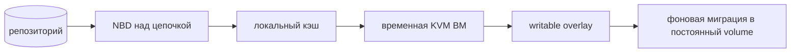

# Восстановление: текущее состояние и roadmap

Документ отделяет уже работающий путь восстановления от следующих этапов.
Функция считается готовой к production не только после появления API: для неё
нужен регулярный приёмочный прогон на копии реальной инфраструктуры.

## Что реализовано

### Восстановление данных

- образ диска собирается из полной, инкрементальной или разностной цепочки;
- результат можно записать в разрешённый каталог сервера, новый диск oVirt или
  поверх существующего диска с явным подтверждением;
- для чтения можно выбрать физическую копию; вся цепочка берётся из одного
  хранилища и не смешивается между репозиториями;
- отдельный restore run создаётся до фоновой операции и хранит фазу, прогресс,
  итог, ошибку и путь результата.

### Новая ВМ одним действием

Поддерживаются совместимые направления **oVirt→oVirt** и **KVM→KVM**.

1. Preview читает сохранённый переносимый профиль и реальные ресурсы цели:
   кластеры, storage domains/pools, сети и vNIC profiles. До запуска проверяются
   конфликт имени, свободное место, архитектура и обязательные сопоставления.
2. Профиль версии 2 переносит CPU, память, архитектуру, firmware, Secure Boot,
   диски, шины, порядок загрузки и описание NIC. Исходные UUID, пути к дискам,
   NVRAM и MAC не проигрываются напрямую.
3. Каждый NIC можно исключить либо сопоставить с vNIC profile oVirt,
   libvirt network или bridge. По умолчанию интерфейсы отсоединены, а MAC
   создаются заново.
4. Запуск ВМ является отдельным выбором. Копия типа `config` создаёт ВМ без
   дисков, предупреждает об отсутствии данных и не допускает автозапуск.
5. При ошибке исполнитель идемпотентно удаляет созданные диски/volumes и ВМ.
   Если очистка не завершилась, restore run перечисляет оставшиеся ресурсы.

oVirt использует `CreateVM`, ImageIO и подключение новых дисков. KVM создаёт
storage volumes, безопасный domain XML, выполняет define/start и обратную
очистку через libvirt. Межплатформенная конвертация намеренно не маскируется под
обычное восстановление: **oVirt↔KVM пока не поддерживается**.

### Проверка до аварии

Восемь режимов проверки покрывают наличие объектов, цепочку, checksum,
структуру диска, сборку образа, `qemu-img check`, сверку с источником и пробный
запуск. Режим `boot` поднимает изолированную transient-ВМ на KVM без сети и
ждёт `qemu-guest-agent`. Это проверка загружаемости, а не мгновенный запуск
production-нагрузки.

## Что ещё требует приёмки

Автоматические unit-тесты проверяют построение плана, совместимость профилей и
часть ошибок. Перед стабилизационным релизом остаётся прогнать на стендах:

- oVirt→oVirt и KVM→KVM для BIOS, UEFI и Secure Boot;
- многодисковые ВМ с разными шинами и порядком загрузки;
- все варианты NIC mapping, start/no-start и конфликт имени;
- `config`-точку без дисков;
- отмену и ошибку на каждой фазе с проверкой rollback и списка остатков;
- восстановление из основной копии и полной реплики при недоступном primary.

## Следующие этапы

### Мгновенный запуск из копии

Этой функции ещё нет. Обычный restore и проверка `boot` сначала собирают диски.
Для запуска KVM прямо из репозитория нужен отдельный NBD-сервер над цепочкой,
локальный кэш чанков, writable overlay и фоновый перенос в постоянное хранилище.

Начинать следует с KVM: libvirt умеет подключить NBD-источник. oVirt не даёт
присоединить внешний NBD как обычный диск ВМ, поэтому его поддержка потребует
другой архитектуры.

### Согласованность с приложением

Текущий `fsfreeze` через гостевого агента обеспечивает согласованность файловой
системы, но не координирует транзакции PostgreSQL, MySQL, 1С и других
приложений. Application hooks пока находятся в roadmap.

Предлагаемая модель: именованные сценарии внутри гостя, а не произвольная
команда из web.

| Точка | Когда | Обязательное поведение |
|---|---|---|
| `pre-freeze` | до заморозки | ошибка по умолчанию прерывает копию |
| `post-thaw` | сразу после разморозки | выполняется всегда, даже при ошибке бэкапа |
| `post-backup` | после публикации точки | ошибка фиксируется отдельно |

Для каждого hook нужен timeout, аудит и отдельный признак
application-consistent в результате. `post-thaw` нельзя оставлять на обычном
happy path: незамороженная вовремя ФС важнее успешного статуса бэкапа.

### Агент на гипервизорах

Сервис остаётся безагентным. Host agent для метрик, локального управления и
восстановления при недоступном Engine не реализован. Если этот этап будет
принят, первая версия должна быть только наблюдающей, работать через исходящее
соединение и иметь версионированный протокол. Управление хостом добавляется
отдельно через те же разрешения, cooldown, лимиты и dry-run, что и действующее
авто-восстановление.

## Граница стабилизационного релиза

В релиз входят существующие восстановление дисков/файлов и создание новой ВМ
внутри той же платформы после стендовой приёмки. Мгновенный запуск, application
hooks, host agent и межплатформенная конвертация остаются отдельными функциями и
не должны подразумеваться в интерфейсе или эксплуатационных обещаниях.
